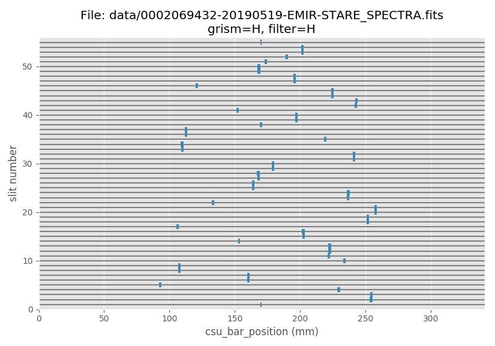
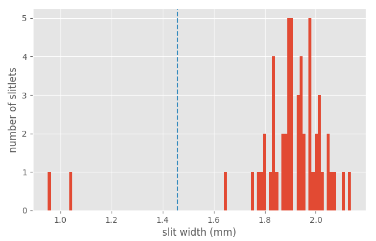
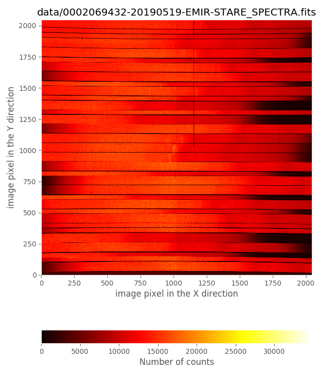
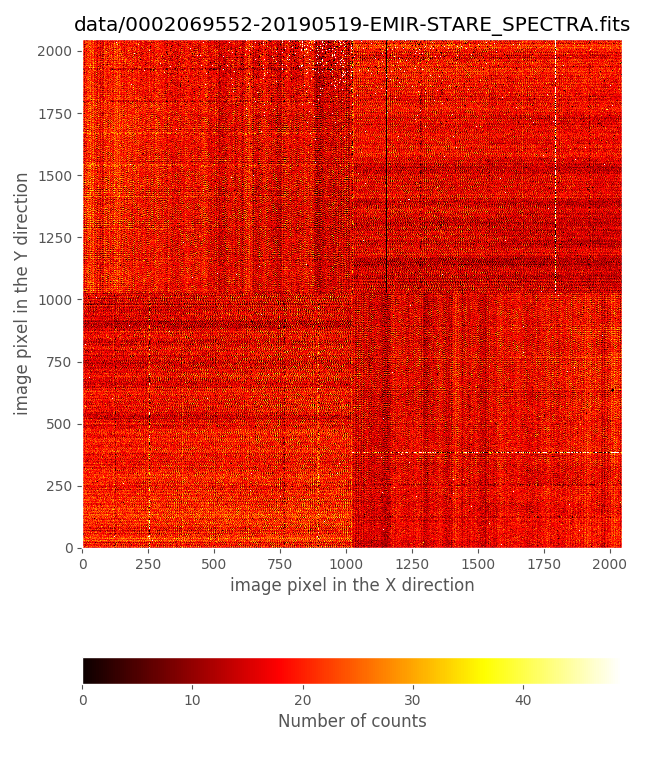
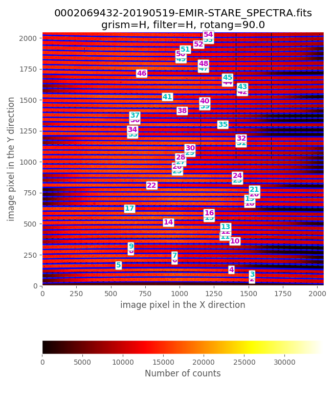
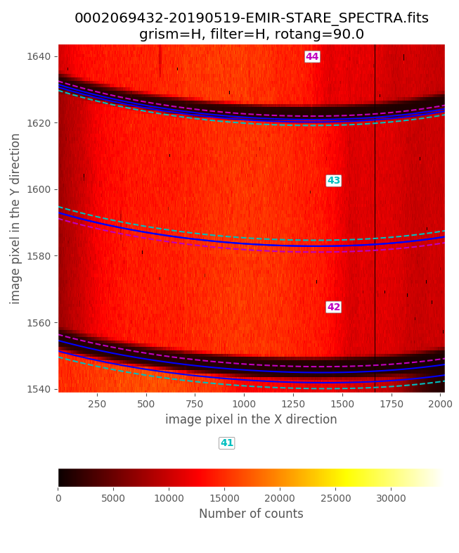
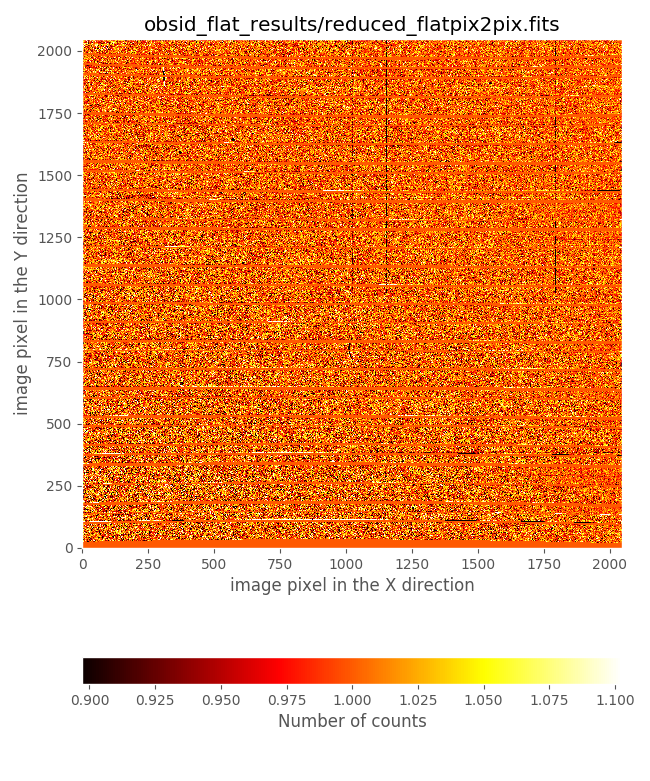

.. _FLAT_generation:

####################
Flatfield generation
####################

.. warning::

   All the commands are assumed to be executed in a terminal running the **bash
   shell**.

   Don't forget to activate the same Python environment employed to install
   PyEmir.  In this document, the prompt ``(emir) $`` will indicate that this
   is the case.

This example provides an easy introduction to the generation of flatfield
images with PyEmir (via Numina),

For detailed documentation concerning the installation of PyEmir, see the
:ref:`pyemir_installation` guide.

Pixel-to-pixel variation
========================

Concerning pixel-to-pixel variation, in principle PyEmir distinguishes between:

- Imaging flatfield: identified as ``MasterIntensityFlat`` in the file
  ``control.yaml``. This should be set to the flatfield to be applied when
  reducing data obtained in imaging mode: for example, when using the recipe
  ``STARE_IMAGE`` when performing the basic initial reduction of the images.

- Spectroscopic flatfield: identified as ``MasterSpectralFalt`` in the file
  ``control.yaml``. This should be set to the flatfield to be applied when
  reducing data obtained in spectroscopic mode: for example, when using the
  recipe ``GENERATE_RECTWV_COEFF`` to generate the rectification and wavelength
  calibration coefficients, or the recipe ``ABBA_SPECTRA_RECTWV`` to combine
  dithered spectroscopic observations following an ABBA pattern.

A master pixel-to-pixel flatfield from spectroscopic data,
``master_flat_spec.fits``, is provided in the initial file tree structure
provided in :ref:`initial_file_tree`.  Interestingly, as shown in that section,
the pixel-to-pixel variation is quite constant along the different spectral
ranges. For that reason we consider that this image can safely be used for most
purposes for both, imaging and spectroscopic observations.

Furthermore, imaging mode observations, as those described in
:ref:`IMAGING_tutorial`, are reduced by generating a superflatfield from the
sky signal in different images.  In this sense, the use of a pixel-to-pixel
flatfield in the initial basic reduction of the original images is not
essential. The user can easily check this by setting ``MasterIntensityFlat`` to
``master_flat_ones.fits`` in the ``control.yaml`` file, i.e.:

::

    - {id: 4, type: 'MasterIntensityFlat', tags: {}, content: 'master_flat_ones.fits'}

Note that ``master_flat_ones.fits`` is a dummy image in which all the pixels
have been set to 1.0.

Generating a pixel-to-pixel flatfield from spectroscopic data
=============================================================

If for any reason the user needs to compute her own pixel-to-pixel flatfield
from spectroscopic data, PyEmir provides the reduction recipe
``SPEC_FLAT_PIX2PIX`` that perform this task using, as input, tungsten
exposures. In this sense, it is important to keep in mind the following
recommendations:

- The exposures should be obtained with the same MOS configuration
  as the scientific images to which we plan to apply the computed flatfiled;
  otherwise, the pixel-to-pixel reponse may not be available in the wavelength
  range covered by each particular slitlet.

- For observations covering the K band it is advisable to obtain images with the
  tungsten lamp both ON and OFF, since in this case the OFF images exhibit a
  non-negligible signal.

Here we illustrate the computation of a spectroscopic pixel-to-pixel flatfield
using the following 20 tungsten lamp exposures in the H band, 10 obtained with
the lamp ON and 10 with the lamp OFF. Although in principle it is not necessary
to obtain images with lamp OFF in this spectral range, here we will use both
kind of input images to illustrate the general procedure, as well as to double
check that the lamp OFF signal in this case is negligible.

::

   0002069432-20190519-EMIR-STARE_SPECTRA.fits
   0002069435-20190519-EMIR-STARE_SPECTRA.fits
   0002069438-20190519-EMIR-STARE_SPECTRA.fits
   0002069441-20190519-EMIR-STARE_SPECTRA.fits
   0002069444-20190519-EMIR-STARE_SPECTRA.fits
   0002069447-20190519-EMIR-STARE_SPECTRA.fits
   0002069450-20190519-EMIR-STARE_SPECTRA.fits
   0002069453-20190519-EMIR-STARE_SPECTRA.fits
   0002069456-20190519-EMIR-STARE_SPECTRA.fits
   0002069459-20190519-EMIR-STARE_SPECTRA.fits
   0002069552-20190519-EMIR-STARE_SPECTRA.fits
   0002069555-20190519-EMIR-STARE_SPECTRA.fits
   0002069558-20190519-EMIR-STARE_SPECTRA.fits
   0002069561-20190519-EMIR-STARE_SPECTRA.fits
   0002069564-20190519-EMIR-STARE_SPECTRA.fits
   0002069567-20190519-EMIR-STARE_SPECTRA.fits
   0002069570-20190519-EMIR-STARE_SPECTRA.fits
   0002069573-20190519-EMIR-STARE_SPECTRA.fits
   0002069576-20190519-EMIR-STARE_SPECTRA.fits
   0002069579-20190519-EMIR-STARE_SPECTRA.fits
   

Those files (together with some additional files that you will need to follow
this imaging example) are available as a compressed tgz file:
`pyemir_flatpix2pix_tutorial_v1.tgz
<http://nartex.fis.ucm.es/data/pyemir/pyemir_flatpix2pix_tutorial_v1.tgz>`_.

.. warning::

   Before continuing, make sure that you have already initialize the file tree
   structure by following the instructions provided in the
   :ref:`initial_file_tree` section of this documentation.

Move to the directory where you have deployed the initial file tree structure
containing the basic PyEmir calibration files (see  :ref:`initial_file_tree`).

Decompress there the previously mentioned tgz file:

::

   (emir) $ tar zxvf pyemir_flatpix2pix_tutorial_v1.tgz
   ...
   ...
   (emir) $ rm pyemir_flatpix2pix_tutorial_v1.tgz

This action should have populated the file tree with the 
20 tungsten FITS images (placed wihtin the ``data``
subdirectory) and some additional auxiliary files:

::

   (emir) $ tree
   .
   ├── control.yaml
   ├── data
   │   ├── 0002069432-20190519-EMIR-STARE_SPECTRA.fits
   │   ├── 0002069435-20190519-EMIR-STARE_SPECTRA.fits
   │   ├── 0002069438-20190519-EMIR-STARE_SPECTRA.fits
   │   ├── 0002069441-20190519-EMIR-STARE_SPECTRA.fits
   │   ├── 0002069444-20190519-EMIR-STARE_SPECTRA.fits
   │   ├── 0002069447-20190519-EMIR-STARE_SPECTRA.fits
   │   ├── 0002069450-20190519-EMIR-STARE_SPECTRA.fits
   │   ├── 0002069453-20190519-EMIR-STARE_SPECTRA.fits
   │   ├── 0002069456-20190519-EMIR-STARE_SPECTRA.fits
   │   ├── 0002069459-20190519-EMIR-STARE_SPECTRA.fits
   │   ├── 0002069552-20190519-EMIR-STARE_SPECTRA.fits
   │   ├── 0002069555-20190519-EMIR-STARE_SPECTRA.fits
   │   ├── 0002069558-20190519-EMIR-STARE_SPECTRA.fits
   │   ├── 0002069561-20190519-EMIR-STARE_SPECTRA.fits
   │   ├── 0002069564-20190519-EMIR-STARE_SPECTRA.fits
   │   ├── 0002069567-20190519-EMIR-STARE_SPECTRA.fits
   │   ├── 0002069570-20190519-EMIR-STARE_SPECTRA.fits
   │   ├── 0002069573-20190519-EMIR-STARE_SPECTRA.fits
   │   ├── 0002069576-20190519-EMIR-STARE_SPECTRA.fits
   │   ├── 0002069579-20190519-EMIR-STARE_SPECTRA.fits
   │   ├── master_bpm.fits
   │   ├── master_dark_zeros.fits
   │   ├── master_flat_ones.fits
   │   ├── master_flat_spec.fits
   │   ├── rect_wpoly_MOSlibrary_grism_H_filter_H.json
   │   ├── rect_wpoly_MOSlibrary_grism_J_filter_J.json
   │   ├── rect_wpoly_MOSlibrary_grism_K_filter_Ksp.json
   │   ├── rect_wpoly_MOSlibrary_grism_LR_filter_HK.json
   │   └── rect_wpoly_MOSlibrary_grism_LR_filter_YJ.json
   └── flatpix2pix.yaml
   
You can easily examine the header of the scientific FITS images using the
astropy utility ``fitsheader``:

::

   (emir) $ fitsheader data/0002069*.fits -k object -k lampincd -k lampintn -f
                       filename                         OBJECT    LAMPINCD     LAMPINTN    
   ------------------------------------------------ ------------- -------- ----------------
   data/0002069432-20190519-EMIR-STARE_SPECTRA.fits Goya Mask1b H        1 8.99973011016846
   data/0002069435-20190519-EMIR-STARE_SPECTRA.fits Goya Mask1b H        1 8.99973011016846
   data/0002069438-20190519-EMIR-STARE_SPECTRA.fits Goya Mask1b H        1 8.99973011016846
   data/0002069441-20190519-EMIR-STARE_SPECTRA.fits Goya Mask1b H        1 8.99973011016846
   data/0002069444-20190519-EMIR-STARE_SPECTRA.fits Goya Mask1b H        1 8.99973011016846
   data/0002069447-20190519-EMIR-STARE_SPECTRA.fits Goya Mask1b H        1 8.99973011016846
   data/0002069450-20190519-EMIR-STARE_SPECTRA.fits Goya Mask1b H        1 8.99973011016846
   data/0002069453-20190519-EMIR-STARE_SPECTRA.fits Goya Mask1b H        1 8.99973011016846
   data/0002069456-20190519-EMIR-STARE_SPECTRA.fits Goya Mask1b H        1 8.99973011016846
   data/0002069459-20190519-EMIR-STARE_SPECTRA.fits Goya Mask1b H        1 8.99973011016846
   data/0002069552-20190519-EMIR-STARE_SPECTRA.fits Goya Mask1b H        0              0.0
   data/0002069555-20190519-EMIR-STARE_SPECTRA.fits Goya Mask1b H        0              0.0
   data/0002069558-20190519-EMIR-STARE_SPECTRA.fits Goya Mask1b H        0              0.0
   data/0002069561-20190519-EMIR-STARE_SPECTRA.fits Goya Mask1b H        0              0.0
   data/0002069564-20190519-EMIR-STARE_SPECTRA.fits Goya Mask1b H        0              0.0
   data/0002069567-20190519-EMIR-STARE_SPECTRA.fits Goya Mask1b H        0              0.0
   data/0002069570-20190519-EMIR-STARE_SPECTRA.fits Goya Mask1b H        0              0.0
   data/0002069573-20190519-EMIR-STARE_SPECTRA.fits Goya Mask1b H        0              0.0
   data/0002069576-20190519-EMIR-STARE_SPECTRA.fits Goya Mask1b H        0              0.0
   data/0002069579-20190519-EMIR-STARE_SPECTRA.fits Goya Mask1b H        0              0.0

The value of the following keywords provide the required information to know
what type of images we are handling:

- ``LAMPINCD``: tungsten lamp status (1=ON, 0=OFF)

- ``LAMPINTN``: tungsten lamp intensity

It is clear that the first 10 images of this sequence correspond to lamp ON
and the last 10 images to lamp OFF.

Let's have a look to the CSU configuration:

::

   (emir) $ pyemir-display_slitlet_arrangement data/0002069432-20190519-EMIR-STARE_SPECTRA.fits \
     --longslits --n_clusters 2

The previous histogram indicates that the valid slitlet widths for the present
CSU configuration are given by:

- ``minimum_slitlet_width_mm: 1.5`` 

- ``maximum_slitlet_width_mm: 2.5``

We can also display the first image with lamp ON and the first with lamp OFF:

.. numina-ximshow data/0002069432-20190519-EMIR-STARE_SPECTRA.fits --geometry 0,0,650,850
   

.. numina-ximshow data/0002069552-20190519-EMIR-STARE_SPECTRA.fits --geometry 0,0,650,850
   

An estimate of the integer vertical offset (in pixels) can be obtained using:

::

   $ pyemir-overplot_boundary_model data/0002069432-20190519-EMIR-STARE_SPECTRA.fits \
     --rect_wpoly_MOSlibrary data/rect_wpoly_MOSlibrary_grism_H_filter_H.json

Zooming in the previous image:

From this examination we estimate ``global_integer_offset_y_pix: -2``. Note
that to obtain the pixel-to-pixel response we do not need to estimate
``global_integer_offset_x_pix``. The reason for that is that the recipe
responsible for the computation of this kind of flat, ``SPEC_FLAT_PIX2PIX``,
only needs to rectify the spectra of each slitlet without performing a
wavelength calibration. The averaged rectified spectrum of each slitlet is then
smoothed and unrectified (i.e., distorted to follow the original image
distortions) to obtain the pixel-to-pixel variation (dividing the original
image by the smoothed distorted spectra).

The required observation result file to reduce these lamp images,
``flatpix2pix.yaml``, is already provided in the tgz accompanying this example
data:

.. literalinclude:: flatpix2pix.yaml
   :linenos:
   :lineno-start: 1

Note that the ``frames`` section of this file contains the list of the 20
tungsten lamp images, independently of whether the images were obtained with
the lamp ON or OFF (the order of the images here is not relevant; the recipe
examines the value of the keyword ``LAMPINCD`` to determine which images
correspond to each lamp status).

The ``requeriments`` section includes some parameters already employed in other
reduction recipes (like the combination method, the width interval for valid
slitlets, or the integer offsets between the images and the empirical
distortion calibration), and some new parameters:

- ``nwindow_median: 5`` is the numbers of pixels employed to smooth (via median
  filtering in the spectral direction) the averaged rectified spectrum of each
  slitlet before unrectifying it.

- ``mininum_fraction: 0.01`` is the minimum fraction of the maximum signal of
  the tungsten lamp that is employed to estimate the pixel-to-pixel response.
  Pixel values below this limit are receiving a very low illumination and the
  pixel-to-pixel response is highly uncertain.

- ``minimum_value_in_output: 0.01`` and ``maximum_value_in_output: 10`` are 
  the minimum and maximum pixel-to-pixel value allowed
  in the generated flatfield. This truncation avoids having undesired divisions
  by too small or too large numbers (typically spurious estimates computed at
  the frontiers between slitlets that are not aligned forming a pseudo
  longslit).

In principle, the default values for these last parameters seem to work
properly for all combinations of grism+filter.

You can now execute the reduction recipe:

::

   (emir) $ numina run flatpix2pix.yaml --link-files -r control.yaml
   ...
   ...

The resulting pixel-to-pixel flatfield can be found in the corresponding
``results`` subdirectory:

.. numina-ximshow obsid_flat_results/reduced_flatpix2pix.fits --geometry 0,0,650,850

::

   (emir) $ numina-ximshow obsid_flat_results/reduced_flatpix2pix.fits

It is very illustrative to compare the derived flatfield with the file
``master_flat_spec.fits``, provided in the initial PyEmir tree. Let's have a
look to that comparison in a small image region:

.. numina-ximshow obsid_flat_results/reduced_flatpix2pix.fits --geometry 0,0,650,850 --bbox 884,1182,732,1063 --z1z2 0.80,1.20 --> xxx1.png
   numina-ximshow data/master_flat_spec.fits --geometry 0,0,650,850 --bbox 884,1182,732,1063 --z1z2 0.80,1.20  --> xxx2.png
   convert -delay 100 -loop 0 xxx[12].png comparison_flatpix2pix.gif

.. only:: html

   .. image:: comparison_flatpix2pix.gif
      :width: 800
      :alt: flat pixel-to-pixel

.. only:: latex

   |pic_comparison_flatpix2pix_0| |pic_comparison_flatpix2pix_1|

   .. |pic_comparison_flatpix2pix_0| image:: comparison_flatpix2pix_0.png
      :width: 48%

   .. |pic_comparison_flatpix2pix_1| image:: comparison_flatpix2pix_1.png
      :width: 48%

This comparison reveals that the flatfield just computed exhibits:

- gaps in the regions around the frontiers between slitlets

- defects due to the presence of some ghosts produced by zero order images
  of the slitlets themselves

On the contrary, the file ``master_flat_spec.fits``, which has been built from
observations of 2000 pairs of tungten lamp ON - OFF with the CSU configured
simulating longslits at different locations in the spectral direction, does not
show these problems: the longslit configurations avoid the dark gaps in the
frontiers between slitlets (that appear when consecutive slitlets are not
perfectly aligned), and the ghost problems are avoided by combining the
information of images that do not exhibit these ghots at the central detector
region. For all those reasons we suggest the use of ``master_flat_spec.fits``
unless you have a good reason for not doing it.
