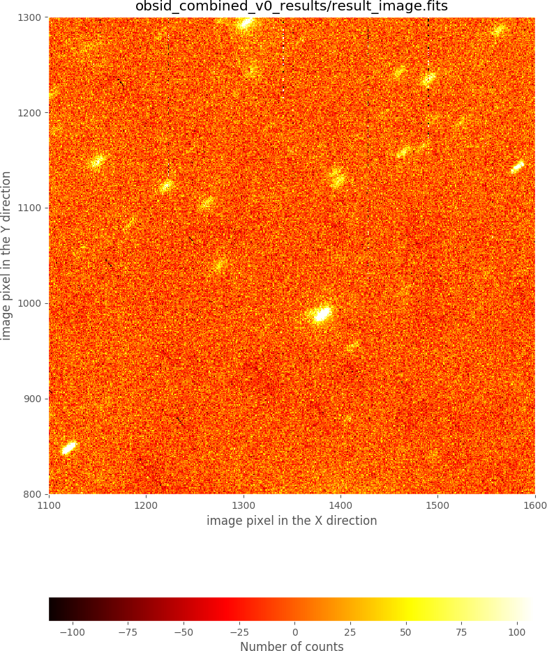

=======================
Preliminary combination
=======================

.. warning::

   Before continuing, make sure that you have already initialize the file tree
   structure by following the instructions provided in the
   :ref:`initial_file_tree` section of this documentation.

Assume you want to combine the following raw images obtained using a dithered
pattern of 7 positions iterated twice (i.e., you have gathered a total of 14
images):

::

   0001877553-20181217-EMIR-STARE_IMAGE.fits
   0001877559-20181217-EMIR-STARE_IMAGE.fits
   0001877565-20181217-EMIR-STARE_IMAGE.fits
   0001877571-20181217-EMIR-STARE_IMAGE.fits
   0001877577-20181217-EMIR-STARE_IMAGE.fits
   0001877583-20181217-EMIR-STARE_IMAGE.fits
   0001877589-20181217-EMIR-STARE_IMAGE.fits
   0001877595-20181217-EMIR-STARE_IMAGE.fits
   0001877601-20181217-EMIR-STARE_IMAGE.fits
   0001877607-20181217-EMIR-STARE_IMAGE.fits
   0001877613-20181217-EMIR-STARE_IMAGE.fits
   0001877619-20181217-EMIR-STARE_IMAGE.fits
   0001877625-20181217-EMIR-STARE_IMAGE.fits
   0001877631-20181217-EMIR-STARE_IMAGE.fits   

Those files (together with some additional files that you will need to follow
this imaging example) are available as a compressed tgz file:
`pyemir_imaging_tutorial_v3.tgz
<http://nartex.fis.ucm.es/data/pyemir/pyemir_imaging_tutorial_v3.tgz>`_.

The preliminary combination of these 14 images will be carried out in two
steps:

- **Step 1:** basic reduction of each individual image (bad-pixel masking and
  flatfielding)

- **Step 2:** actual combination of the images

Step 1: basic reduction of individual exposures
-----------------------------------------------

Move to the directory where you have deployed the initial file tree structure
containing the basic PyEmir calibration files (see  :ref:`initial_file_tree`).

Decompress there the previously mentioned tgz file:

::

   (emir) $ tar zxvf pyemir_imaging_tutorial_v3.tgz
   ...
   ...
   (emir) $ rm pyemir_imaging_tutorial_v3.tgz

This action should have populated the file tree with the 
14 scientific raw FITS (placed wihtin the ``data``
subdirectory) and some additional auxiliary files:

::

   (emir) $ tree
   .
   ├── control.yaml
   ├── data
   │   ├── 0001877553-20181217-EMIR-STARE_IMAGE.fits
   │   ├── 0001877559-20181217-EMIR-STARE_IMAGE.fits
   │   ├── 0001877565-20181217-EMIR-STARE_IMAGE.fits
   │   ├── 0001877571-20181217-EMIR-STARE_IMAGE.fits
   │   ├── 0001877577-20181217-EMIR-STARE_IMAGE.fits
   │   ├── 0001877583-20181217-EMIR-STARE_IMAGE.fits
   │   ├── 0001877589-20181217-EMIR-STARE_IMAGE.fits
   │   ├── 0001877595-20181217-EMIR-STARE_IMAGE.fits
   │   ├── 0001877601-20181217-EMIR-STARE_IMAGE.fits
   │   ├── 0001877607-20181217-EMIR-STARE_IMAGE.fits
   │   ├── 0001877613-20181217-EMIR-STARE_IMAGE.fits
   │   ├── 0001877619-20181217-EMIR-STARE_IMAGE.fits
   │   ├── 0001877625-20181217-EMIR-STARE_IMAGE.fits
   │   ├── 0001877631-20181217-EMIR-STARE_IMAGE.fits
   │   ├── master_bpm.fits
   │   ├── master_dark_zeros.fits
   │   ├── master_flat_ones.fits
   │   ├── master_flat_spec.fits
   │   ├── rect_wpoly_MOSlibrary_grism_H_filter_H.json
   │   ├── rect_wpoly_MOSlibrary_grism_J_filter_J.json
   │   ├── rect_wpoly_MOSlibrary_grism_K_filter_Ksp.json
   │   ├── rect_wpoly_MOSlibrary_grism_LR_filter_HK.json
   │   ├── rect_wpoly_MOSlibrary_grism_LR_filter_YJ.json
   │   └── user_offsets.txt
   ├── dithered_ini.yaml
   ├── dithered_v0.yaml
   ├── dithered_v1.yaml
   ├── dithered_v2.yaml
   ├── dithered_v3.yaml
   ├── dithered_v4.yaml
   └── dithered_v5.yaml

You can easily examine the header of the scientific FITS images using the
astropy utility ``fitsheader``:

::

   (emir) $ fitsheader data/0001877*.fits -k nobsblck -k obsblock -k nimgobbl -k imgobbl -k exp -k object -k exptime -k readmode -f
                      filename                    NOBSBLCK OBSBLOCK NIMGOBBL IMGOBBL EXP OBJECT EXPTIME  READMODE
   ---------------------------------------------- -------- -------- -------- ------- --- ------ -------- --------
   data/0001877553-20181217-EMIR-STARE_IMAGE.fits       18        1        7       1   1   TEST 29.99926     RAMP
   data/0001877559-20181217-EMIR-STARE_IMAGE.fits       18        1        7       2   1   TEST 29.99926     RAMP
   data/0001877565-20181217-EMIR-STARE_IMAGE.fits       18        1        7       3   1   TEST 29.99926     RAMP
   data/0001877571-20181217-EMIR-STARE_IMAGE.fits       18        1        7       4   1   TEST 29.99926     RAMP
   data/0001877577-20181217-EMIR-STARE_IMAGE.fits       18        1        7       5   1   TEST 29.99926     RAMP
   data/0001877583-20181217-EMIR-STARE_IMAGE.fits       18        1        7       6   1   TEST 29.99926     RAMP
   data/0001877589-20181217-EMIR-STARE_IMAGE.fits       18        1        7       7   1   TEST 29.99926     RAMP
   data/0001877595-20181217-EMIR-STARE_IMAGE.fits       18        2        7       1   1   TEST 29.99926     RAMP
   data/0001877601-20181217-EMIR-STARE_IMAGE.fits       18        2        7       2   1   TEST 29.99926     RAMP
   data/0001877607-20181217-EMIR-STARE_IMAGE.fits       18        2        7       3   1   TEST 29.99926     RAMP
   data/0001877613-20181217-EMIR-STARE_IMAGE.fits       18        2        7       4   1   TEST 29.99926     RAMP
   data/0001877619-20181217-EMIR-STARE_IMAGE.fits       18        2        7       5   1   TEST 29.99926     RAMP
   data/0001877625-20181217-EMIR-STARE_IMAGE.fits       18        2        7       6   1   TEST 29.99926     RAMP
   data/0001877631-20181217-EMIR-STARE_IMAGE.fits       18        2        7       7   1   TEST 29.99926     RAMP

Note that:

- ``NOBSBLCK`` indicates the requested number of blocks in the
  observation sequence. In this case this number is 18, which means that 18
  dithering patterns were requested when the observation sequence started. Note
  that in this example we are going to reduce only the first 2 blocks (i.e.,
  the first 2 dithering patterns) in order to reduce the execution time.

- ``OBSBLOCK`` is the counter of the block sequence. In this
  example this numbers runs from 1 to 2 (although as just explained above, the
  whole image sequence is composed of 18 blocks). Thus, the 14 images encompass
  two complete dithering patterns of 7 images (see next keyword).

- ``NIMGOBBL`` provides the total number of images in each
  dithering pattern (7 in this case).

- ``IMGOBBL`` indicates the sequential number within each dithering pattern.

- ``EXP`` gives the exposure sequential number at each location within the
  dithering pattern. In this simple example this number is always 1, which
  means that a single exposure was performed before moving from one location
  to the next one within the dithering pattern.

The first step in the reduction process will be the bad-pixel mask
and flatfield corrections.

.. note::

   Remember that the ``numina`` script is the interface with GTC pipelines. 
   In order to execute PyEmir recipes you should use type something like:

   ::
   
      (emir) $ numina run <observation_result_file.yaml> -r <requirements_file.yaml>

   where ``<observation_result_file.yaml>`` is an observation result file in 
   YAML format, and ``<requirements_files.yaml>`` is a requirements file, also 
   in YAML format.

   YAML is a human-readable data serialization language (for details see 
   `YAML Syntax
   <https://docs.ansible.com/ansible/latest/reference_appendices/YAMLSyntax.html>`_)

The deployed file tree already contains the files required
to execute the initial reduction recipe needed in this case: the observation
result file ``dithered_ini.yaml`` and the requirements file ``control.yaml``.
Let's have a look to each of them separately.

**The observation result file:** ``dithered_ini.yaml``

This is what we call an observation result file, which basically contains the
reduction recipes to be applied and the images involved. Note that this
particular file contains 14 blocks, one for each individual image. 

Each block is separated by a line containing just three dashes (``---``):

- Do not forget the separation line ``---`` between blocks (otherwise the 
  pipeline will not recognize where one block ends and the next one begins).

- This separation line must not appear after the last block.

The contents of this file is displayed below,
highlighting the first block (first six lines):

.. literalinclude:: dithered_ini.yaml
   :lines: 1-97
   :emphasize-lines: 1-6
   :linenos:
   :lineno-start: 1

- The ``id`` value is an arbitrary label that is employed to generate the name
  of two auxiliary subdirectories. In this example the reduction of the first
  block will generate two subdirectories named ``obsid_0001877553_work`` and
  ``obsid_0001877553_results``, where the intermediate results and the final
  results are going to be stored, respectively. Note that we have arbitrarily
  chosen the 10 digits of the unique running number assigned to each image
  obtained with the GTC to build the label.
 
- Not surprisingly, the key ``instrument`` is set to EMIR (do not forget that
  Numina also is at present also employed to reduce MEGARA data, and hopefully,
  future GTC instruments).
   
- The key ``mode`` indicates the identification of the reduction recipe
  (``STARE_IMAGE`` in this example). 
     
- The key ``frames`` lists the images to be combined prior to the execution of
  the reduction recipe. In this case a single image has been obtained at each
  point of the dithering pattern before moving to the next location within the
  pattern. For that reason a single image appears in each block. 
   
- The key ``enabled: True`` indicates that this block is going to be reduced.
  As it is going to be shown later, the user can easily
  activate/deactivate the execution of particular reduction recipes (i.e.
  blocks in this file) just by modifying this flag.

.. warning::
   
   Since the generation of the file ``dithered_ini.yaml`` can be cumbersome,
   specially
   when the number of images is large, an auxiliary script has been
   incorporated in PyEmir in order to help in its generation.

   In particular, the file used in this example can be easily created using a
   few simple commands:

   ::

      (emir) $ cd data/
      (emir) $ ls 0001877*fits > list_images.txt
      (emir) $ cd ..
      (emir) $ pyemir-generate_yaml_for_dithered_image \
        data/list_images.txt --step 0 --outfile dithered_ini.yaml

   Note that a temporary file ``list_images.txt`` is created with a list of the
   the individual exposures.  The script
   ``pyemir-generate_yaml_for_dithered_image`` reads that file and generate the
   observation result file ``dithered_ini.yaml`` (the parameter ``--step 0``
   indicates that the reduction recipe to be used here is ``STARE_IMAGE``,
   which corresponds to the preliminary image reduction).

.. warning::

   In this simple example, there is a single exposure at each dithering
   location (before moving to the next location within the same dithering
   cycle, at a fixed ``OBSBLOCK`` value). In a more general case, where the
   number of individual exposures at each location can be larger than 1, the
   ``EXP`` keyword will increase from 1 up to the repetition value. For
   example, if 5 exposures were performed at each dithering location, ``EXP``
   will run from 1 to 5 at a fixed ``IMGOBBL`` value. The preliminary reduction
   should combine these 5 individual exposures into a single image before
   trying to combine the resulting images at different locations. In order to
   do this, the parameter ``--repeat`` must be used when executing
   ``pyemir-generate_yaml_for_dithered_image`` (by default ``--repeat 1`` is
   assumed). In particular, if 5 individual exposures were obtained at each
   dithering location for a particular dithering cycle, ``--repeat 5`` should
   be used.

**The requirements file:** ``control.yaml``

This is the requirements file, containing the expected name of generic 
calibration files. You do not need to modify anything here.

.. literalinclude:: control.yaml
   :linenos:
   :lineno-start: 1

**Numina execution**

You are ready to execute the reduction recipe indicated in the file
``dithered_ini.yaml`` (in this case the reduccion recipe named
``STARE_IMAGE``):

::

   (emir) $ numina run dithered_ini.yaml -r control.yaml
   ...
   ...

After the execution of the previous command line, two subdirectories for each
block should have appeared:

::

   (emir) $ ls
   control.yaml              obsid_0001877565_results/ obsid_0001877601_work/
   data/                     obsid_0001877565_work/    obsid_0001877607_results/
   dithered_ini.yaml         obsid_0001877571_results/ obsid_0001877607_work/
   dithered_v0.yaml          obsid_0001877571_work/    obsid_0001877613_results/
   dithered_v1.yaml          obsid_0001877577_results/ obsid_0001877613_work/
   dithered_v2.yaml          obsid_0001877577_work/    obsid_0001877619_results/
   dithered_v3.yaml          obsid_0001877583_results/ obsid_0001877619_work/
   dithered_v4.yaml          obsid_0001877583_work/    obsid_0001877625_results/
   dithered_v5.yaml          obsid_0001877589_results/ obsid_0001877625_work/
   obsid_0001877553_results/ obsid_0001877589_work/    obsid_0001877631_results/
   obsid_0001877553_work/    obsid_0001877595_results/ obsid_0001877631_work/
   obsid_0001877559_results/ obsid_0001877595_work/
   obsid_0001877559_work/    obsid_0001877601_results/

**The** ``work`` **subdirectories**

All the relevant images (scientific and calibrations) involved in the reduction
of a particular block of the observation result file are copied into the
``work`` subdirectories in order to preserve the original files. 

In particular, for the first block:

::

   (emir) $ tree obsid_0001877553_work/
   obsid_0001877553_work/
   ├── 0001877553-20181217-EMIR-STARE_IMAGE.fits
   ├── index.pkl
   ├── mask_bpm.fits
   ├── master_dark_zeros.fits
   └── master_flatframe.fits

*When disk space is an issue, it is possible to execute numina indicating that
links (instead of actual copies of the original raw files) must be placed in the
``work`` subdirectory.* This behaviour is set using the parameter
``--link-files``:

::

   (emir) $ numina run dithered_ini.yaml --link-files -r control.yaml
   ...
   ...

   (emir) $ tree obsid_0001877553_work/
   obsid_0001877553_work/
   ├── 0001877553-20181217-EMIR-STARE_IMAGE.fits -> /Users/cardiel/w/GTC/emir/work/z_tutorials_201907/x/data/0001877553-20181217-EMIR-STARE_IMAGE.fits
   ├── index.pkl
   ├── master_bpm.fits -> /Users/cardiel/w/GTC/emir/work/z_tutorials_201907/x/data/master_bpm.fits
   ├── master_dark_zeros.fits -> /Users/cardiel/w/GTC/emir/work/z_tutorials_201907/x/data/master_dark_zeros.fits
   └── master_flat_spec.fits -> /Users/cardiel/w/GTC/emir/work/z_tutorials_201907/x/data/master_flat_spec.fits

**The** ``results`` **subdirectories**

These subdirectories store the result of the execution of the reduction
recipes. In particular, for the first block:

:: 

   $ tree obsid_0001877553_results/
   obsid_0001877553_results/
   ├── processing.log
   ├── result.json
   ├── result_image.fits
   └── task.json
   
Note that although all the reduced images receive the same name in all these
``results`` subdirectories (for this reduction recipe ``result_image.fits``),
there is no confusion because the subdirectory name contains a unique label for
each block in the observation result file.

Step 2: image combination
-------------------------

After the basic reduction performed in step 1, we can proceed with the
combination of the images. For that purpose a different reduction recipe must
be employed: ``FULL_DITHERED_IMAGE``. 

This task is carried out using a new
observation result file: ``dithered_v0.yaml``: the first 97 lines of this new
file are the same as the content of the the previous file
``dithered_ini.yaml``, but setting ``enabled: False`` in each of the 14 blocks.
This flag indicates that the execution of the recipe ``STARE_IMAGE`` is no
longer necessary in any of the 14 blocks. **Note however that these blocks must
explicitly appear in the observation result file, even though they imply no
actual reduction, because they define the location of the previously reduced
images**.

The new observation result file ``dithered_v0.yaml`` contains a new block at
the end (see lines 99-121 below), that is responsible of the execution of the
combination of the previously reduced images:

.. literalinclude:: dithered_v0.yaml
   :lines: 1-121
   :emphasize-lines: 99-121
   :linenos:
   :lineno-start: 1

The new block (lines 99-121) indicates that the reduction recipe
``FULL_DITHERED_IMAGE`` must be executed using as input the results of the
previous blocks. In particular, the ``id's`` of the initial 14 blocks are given
under the ``children:`` keyword (lines 103 to 116).

In addition, a few parameters (which will be modified later) are set to some
default values in this initial combination:

- ``iterations: 0``: this parameter indicates whether an object mask is
  employed or not. A value of ``0`` means that no object mask is computed. Note
  that an object mask allows a better sky background determination since bright
  objects are removed prior to the sky signal estimation. When this parameter
  is greater than zero, an object mask is created by performing a
  SEXtractor-like object search in the resulting image at the end of the
  previous iteration.

- ``sky_images: 0``: number of images employed to determine the sky background
  of each pixel. Setting this parameter to ``0`` indicates that the sky
  background is simply computed as the median value in the same image in which
  the pixel background is being estimated. Using a value larger than zero sets
  the number of closest images (in time) where the signal of a particular pixel
  is averaged (for example, a value of ``6`` will tipically mean that the sky
  background will be estimated using 3 images acquired before and 3 images
  acquired after the current one; note that at the beginning and at the end of
  a given observation sequence, the closest nearby images correspond to
  exposures obtained only after or only before the current one, respectively).

- ``refine_offsets: False``: this flag indicates whether the offsets between
  images must be refined using cross-correlation of subimages around the
  brightest objects.

As it will be explained later, the use of these parameters can help to obtain
better results. So far we are only interested in showing a fast way to generate
a combined image.

.. warning::

   The file ``dithered_v0.yaml`` can also be automatically generated using
   the same script previously mentioned in step 1:

   ::

      (emir) $ pyemir-generate_yaml_for_dithered_image \
        data/list_images.txt --step 1 --obsid_combined combined_v0 \
        --outfile dithered_v0.yaml 

   Note that here we are using ``--step 1`` instead of ``--step 0``. In
   addition, a new parameter ``--obsid_combined combined_v0`` has also been
   employed in order to set the ``id`` of the block responsible for the
   execution of the combination recipe (see line number 99 above).

The combination of the images is finally performed using numina:

::

   (emir) $ numina run dithered_v0.yaml --link-files -r control.yaml

The previous execution also generates two auxiliary subdirectories ``work`` and
``results``. The resulting combined image can be found in
``obsid_combined_v0_result/result_image.fits``:

::

   (emir) $ tree obsid_combined_v0_results/
   obsid_combined_v0_results/
   ├── processing.log
   ├── result.json
   ├── result_image.fits
   └── task.json

You can display the image using ``ds9``, using ``numina-ximshow`` (the display
tool shipped with numina based on matplotlib), or with any other tool:

::

   (emir) $ numina-ximshow obsid_combined_v0_results/result_image.fits

.. generada con --geometry 0,0,850,1200
.. convert image.png -trim image_trimmed.png
.. image:: combined_v0_trimmed.png
   :width: 100%
   :alt: combined image, version 0

It is clear that this combined image is far from perfect. In particular, there
are inhomogeneities in the background level, which are easier to see at the
image borders. In addition, the objects appear elongated, which indicates that
the offsets between individual exposures, determined from the WCS header
information, are not suficiently precise. The zoomed region shown in the next
image reveals that the problem is not negligible:

.. generada con --geometry 0,0,850,1200 --bbox 1100,1600,800,1300
.. convert image.png -trim image_trimmed.png

In the next section we are showing several alternatives to improve the
image combination.
