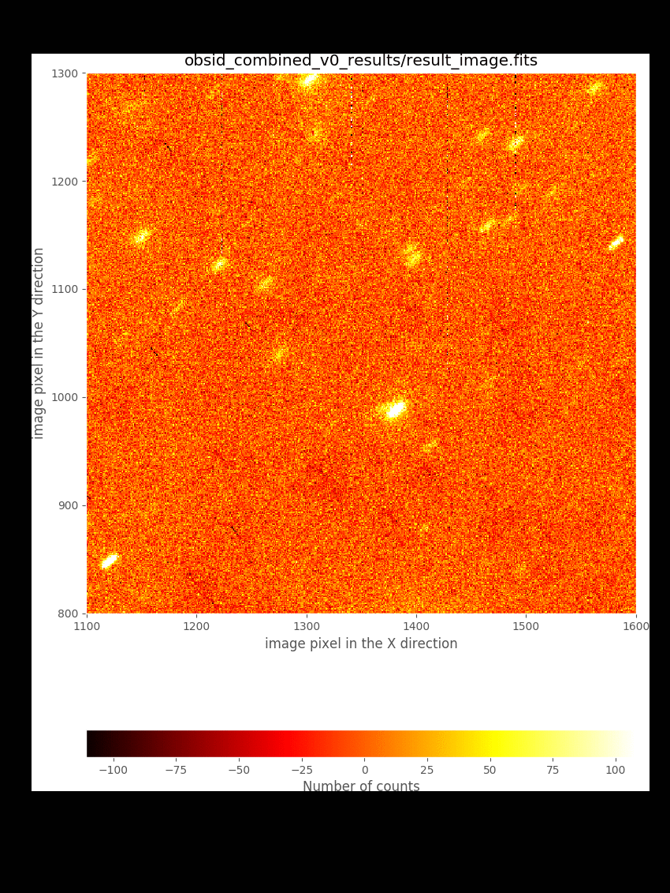
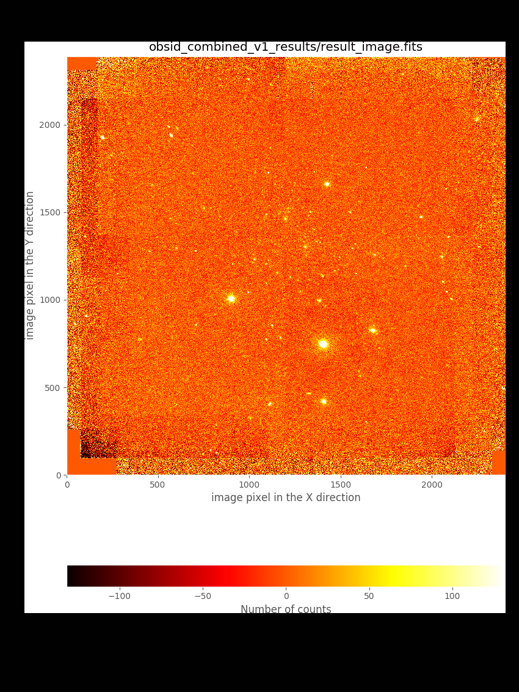
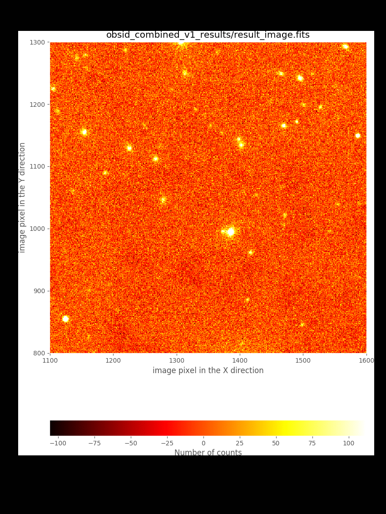
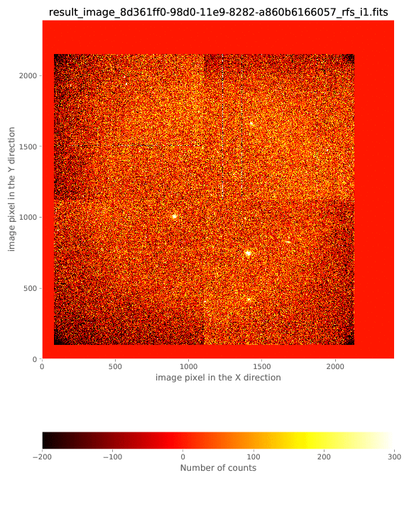

===============================
Improving the image combination
===============================

The image combination can be improve by tuning some of the parameters of the
recipe ``FULL_DITHERED_IMAGE`` (step 2 in the previous section).
In this sense, there is no need to repeat the basic reduction of the individual
exposures (step1).

As previously mentioned, two are the problems that we want to solve:

1. **Improve the offsets between individual exposures:** this can be achieved
   in several ways:

   - by setting the requirement ``refine_offsets: True``: in this case a
     cross-correlation between subimage regions around bright targets is
     carried out to derive refined offsets. See subsection
     :ref:`improving_offsets_1` below.

   - by providing an ASCII file with a list of offsets measured independently 
     by the user and indicated with the requirement ``offsets:
     user_offsets.txt``. See subsection :ref:`improving_offsets_2` below.

   - by providing the same ASCII file with precomputed offsets (as in the
     previous item) and using, in addition, the cross-correlation method. In
     this case, both requirements ``refine_offsets: True`` and ``offsets:
     user_offsets.txt`` must be set. See subsection :ref:`improving_offsets_3`
     below.

2. **Improve the sky background level estimation:** the background level can be
   improved by:

   - generating an object mask and iterating the combination process. See
     subsection :ref:`improving_skybackground_1` below.

   - introducing an *ad hoc* fit to a low-order polynomial surface to the sky
     background. See subsection :ref:`improving_skybackground_2` below.

.. _improving_offsets_1:

Improving offsets (method #1)
-----------------------------

We can activate the use of 2D cross-correlation of subimages around bright
targets to obtain refined offsets. This method works only if the initial
offsets (either derived from the WCS information in the image headers or from
an external file provided by the user) are a reasonable approximation of the
refined values. To set this option it it necessary to set the requirement
``refine_offsets: True`` in the observation file.

This option is already set in line number 120 of the file ``dithered_v1.yaml``,
available in the downloaded package for this tutorial.

.. literalinclude:: dithered_v1.yaml
   :lines: 117-121
   :emphasize-lines: 4
   :linenos:
   :lineno-start: 117

The refined version of the combined image is then obtained by executing numina
again with this new observation result file:

::

   (emir) $ numina run dithered_v1.yaml --link-files -r control.yaml

.. generada con --geometry 0,0,850,1200
.. convert combined_v1.png -trim combined_v1_trimmed.png
.. convert -delay 50 -loop 0 combined_v[01]_trimmed.png comparison_v1.gif

.. generada con --geometry 0,0,850,1200 --bbox 1100,1600,800,1300
.. convert combined_v1_zoom.png -trim combined_v1_zoom_trimmed.png
.. convert -delay 50 -loop 0 combined_v[01]_zoom_trimmed.png comparison_v1_zoom.gif

.. _improving_offsets_2:

Improving offsets (method #2)
-----------------------------

An alternative to the use of the offsets computed from the WCS information in
the image header is to provide a two-column ASCII file with the measured
offsets between the individual images. The (arbitray) name of that file must be
provided through the requirement ``offsets:``. For this tutoral, we are
providing such a file with the name ``user_offsets.txt``. Note that this file
must be placed within the ``data`` subdirectory.

The observation result file ``dithered_v2.yaml`` is similar to the initial
``dithered_v0.yaml`` file, with the inclusion of the new requirement (line
number 121):

.. literalinclude:: dithered_v2.yaml
   :lines: 117-122
   :emphasize-lines: 4
   :linenos:
   :lineno-start: 117

The contents of the ASCII file with the measured offsets is the following:

::

   (emir) cat data/user_offsets.txt
   822 907
   730 660
   555 863
   620 998
   895 741
   545 674
   708 811
   830 911
   735 666
   561 868
   626 1003
   901 746
   551 679
   715 816

Execute numina to obtain the new version of the combined image:

::

   (emir) $ numina run dithered_v2.yaml --link-files -r control.yaml

.. generada con --geometry 0,0,850,1200
.. convert combined_v2.png -trim combined_v2_trimmed.png
.. convert -delay 50 -loop 0 combined_v[02]_trimmed.png comparison_v2.gif

.. generada con --geometry 0,0,850,1200 --bbox 1100,1600,800,1300
.. convert combined_v2_zoom.png -trim combined_v2_zoom_trimmed.png
.. convert -delay 50 -loop 0 combined_v[02]_zoom_trimmed.png comparison_v2_zoom.gif

.. _improving_offsets_3:

Improving offsets (method #3)
-----------------------------

It is also possible to combine both the offsets provided by the user through an
external ASCII file, as well as the cross-correlation method to improve those
numbers.

The last lines of the new observation result file ``dithered_v3.yaml`` are the
following:

.. literalinclude:: dithered_v3.yaml
   :lines: 117-122
   :emphasize-lines: 4-5
   :linenos:
   :lineno-start: 117

Execute numina again with this new observation result file:

::

   (emir) $ numina run dithered_v3.yaml --link-files -r control.yaml

The comparison with the result obtained by refining the offsets initially
computed from the WCS information indicates that both methods lead to basically
the same result.

.. generada con --geometry 0,0,850,1200
.. convert combined_v3.png -trim combined_v3_trimmed.png
.. convert -delay 50 -loop 0 combined_v[13]_trimmed.png comparison_v3.gif

.. generada con --geometry 0,0,850,1200 --bbox 1100,1600,800,1300
.. convert combined_v3_zoom.png -trim combined_v3_zoom_trimmed.png
.. convert -delay 50 -loop 0 combined_v[13]_zoom_trimmed.png comparison_v3_zoom.gif

.. note::

   The conclusion of these comparisons is that the user can rely on the offsets
   computed from the WCS information in the image headers as a
   reasonable initial guess, but that these offsets need to be refined. Unless
   something is really wrong with that WCS information, the user probabily will
   not need to measure the offsets manually. Anyway, that option is always
   there just in case it is necessary.

.. _improving_skybackground_1:

Improving the sky background (problem #1)
-----------------------------------------

The first obvious way to improve the background computation is by masking the
objects present in the image. This masking process requires an initial object
detection, that must be carried out on the result of an initial combination.
For that reason, this masking requires to set ``iterations`` to a number larger
than zero. 

In addition, the user can indicate that the sky signal at each pixel must be
computed from the signal at the same pixel in a predefined number of images
(close in observing time).

The observation result file ``dithered_v4.yaml`` includes both options:

.. literalinclude:: dithered_v4.yaml
   :lines: 117-121
   :emphasize-lines: 2-3
   :linenos:
   :lineno-start: 117

Note that ``refine_offsets: True`` is also being used, but without setting
``offsets`` with an external ASCII file (i.e., the initial offsets will be
computed from the WCS information in the image headers).

Execute numina to start the reduction including object masking:

::

   (emir) $ numina run dithered_v4.yaml --link-files -r control.yaml

It is useful to subtract the new result from the one derived previously:

::

   (emir) $ numina-imath obsid_combined_v1_results/result_image.fits - \
      obsid_combined_v4_results/result_image.fits difference_v4.fits

.. generada con --geometry 0,0,850,1200
.. convert combined_v4.png -trim combined_v4_trimmed.png
.. convert difference_v4.png -trim difference_v4_trimmed.png
.. convert -delay 50 -loop 0 combined_v[14]_trimmed.png difference_v4_trimmed.png comparison_v4.gif

.. generada con --geometry 0,0,850,1200 --bbox 1100,1600,800,1300
.. convert combined_v4_zoom.png -trim combined_v4_zoom_trimmed.png
.. convert difference_v4_zoom.png -trim difference_v4_zoom_trimmed.png
.. convert -delay 50 -loop 0 combined_v[14]_zoom_trimmed.png difference_v4_zoom_trimmed.png comparison_v4_zoom.gif

.. _improving_skybackground_2:

Improving the sky background (problem #2)
-----------------------------------------

In all the previous examples, the combined images always exhibit variations in
the sky background that are clearly visible in the image borders. The reason
for that is that some individual exposures (in particular the first two
individual images), have a wrong image background. This can be seen examining
the sky-subtracted individual images (files ending in ``_rfs_i?.fits`` within
the ``work`` subdirectories):

.. cd obsid_combined_v4_work
.. numina-ximshow result_image_*_rfs_i1.fits --z1z2 [-200,300] --pdf skysub_v4.pdf --figuredict "{'figsize':(8, 10), 'dpi':100}"
.. convert -delay 50 -loop 0 skysub_v4.pdf skysub_v4.gif

One possibility is to remove the first two images from the list of images to be
reduced. This is undesirable because it obviously reduces the depth of the
combined image.

Another option is to apply an *ad hoc* correction, by fitting for example a
low-order 2D polynomial surface to the masked (i.e. removing objects)
sky-subtracted images. This option can be activated by using the requirement
``nside_adhoc_sky_correction``. We have incorporated that option in the
observation result file ``dithered_v5.yaml``, which also includes an iteration
to generate an object mask:

.. literalinclude:: dithered_v5.yaml
   :lines: 117-122
   :emphasize-lines: 5
   :linenos:
   :lineno-start: 117

Since the problem with the sky background in different for each quadrant of the
EMIR detector, the value of ``nside_adhoc_sky_correction`` indicates the
number subdivisions (in X and Y) in which each quadrant is subdivided. In this
case we are using a pattern of 10 x 10 regions in each quadrant. The median
value in each of these 100 subregions is computed (masking pixels affected by
objects) and a smooth spline surface is fitted to that collection of points.

::

   (emir) $ numina run dithered_v5.yaml --link-files -r control.yaml

.. generada con --geometry 0,0,850,1200
.. convert combined_v5.png -trim combined_v5_trimmed.png
.. convert -delay 50 -loop 0 combined_v[45]_trimmed.png comparison_v5.gif

