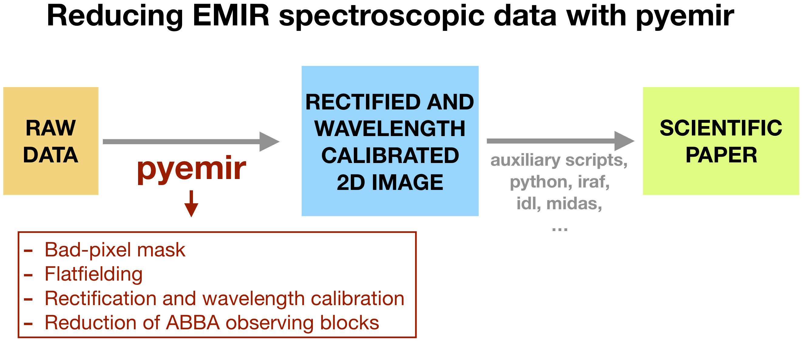
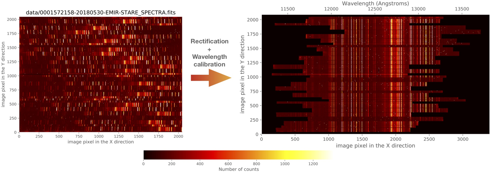

.. _MOS_tutorial:

#####################################
Spectroscopic mode tutorial: MOS data
#####################################

This tutorial provides an easy introduction to the use of PyEmir (via Numina),
focusing on the rectification and wavelength calibration of EMIR spectroscopic
images.

For detailed documentation concerning the installation of PyEmir, see the
:ref:`pyemir_installation` guide.

As shown in the previous diagram, PyEmir helps to generate a rectified and
wavelength calibrated 2D image. From this point, the astronomer can use her
favourite software tools to proceed with the spectra extraction and analysis.

The rectification and wavelength calibration of the original 2048x2048-size raw
images generates reduced 3400x2090-size images. The spatial and spectral
sampling of the raw images are preserved, as much as possible (to minimise
resampling problems) in the reduced images, and the spectral direction axis is
enlarged to acommodate the varying wavelength ranges covered by the slitlet
spectra depending on the location of the slitlets on the plane defined by the
CSU (Cold Slit Unit).

At present, PyEmir is able to work with raw images obtained with the following
spectroscopic configurations:

=====   ======  ===============  ======  ======  ======  ======
Grism   Filter  Useful slitlets  CRVAL1  CDELT1  NAXIS1  NAXIS2
=====   ======  ===============  ======  ======  ======  ======
HR J    J       2 - 54           11200    0.77    3400    2090
HR H    H       2 - 54           14500    1.22    3400    2090
HR K    Ksp     2 - 54           19100    1.73    3400    2090
LR      YJ      4 - 55            8900    3.56    1270    2090
LR      HK      4 - 55           14500    6.83    1435    2090
=====   ======  ===============  ======  ======  ======  ======

In the previous table, ``CRVAL1``, ``CDELT1``, ``NAXIS1`` and ``NAXIS2``
correspond to the values for the rectified and wavelength calibrated images.

We strongly recommend to follow the different sections of this tutorial in the
provided order, starting with the simple handling of (pseudo) longslit data and
then facing the proper reduction of MOS observations.

**Tutorial index:**

.. toctree::
   :maxdepth: 2

   understanding
   simple_example
   mos_example
   ngc7798

