.. _mos_example:

***********
MOS example
***********

.. warning::

   All the commands are assumed to be executed in a terminal running the **bash
   shell**.

   Don't forget to activate the same Python environment employed to install
   PyEmir.  In this document, the prompt ``(emir) $`` will indicate that this
   is the case.

.. note::

   It is assumed that the reader has already followed the previous section of
   this tutorial :ref:`simple_example`. Some of the concepts already introduced
   there are not going to be repeated here with the same level of detail (or
   even mentioned at all!).

Let's consider the rectification and wavelength calibration of a MOS image with
slitlets configured in a non-longslit pattern. In this case, the scientific
observations are deep enough to allow the use of the airglow OH lines to
produce a good wavelength calibration. This means that no arc exposures are
needed!

Downloading the tutorial data
=============================

Download the following file: `pyemir_mos_tutorial.tgz 
<http://nartex.fis.ucm.es/data/pyemir/pyemir_mos_tutorial_v1.tgz>`_.

Move to the directory where you have deployed the initial file tree structure
containing the basic PyEmir calibration files (see  :ref:`initial_file_tree`).

Decompress there the previously mentioned tgz file:

::

   (emir) $ tar zxvf pyemir_mos_tutorial_v1.tgz
   ...
   ...
   (emir) $ rm pyemir_mos_tutorial_v1.tgz

This action should have populated the file tree with 24 science exposures
(placed wihtin the ``data`` subdirectory) and some additional auxiliary files:

::

   (emir) $ tree
   ...

You can easily examine the header of the 12 science files using the astropy 
utility ``fitsheader``:

::

   (emir) $ fitsheader data/0002004* -k object -k grism -k filter -k exptime -k date-obs -f
                       filename                         OBJECT    GRISM FILTER  EXPTIME          DATE-OBS       
   ------------------------------------------------ ------------- ----- ------ ---------- ----------------------
   data/0002004226-20190424-EMIR-STARE_SPECTRA.fits goya_mask1a_J     J      J 359.986465 2019-04-25T00:40:52.36
   data/0002004255-20190424-EMIR-STARE_SPECTRA.fits goya_mask1a_J     J      J 359.986465 2019-04-25T00:46:58.26
   data/0002004284-20190424-EMIR-STARE_SPECTRA.fits goya_mask1a_J     J      J 359.986465 2019-04-25T00:53:02.05
   data/0002004313-20190424-EMIR-STARE_SPECTRA.fits goya_mask1a_J     J      J 359.986465 2019-04-25T00:59:09.00
   data/0002004342-20190424-EMIR-STARE_SPECTRA.fits goya_mask1a_J     J      J 359.986465 2019-04-25T01:05:30.72
   data/0002004371-20190424-EMIR-STARE_SPECTRA.fits goya_mask1a_J     J      J 359.986465 2019-04-25T01:11:37.67
   data/0002004400-20190424-EMIR-STARE_SPECTRA.fits goya_mask1a_J     J      J 359.986465 2019-04-25T01:17:41.46
   data/0002004429-20190424-EMIR-STARE_SPECTRA.fits goya_mask1a_J     J      J 359.986465 2019-04-25T01:23:49.46
   data/0002004458-20190424-EMIR-STARE_SPECTRA.fits goya_mask1a_J     J      J 359.986465 2019-04-25T01:30:12.23
   data/0002004487-20190424-EMIR-STARE_SPECTRA.fits goya_mask1a_J     J      J 359.986465 2019-04-25T01:36:20.24
   data/0002004516-20190424-EMIR-STARE_SPECTRA.fits goya_mask1a_J     J      J 359.986465 2019-04-25T01:42:24.03
   data/0002004545-20190424-EMIR-STARE_SPECTRA.fits goya_mask1a_J     J      J 359.986465 2019-04-25T01:48:32.03
   data/0002004574-20190424-EMIR-STARE_SPECTRA.fits goya_mask1a_J     J      J 359.986465 2019-04-25T01:54:54.80
   data/0002004603-20190424-EMIR-STARE_SPECTRA.fits goya_mask1a_J     J      J 359.986465 2019-04-25T02:01:02.81
   data/0002004632-20190424-EMIR-STARE_SPECTRA.fits goya_mask1a_J     J      J 359.986465 2019-04-25T02:07:06.59
   data/0002004661-20190424-EMIR-STARE_SPECTRA.fits goya_mask1a_J     J      J 359.986465 2019-04-25T02:13:14.60
   data/0002004690-20190424-EMIR-STARE_SPECTRA.fits goya_mask1a_J     J      J 359.986465 2019-04-25T02:19:37.37
   data/0002004719-20190424-EMIR-STARE_SPECTRA.fits goya_mask1a_J     J      J 359.986465 2019-04-25T02:25:45.38
   data/0002004748-20190424-EMIR-STARE_SPECTRA.fits goya_mask1a_J     J      J 359.986465 2019-04-25T02:31:49.16
   data/0002004777-20190424-EMIR-STARE_SPECTRA.fits goya_mask1a_J     J      J 359.986465 2019-04-25T02:37:57.17
   data/0002004806-20190424-EMIR-STARE_SPECTRA.fits goya_mask1a_J     J      J 359.986465 2019-04-25T02:44:19.93
   data/0002004835-20190424-EMIR-STARE_SPECTRA.fits goya_mask1a_J     J      J 359.986465 2019-04-25T02:50:27.94
   data/0002004864-20190424-EMIR-STARE_SPECTRA.fits goya_mask1a_J     J      J 359.986465 2019-04-25T02:56:31.73
   data/0002004893-20190424-EMIR-STARE_SPECTRA.fits goya_mask1a_J     J      J 359.986465 2019-04-25T03:02:40.79
 
It is also useful to display additional FITS keywords that store relevant
information concerning the observation strategy:

::

   (emir) $ fitsheader data/0002004*fits -k OBSBLOCK -k NIMGOBBL -k IMGOBBL -k NFRSEC -k FRSEC -k READMODE -f
                    filename                     OBSBLOCK NIMGOBBL IMGOBBL NFRSEC FRSEC READMODE
   ------------------------------------------------ -------- -------- ------- ------ ----- --------
   data/0002004226-20190424-EMIR-STARE_SPECTRA.fits        1        4       1     28     0     RAMP
   data/0002004255-20190424-EMIR-STARE_SPECTRA.fits        1        4       2     28     0     RAMP
   data/0002004284-20190424-EMIR-STARE_SPECTRA.fits        1        4       3     28     0     RAMP
   data/0002004313-20190424-EMIR-STARE_SPECTRA.fits        1        4       4     28     0     RAMP
   data/0002004342-20190424-EMIR-STARE_SPECTRA.fits        2        4       1     28     0     RAMP
   data/0002004371-20190424-EMIR-STARE_SPECTRA.fits        2        4       2     28     0     RAMP
   data/0002004400-20190424-EMIR-STARE_SPECTRA.fits        2        4       3     28     0     RAMP
   data/0002004429-20190424-EMIR-STARE_SPECTRA.fits        2        4       4     28     0     RAMP
   data/0002004458-20190424-EMIR-STARE_SPECTRA.fits        3        4       1     28     0     RAMP
   data/0002004487-20190424-EMIR-STARE_SPECTRA.fits        3        4       2     28     0     RAMP
   data/0002004516-20190424-EMIR-STARE_SPECTRA.fits        3        4       3     28     0     RAMP
   data/0002004545-20190424-EMIR-STARE_SPECTRA.fits        3        4       4     28     0     RAMP
   data/0002004574-20190424-EMIR-STARE_SPECTRA.fits        4        4       1     28     0     RAMP
   data/0002004603-20190424-EMIR-STARE_SPECTRA.fits        4        4       2     28     0     RAMP
   data/0002004632-20190424-EMIR-STARE_SPECTRA.fits        4        4       3     28     0     RAMP
   data/0002004661-20190424-EMIR-STARE_SPECTRA.fits        4        4       4     28     0     RAMP
   data/0002004690-20190424-EMIR-STARE_SPECTRA.fits        5        4       1     28     0     RAMP
   data/0002004719-20190424-EMIR-STARE_SPECTRA.fits        5        4       2     28     0     RAMP
   data/0002004748-20190424-EMIR-STARE_SPECTRA.fits        5        4       3     28     0     RAMP
   data/0002004777-20190424-EMIR-STARE_SPECTRA.fits        5        4       4     28     0     RAMP
   data/0002004806-20190424-EMIR-STARE_SPECTRA.fits        6        4       1     28     0     RAMP
   data/0002004835-20190424-EMIR-STARE_SPECTRA.fits        6        4       2     28     0     RAMP
   data/0002004864-20190424-EMIR-STARE_SPECTRA.fits        6        4       3     28     0     RAMP
   data/0002004893-20190424-EMIR-STARE_SPECTRA.fits        6        4       4     28     0     RAMP
   
The last summary shows that:

- ``OBSBLOCK``: (counter of the block sequence) runs from 1 to 6

- ``NIMGOBBL=4`` (requested number of images per observing block): each block
  correspond to a typical ABBA dithering pattern along the slit.

- ``IMGOBBL`` (counter of the image sequence) runs from 1 to 4 within each
  block.

- ``NFRSEC=28`` (frames produced per detector exposure): note that
  ``READMODE=RAMP``, so 28 reads are performed in each exposure. Note that
  these frames are what GTC calls *raw* frames: each one of them corresponds to
  a single read in the ramp. These files are provided by GTC with the suffix
  ``*_raw.fits``. The images we are reducing here are the result of the fit of
  ramps to the collection of 28 reads (in each detector pixel). In this
  tutorial we are using the adjective *raw* to refer to the latter FITS images
  resulting from the ramp fitting process. 

- ``FRSEC=0`` (counter of the frame sequence): in this case, a value of ``0``
  indicates that the FITS image is the result of the ramp fitting process. In
  the individual FITS images ``*_raw.fits`` (not provided), corresponding to
  each detector read, this keyword runs from 1 to 28.

In summary, the 24 science images provided correspond to 6 ABBA blocks.
Have a look to any of these images.  For that purpose you can use ``ds9`` or
the visualization tool provided with numina:
   
::

   (emir) $ numina-ximshow data/0002004226-20190424-EMIR-STARE_SPECTRA.fits 

.. numina-ximshow data/0002004226-20190424-EMIR-STARE_SPECTRA.fits --geometry 0,0,650,850

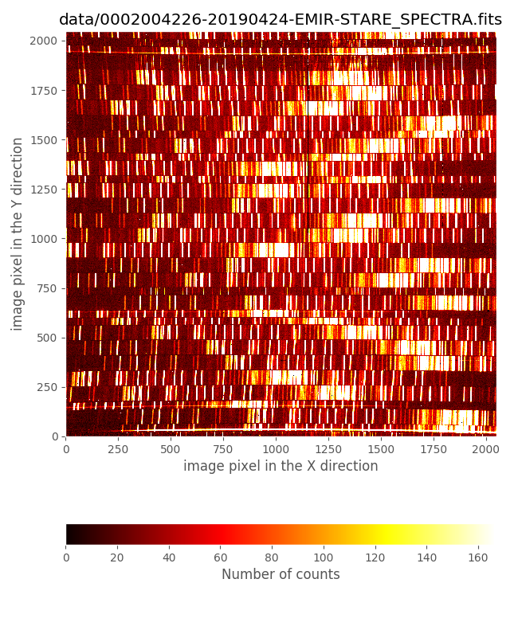

The CSU configuration
=====================

It is clear from the previous figure that the EMIR slitlets were not configured
in `longslit` mode, but in `MOS` mode. In addition, it is important to
highlight that not all the slitlets were opened (i.e., the slits not assigned
to a particular scientific target were closed in order to avoid spurious
spectra in the image; note that even for the closed slitlets the corresponding
CSU bars are not completely closed to avoid collisions)

The slitlet configuration can be easily displayed with the help of the
auxiliary PyEmir script ``pyemir-display_slitlet_arrangement`` (please, note
the use in this case of the additional parameter ``--n_clusters 2``):

::

   (emir) $ pyemir-display_slitlet_arrangement \
     data/0002004226-20190424-EMIR-STARE_SPECTRA.fits \
     --n_clusters 2 --longslits
   ...
   ...
   ---> separator:   1.475

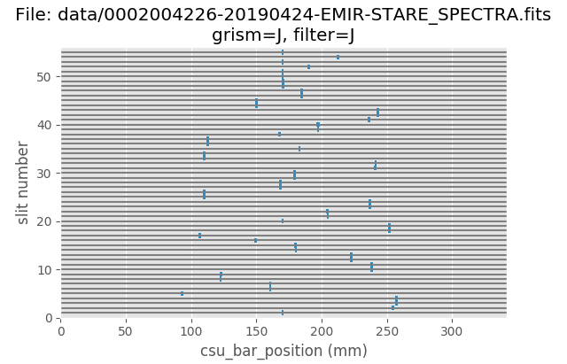

The first figure displays the slitlet arrangement.

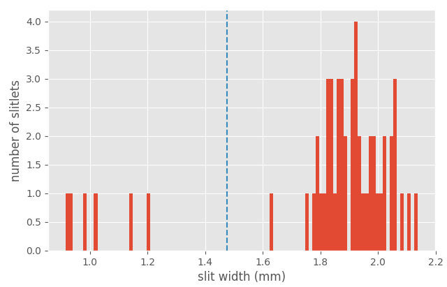

Note that in this case we have employed the parameter ``--n_clusters 2``, that
forces the script to display a histogram of slitlet widths, and to compute two
clusters and a separating value (in this case 1.475 mm) which classifies the
slitlets in two groups: slitlets closed (widths < 1.475 mm) and opened (width >
1.475 mm). This number will be used later.

Preliminary rectification and wavelength calibration using OH lines
===================================================================

As explained in :ref:`simple_example`, the rectification and wavelength
calibration of any EMIR spectroscopic image can be obtained with two levels of
quality:

- **preliminary calibration**: without auxiliary calibration images, computed
  from the empirical calibration derived by the instrument team.

- **refined calibration**: that refines the empirical calibration by making use
  of either additional calibration images (i.e., arcs) or by using the airglow
  (OH) emission lines. The latter approach is going to be use in this example.
  
*The refinement process requires an initial estimation of the offsets in the
spatial (Y axis) and spectral (X axis) directions between the empirical
calibration and the actual data. These two offsets can be easily estimated
after computing the preliminary calibration.*

**At this point we are going to describe a new auxiliary script**
``pyemir-generate_yaml_for_abba`` **(not available in previous PyEmir versions)
which helps to create the observation result files required to execute the
reduction recipes. This is an excellent alternative to the manual edition and
writing of this kind of files.**

Before using the auxiliary script, one needs to generate a simple text file,
arbitrarily named ``list_abba.txt``,
with the list of scientific images (note that the list of files is generated
within the ``data`` subdirectory to avoid having the subdirectory name in front
of the file name):

::

   (emir) $ cd data

   (emir) $ ls 0002004*fits > list_abba.txt

   (emir) $ cat list_abba.txt

   0002004226-20190424-EMIR-STARE_SPECTRA.fits
   0002004255-20190424-EMIR-STARE_SPECTRA.fits
   0002004284-20190424-EMIR-STARE_SPECTRA.fits
   0002004313-20190424-EMIR-STARE_SPECTRA.fits
   0002004342-20190424-EMIR-STARE_SPECTRA.fits
   0002004371-20190424-EMIR-STARE_SPECTRA.fits
   0002004400-20190424-EMIR-STARE_SPECTRA.fits
   0002004429-20190424-EMIR-STARE_SPECTRA.fits
   0002004458-20190424-EMIR-STARE_SPECTRA.fits
   0002004487-20190424-EMIR-STARE_SPECTRA.fits
   0002004516-20190424-EMIR-STARE_SPECTRA.fits
   0002004545-20190424-EMIR-STARE_SPECTRA.fits
   0002004574-20190424-EMIR-STARE_SPECTRA.fits
   0002004603-20190424-EMIR-STARE_SPECTRA.fits
   0002004632-20190424-EMIR-STARE_SPECTRA.fits
   0002004661-20190424-EMIR-STARE_SPECTRA.fits
   0002004690-20190424-EMIR-STARE_SPECTRA.fits
   0002004719-20190424-EMIR-STARE_SPECTRA.fits
   0002004748-20190424-EMIR-STARE_SPECTRA.fits
   0002004777-20190424-EMIR-STARE_SPECTRA.fits
   0002004806-20190424-EMIR-STARE_SPECTRA.fits
   0002004835-20190424-EMIR-STARE_SPECTRA.fits
   0002004864-20190424-EMIR-STARE_SPECTRA.fits
   0002004893-20190424-EMIR-STARE_SPECTRA.fits

   (emir) $ cd ..

Generate the observation result file to perform a preliminary rectification
and wavelength calibration:

::

   (emir) $ pyemir-generate_yaml_for_abba data/list_abba.txt \
     --step 0 --npreliminary 4 --outfile 0_rectwv_preliminary.yaml

   Expected sequence pattern: ABBA
   Number of sequences......: 6
   Full set of images.......: ABBAABBAABBAABBAABBAABBA
   --> File 0_rectwv_preliminary.yaml generated!

Note that the first argument after the name of the script in the text file
containing the list of scientific images. The rest of the arguments are:

- ``--step 0``: this number indicates the kind of observation result file that
  is going to be generated. The different options are
  ``0`` (initial rectification and wavelength calibration),
  ``1`` (refined rectificacion and wavelength calibration),
  ``2`` (fast reduction of ABBA observations), and
  ``3`` (careful reduction of ABBA observations).
  At this point we are interested in the initial calibration. The other options
  are going to be described later.

- ``--npreliminary 4``: although we have a total of 24 scientific images 
  the initial rectification and wavelength calibration coefficients will be
  computed for the combined result of the first 4 images (i.e., the first ABBA
  sequence). We could use the 24 images in the combination but, since it is
  possible that the images exhibit small offsets as a function of time, it is
  safer to use a smaller bunch of files. The OH lines in these images are 
  bright enough to provide a good wavelength calibration even in a single
  exposure.

- ``--outfile 0_rectwv_preliminary.yaml``: indicates the name chosen for
  the observation result file. This file (shown below) has a single block
  making use of the reduction recipe ``GENERATE_RECTWV_COEFF``:

  .. literalinclude:: 0_rectwv_preliminary.yaml
     :linenos:
     :lineno-start: 1

At this point, the preliminary rectification and wavelength calibration can be
carried out:

::

   (emir) numina run 0_rectwv_preliminary.yaml --link-files -r control.yaml
   ...
   ...

As expected, two new subdirectories have been created: 

- ``obsid_0002004226_rectwv_preliminary_results``

- ``obsid_0002004226_rectwv_preliminary_work``

::

   (emir) $ numina-ximshow \
     obsid_0002004226_rectwv_preliminary_results/reduced_mos.fits

.. numina-ximshow  obsid_0002004226_rectwv_preliminary_results/reduced_mos.fits --geometry 0,0,1060,850

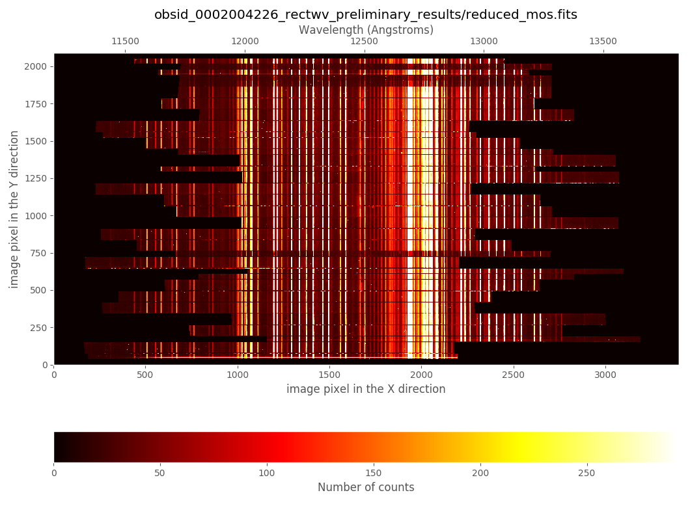

Refined rectification and wavelength calibration
================================================

Although the rectified and wavelength calibration image that we have just
obtained appears to be fine, looking in detail it is possible to realize that
both the absolute and relative wavelength calibration between slitlets are
still not perfect, and that there exists a small offset between the expected
and the observed slitlet frontiers. Fortunately, both problems can be easily
solved.

Two approaches are possible:

1. **Manual determination of X and Y offsets:** We can proceed following
   the same process previously described in :ref:`simple_example`.

2. **Automatic determination of X and Y offsets:** The fact that the scientific
   images correspond to a real MOS observation, and not a longslit observation
   performed by alignining the slitlets, facilitates the use of 2D
   cross-correlation to estimate the offsets between the expected and the
   observed image distortions. Note that if the slitlets are aligned to
   simulate a longslit, the cross-correlation in the vertical direction is
   unable to determine the vertical offset.

In this tutorial we are describing both approaches.

Manual determination of X and Y offsets
---------------------------------------

.. note::

   As described in :ref:`simple_example`, the task of visually finding the
   offsets can be performed with either the auxiliary PyEmir script
   ``pyemir-overplot_boundary_model``, or by using ``ds9`` with the auxiliary
   ds9-region files created during the preliminary rectification and wavelength
   calibration reduction. In the following two subsections we are using the
   latter option.

**Checking the spatial direction (Y axis)**

The offset in the spatial direction (Y axis) can be estimated by plotting the
expected slitlet frontiers (file ``ds9_frontiers_rawimage.reg`` placed within
the subdirectory ``obsid_0002004226_rectwv_preliminary_work``), derived in the
preliminary rectification and wavelength calibration, over the raw image:

::

   (emir) $ ds9 data/0002004226-20190424-EMIR-STARE_SPECTRA.fits &

- select ``scale --> zscale``

- select ``region --> load -->
  obsid_0002004226_rectwv_preliminary_work/ds9_frontiers_rawimage.reg``

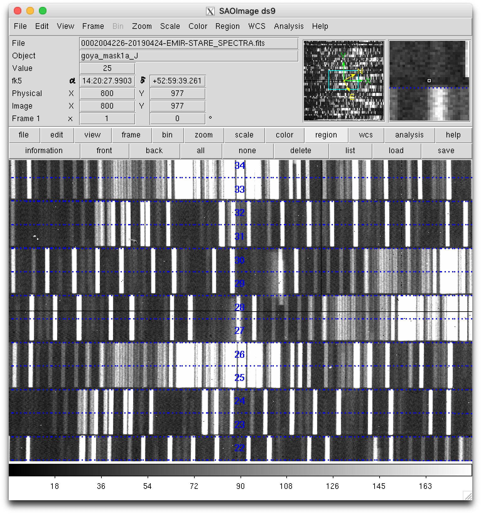

Zooming:

.. image:: images/0002004226_overplot2.png
   :width: 100%
   :alt: Image 0002004226 overplot 2

From this visual examination one concludes that ``global_integer_offset_y_pix:
-3``. Note that the sign of the offset is chosen to align the actual data
with the predicted frontiers (displayed with dotted blue lines).

**Checking the wavelength direction (X axis)**

.. warning::

   The refinement process here described is based on the use of airglow (OH)
   emission lines in the science frames. This assumes that airglow emission is
   much brighter than the target spectra. If this is not the case (for example
   when observing bright sources with short exposure times), the user should
   employ calibration arc images obtained before and/or after the science
   images. The refinement process should then be carried out as described in
   :ref:`simple_example`.

Continuing with the same ``ds9`` interface, overplot the expected location of
the airglow (OH) emission lines:

- select ``region --> load -->
  obsid_0002004226_rectwv_preliminary_work/ds9_oh_rawimage.reg``

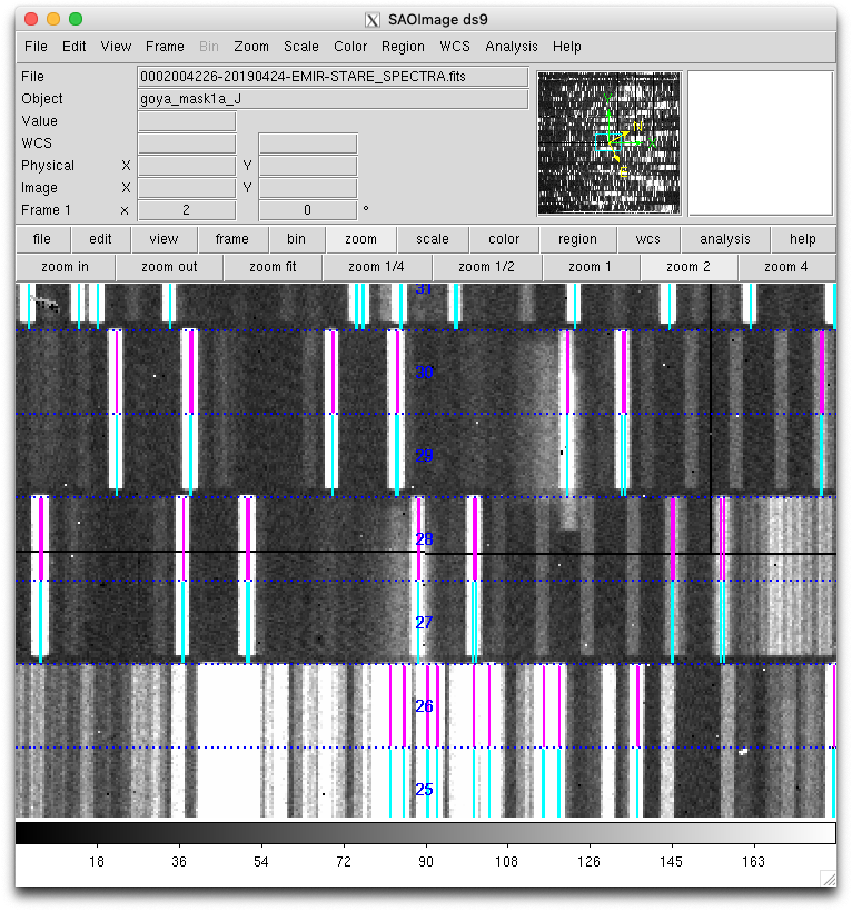

Note that the location of only the brightest OH lines are displayed. The visual
examination reveals that in this case ``global_integer_offset_x_pix: 1``. Note
that the sign of the offset is chosen to place the observed OH lines on the
predicted locations (displayed in cyan and magenta for the odd- and
even-numbered slitlets, respectively).

Improving the rectification and wavelength calibration
------------------------------------------------------

We are ready to obtain the refined rectification and wavelength calibration
coefficients using the integer offsets previously estimated. For that purpose
it is advisable to make use of the same auxiliary script that we used before:

::

   (emir) $ pyemir-generate_yaml_for_abba data/list_abba.txt \
     --step 1 \
     --refine_wavecalib_mode 12 \
     --minimum_slitlet_width_mm 1.475 \
     --maximum_slitlet_width_mm 3.0 \
     --global_integer_offset_x_pix 1 \
     --global_integer_offset_y_pix -3 \
     --rectwv_combined \
     --outfile 1_rectwv_combined.yaml

   Expected sequence pattern: ABBA
   Number of sequences......: 6
   Full set of images.......: ABBAABBAABBAABBAABBAABBA
   --> File 1_rectwv_combined.yaml generated!

Note that in this case the following arguments have been used:

- ``--step 1``: this indicates that the reduction recipe
  ``GENERATE_RECTWV_COEFF`` must carry out a refined estimation of the
  rectification and wavelength calibration coefficients.

- ``--refine_wavecalib_mode 12``: this indicates that the image corresponds to
  a science exposure, deep enough to detect OH sky lines, and that we are
  asking for a refinement of the wavelength calibration using that information.
  Note that if we were using an arc image, this parameter should be set to 2
  instead of 12 (as described in :ref:`simple_example`).

- ``--minimum_slitlet_width_mm 1.475`` and ``--maximum_slitlet_width_mm 3.0``:
  minimum and maximum slitlet widths (mm) for a slitlet to be considered as a
  scientific slitlet. Note that these numbers are compatible with the histogram
  of slitlet widths that we have obtained previously using
  ``pyemir-display_slitlet_arrangement`` with the parameter ``--n_clusters 2``.
  Only the slitlets which width was set within the specified range will be
  employed to derive a median sky spectrum (needed for the cross-correlation
  algorithm that is taking place during the refinement process). This allows to
  skip unused slitlets which could introduce noise in the cross-correlation
  method employed in the wavelength direction.

- ``--global_integer_offset_x_pix 1`` and ``--global_integer_offset_y_pix
  -3``: these are the offsets between the raw images and the expected
  empirical calibration, estimated as previously described.

- ``--rectwv_combined`` is just a flag (i.e. it is present or not, but has no
  associated value). **This flag is very important:** when present it indicates
  that all the images will be combined in a single image before computing the
  refined rectification and wavelength calibration coefficients. This implies
  that the calibration coefficients file ``rectwv_coeff.json`` will be the same
  for all the images. When the are offsets in the location of the OH lines (X
  direction) or in the location of the slitlet frontiers (Y direction), this
  flat must not be present. In this latter scenario, an individual
  rectification and wavelength calibration coefficients file
  ``rectwv_coeff.json`` will be generated for each individual image.

- ``--outfile 1_rectwv_combined.yaml`` indicates the name chosen for the
  observation result file. This file (shown below) has a single block making
  use of the reduction recipe ``GENERATE_RECTWV_COEFF``:

.. literalinclude:: 1_rectwv_combined.yaml
     :linenos:
     :lineno-start: 1

This file contains a single block with the 12 images. The ``requirements``
section appears with the parameters employed when invoking the script 
``pyemir-generate_yaml_for_abba``.

Execute the reduction recipe:

::

   (emir) $ numina run 1_rectwv_combined.yaml --link-files -r control.yaml
   ...
   ...

As expected, two new subdirectories have been created:

- ``obsid_0002004226_rectwv_combined_work``: temporary subdirectory where all
  the relevant files have been copied (or linked), and where the auxiliary
  ``ds9`` region lines have been stored.

- ``obsid_0002004226_rectwv_combined_results``: subdirectory where the
  results of the recipe are saved. In this case:

  ::

     (emir) $ tree obsid_0002004226_rectwv_combined_results/

     obsid_0002004226_rectwv_combined_results/
     ├── processing.log
     ├── rectwv_coeff.json
     ├── reduced_mos.fits
     ├── result.json
     └── task.json

  The interesting files here are ``rectwv_coeff.json``, containing the refined
  rectification and wavelength calibration coefficients, and
  ``reduced_mos.fits``, which is the rectified and wavelength calibrated image
  corresponding to the combination of all the images listed under the keyword
  ``frames:`` (line 4) in the observation result file
  ``1_rectwv_combined.yaml``.

.. warning::

   The refined rectification and wavelength calibration has been saved in the
   file ``rectwv_coeff.json`` stored in the
   ``obsid_0002004226_rectwv_combined_results`` subdirectory. This file can be
   applied, as described below, to any raw image (with the same CSU
   configuration).

   The file ``rectwv_coeff.json`` is stored in JSON format, and contains all
   the relevant information necessary to carry out the rectification and
   wavelength calibration of any image.

   Note: JSON is an open-standard file format that uses human readable text to
   transmit data objects (see details in `JSON description
   <https://www.json.org/>`_).

We can have a look to the reduced image:

::

   (emir) $ numina-ximshow obsid_0002004226_rectwv_combined_results/reduced_mos.fits

.. numina-ximshow obsid_0002004226_rectwv_combined_results/reduced_mos.fits --geometry 0,0,1060,850

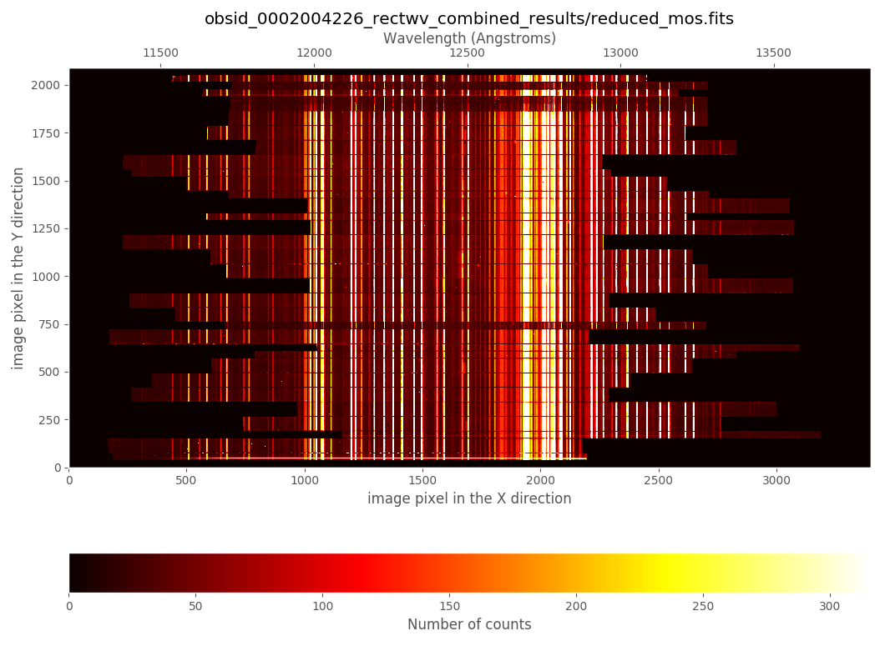

Comparing this new result with the preliminary rectified and wavelength
calibrated image shows that, apart from a global offset in the wavelength
calibration, the OH lines are much more aligned when moving along the spatial
direction:

.. howto:
   numina-ximshow obsid_0002004226_rectwv_preliminary_results/reduced_mos.fits --geometry 0,0,1060,850 --z1z2 0,1200 --bbox 1190,1250,1,2090 --> xxx1.png
   numina-ximshow obsid_0002004226_rectwv_combined_results/reduced_mos.fits --geometry 0,0,1060,850 --z1z2 0,1200 --bbox 1190,1250,1,2090 --> xxx2.png
   convert -delay 100 -loop 0 xxx[12].png 0002004226_rectwv_comparison.gif

.. only:: html

   .. image:: images/0002004226_rectwv_comparison.gif
      :width: 800
      :alt: Image 0002004226 comparison rectification and wavelength calibration

.. only:: latex

   |pic_comparison_rectwv_1| |pic_comparison_rectwv_2|

   .. |pic_comparison_rectwv_1| image:: images/0002004226_rectwv_comparison_1.png
      :width: 48%

   .. |pic_comparison_rectwv_2| image:: images/0002004226_rectwv_comparison_2.png
      :width: 48%

It is also possible to display the synthetic image, generated during the
execution of the reduction recipe, with the expected location of the airglow
(OH) lines (line intensities are normalized in the range from 0.0 to 1.0):

::

   (emir) $ numina-ximshow obsid_0002004226_rectwv_combined_work/expected_catalog_lines.fits \
     --z1z2 0,0.3

.. numina-ximshow obsid_0002004226_rectwv_combined_work/expected_catalog_lines.fits --geometry 0,0,1060,850 --z1z2 [-0.1,0.4]

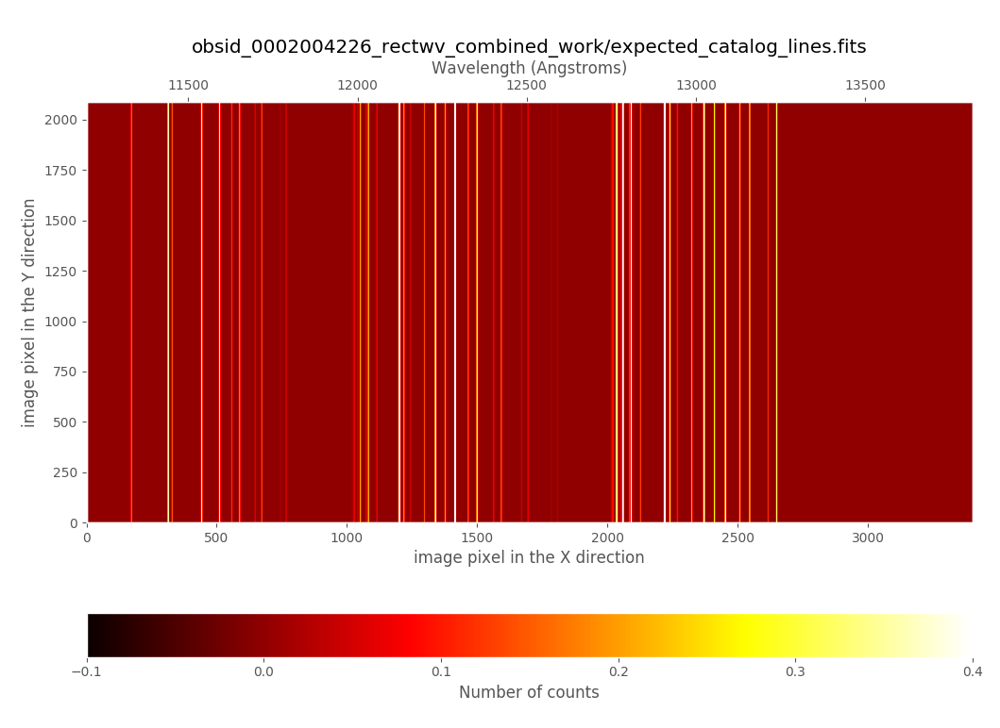

In the ``obsid_0002004226_rectwv_combined_work`` subdirectory you can also find
a file named ``crosscorrelation.pdf`` which contains a graphical summary of the
cross-correlation process in the wavelength direction for each useful slitlet.
A few pages of that file are the following:

.. howto:
   convert -density 200 crosscorrelation.pdf[121] 0002004226_crosscorrelation0.png
   convert -density 200 crosscorrelation.pdf[122] 0002004226_crosscorrelation1.png
   convert -density 200 crosscorrelation.pdf[123] 0002004226_crosscorrelation2.png
   convert -density 200 crosscorrelation.pdf[151] 0002004226_crosscorrelation3.png

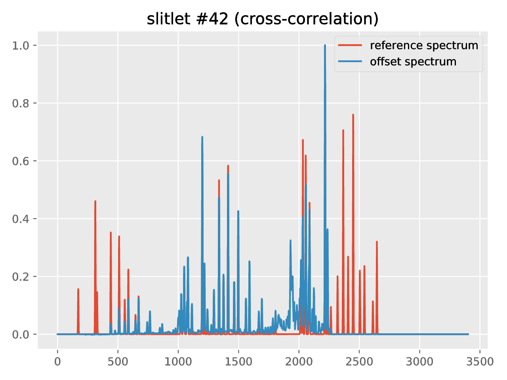

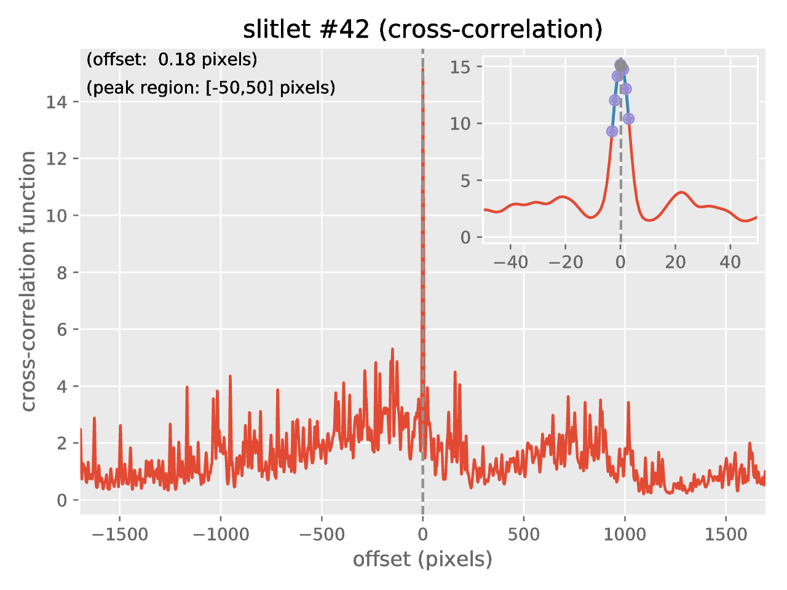

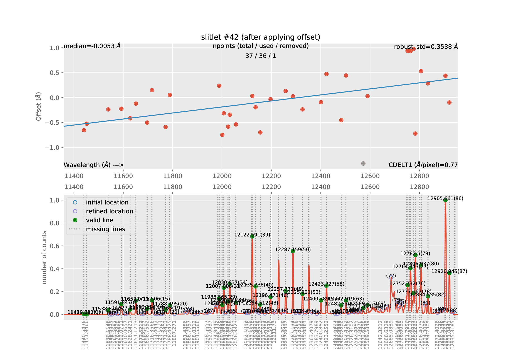

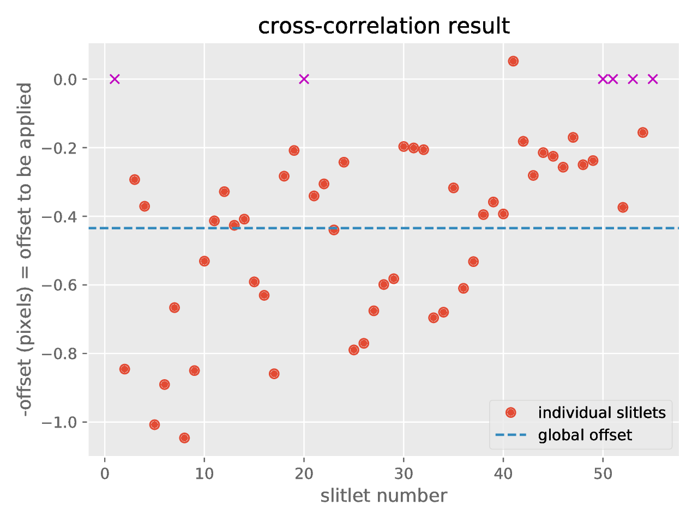

Automatic determination of X and Y offsets
------------------------------------------

As previously mentioned, the integer offsets in X and Y, that we have estimated
before with some effort, can be automatically determined by PyEmir when the
spectroscopic images correspond to MOS observations with the slitlets not
following a longslit pattern.

In order to use this option, copy the previous observation result file and
introduce the changes that are described next:

::

  (emir) $ cp 1_rectwv_combined.yaml 1_rectwv_combined_auto.yaml

  (emir) $ edit 1_rectwv_combined_auto.yaml
  ...

.. literalinclude:: 1_rectwv_combined_auto.yaml
     :linenos:
     :lineno-start: 1

Changes in ``1_rectwv_combined_auto.yaml`` in comparison with
``1_rectwv_combined.yaml``:

- Line 1: the suffix ``_auto`` has been added to the block ``id``

- Lines 33 and 34: both integer global offsets have been set to 0 (they are
  going to be estimated automatically!)

- Insert the new line 35, indicating ``global_integer_offsets_mode: auto``.
  This is the important keyword here: we are indicating that the integer global
  offsets should be computed automatically. In this sense, the previous two
  keywords ``global_integer_offset_x_pix:`` and
  ``global_interger_offset_y_pix`` must have been set to zero (or you'll get an
  error otherwise).

Execute the reduction recipe:

::

   (emir) $ numina run 1_rectwv_combined_auto.yaml --link-files -r control.yaml
   ...
   ...

The reduction now includes the generation of a synthetic image with the
expected location of the OH lines. This image is stored in the
``obsid_0002004226_rectwv_combined_auto_work`` subdirectory with the name
``synthetic_raw_image.fits``.

.. howto:
   cd obsid_0002004226_rectwv_combined_auto_work
   numina-ximshow synthetic_raw_image.fits  --geometry 0,0,650,850 --z1z2 0,40
   cd ..

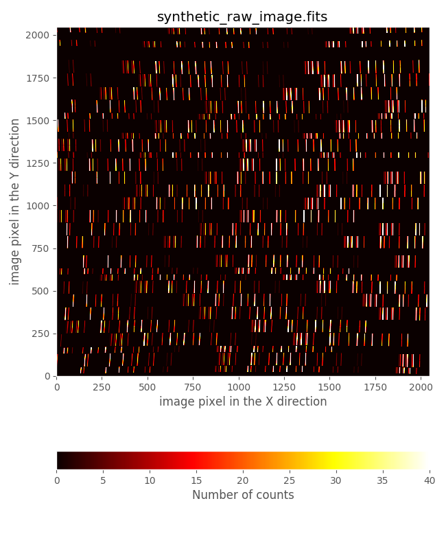

.. howto:
   cd obsid_0002004226_rectwv_combined_auto_work
   numina-ximshow synthetic_raw_image.fits  --geometry 0,0,650,850 --z1z2 0,40 --bbox 1100,1400,1100,1400 --> xxx1.png
   numina-ximshow reduced_image.fits  --geometry 0,0,650,850 --bbox 1100,1400,1100,1400 --z1z2 0,1200 --> xxx2.png
   convert -delay 100 -loop 0 xxx[12].png 0002004226_synthetic_comparison.gif
   cd ..

.. only:: html

   .. image:: images/0002004226_synthetic_comparison.gif
      :width: 800
      :alt: comparison between synthetic and original image

.. only:: latex

   |pic_comparison_synthetic_1| |pic_comparison_synthetic_2|

   .. |pic_comparison_rectwv_1| image:: images/0002004226_synthetic_comparison_1.png
      :width: 48%

   .. |pic_comparison_rectwv_2| image:: images/0002004226_synthetic_comparison_2.png
      :width: 48%

The automatic procedure has determined the following offset values:

- ``global_integer_offset_x_pix: 1``

- ``global_integer_offset_y_pix: -3``

These numbers are the same as the ones that we estimated previously. For that
reason, the resulting refined rectification and wavelength calibrations
coefficients are the same:

::

   (emir) $ diff \
     obsid_0002004226_rectwv_combined_auto_results/rectwv_coeff.json \
     obsid_0002004226_rectwv_combined_results/rectwv_coeff.json 

   8c8
   <   "uuid": "1139443e-99db-11e9-b393-3c15c2e3dc50",
   ---
   >   "uuid": "aca6d82e-99da-11e9-abf7-3c15c2e3dc50",
   18c18
   <     "creation_date": "2019-06-28T19:29:37.736426",
   ---
   >     "creation_date": "2019-06-28T19:26:49.004673",

Note that the contents of both files are identical except for the unique
``uuid`` (that identifies each particular calibration) and the
``creation_date``.

Fast ABBA combination
=====================

The reduction recipe `` ABBA_SPECTRA_FAST_RECTWV`` performs a fast ABBA
combination since it employs a single rectification and wavelength calibration
solution for all the individual images. For that reason, all the A images in
the ABBA sequences can be combined before rectification and wavelength
calibration. The same occurs with the B images. The resulting A minus B
combination is then rectified and wavelength calibrated (i.e., the
rectification and wavelength calibration process is carried out only once).

**Note that this recipe assumes that the images listed in the file**
``data/list_abba.txt`` **follow an ABBA pattern**.

::

  (emir) $ pyemir-generate_yaml_for_abba data/list_abba.txt \
    --step 2 --rectwv_combined --outfile 2_abba_fast.yaml 

   Expected sequence pattern: ABBA
   Number of sequences......: 6
   Full set of images.......: ABBAABBAABBAABBAABBAABBA
   --> File 2_abba_fast.yaml generated!
   
The observation result file ``2_abba_fast.yaml`` has the following content:

.. literalinclude:: 2_abba_fast.yaml
     :linenos:
     :lineno-start: 1

The ``requirements`` section (lines 29-36) is now different:

- ``pattern``: indicates that the images in the ``frames`` sections correspond
  to ABBA sequences. That means that the total number of images must be an
  interger multiple of 4.

- ``rectwv_coeff``: the value that appears here is the expected file name for
  the rectification and wavelength calibration coefficients of the first image.
  Since the calibrations are assumed to be placed within the ``data``
  subdirectory, note that the path of this calibration starts with a ``../`` in
  order to indicate that the calibration is not in the default place but in the
  ``results`` subdirectory corresponding to the reduction of a particular image
  Another alternative is to copy that ``rectwv_json.file`` into the ``data``
  subdirectory, in which case you do not need to include any path (note that in
  this case it is advisable to rename the json file to avoid name collisions
  with similar calibration files).

- ``method``: combination method. The three available possibilities are
  ``sigmaclip``, ``mean`` and ``median``.

- ``method_kwargs``: additional parameters that control the behavior of the
  combination method. These options are only available for the ``sigmaclip``
  method, where the user can set the ``low`` and ``high`` rejection limits (in
  units of the standard deviation).

- ``voffset_pix``: indicates the offset (in pixels) between the A and B images.
  Leaving this number as zero means that no attempt to merge the A and B images
  is going to be performed.

::

  (emir) $ numina run 2_abba_fast.yaml --link-files -r control.yaml

Two results are produced by this recipe (see subdirectory
``obsid_abba_fast_results``):

- ``reduced_mos_abba.fits``: computed as the sum of all the A images minus the
  sum of all the B images. This image should exhibit A spectra with positive
  signal (white) and B spectra with negative signal (black).

- ``reduced_mos_abba_combined.fits``: in this image the coadded A and B spectra
  are combined by multiplying the coadded B spectra in
  ``reduced_mos_abba.fits`` by minus one (in order to obtain spectra with
  positive signal), shifting the result along the spatial direction by
  ``voffset_pix`` pixels, and summing the coadded A spectra. When
  ``voffset_pix=0`` this image is empty.

.. numina-ximshow obsid_abba_fast_results/reduced_mos_abba.fits --geometry 0,0,650,850 --z1z2 [-5,5]

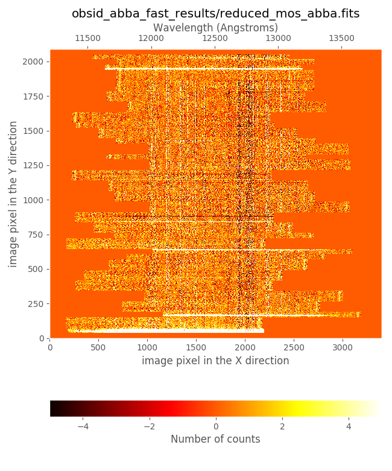

Making a zoom in the resulting combined image, we estimate that the vertical
offsets between A and B spectra (white and black, respectively) is around 38
pixels. We can introduce this number in the requirement ``voffset_pix``:

::

   (emir) $ cp 2_abba_fast.yaml 2_abba_fast_bis.yaml

   (emir) $ edit 2_abba_fast_bis.yaml
   ...

We modify the label in line 1 (adding the suffix ``_bis``), and set the
vertical offset to 38 pixels in line 36:

.. literalinclude:: 2_abba_fast_bis.yaml
   :linenos:
   :emphasize-lines: 1, 36
   :lineno-start: 1

Execute the again the same reduction recipe but using the new observation
result file:

::

  (emir) $ numina run 2_abba_fast_bis.yaml --link-files -r control.yaml

.. numina-ximshow obsid_abba_fast_bis_results/reduced_mos_abba_combined.fits --geometry 0,0,650,850 --z1z2 [-5,5]

Since we have provided a non-zero value for ``voffset_pix``, the image
``reduced_mos_abba_combined.fits`` is not empty but contains the proper 
coaddition of all the A and B spectra. All the targets that have been properly
observed in the A and the B images should appear here three times: two in
negative (black spectra) and one in positive (white spectrum in between the
black ones).

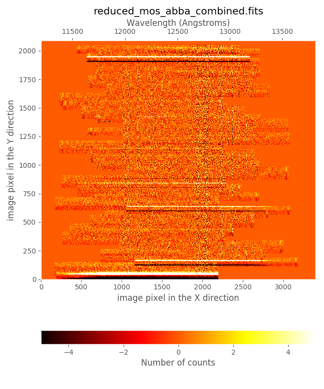

.. warning::

   It is important to keep in mind how the signal in the combined images has
   been scaled:

   - ``reduced_mos_abba.fits``: each target spectrum should appear twice: one
     in positive (white) and one in negative (black). The signal in both
     spectra must have a similar number of counts. Each spectrum has the signal
     corresponding to ``EXPTIME``.

   - ``reduced_mos_abba_combined.fits``: each target spectrum should appear
     three times: one in positive (white) and two in negative (black; at both
     sides of the positive spectrum). The signal in the white spectrum (which
     is the combination of the A and B spectra in the previous image
     ``reduced_mos_abba.fits``) corresponds to ``EXPTIME``.  This means that
     the signal in each of the negative spectrum has been scaled to
     ``EXPTIME/2``.

Careful ABBA combination
========================

In the previous combination we have assumed that in all the A images the
targets were in exactly the same location in the slitlets. The same was assumed
for the B images.

However, it is possible to check whether this was actually the case by looking
in detail at some bright sources. For example, in these observations, 4 stars
were employed to align the CSU on sky. The brightest one was placed in slitlet
number 2. Let's select all the A images and display a zoom around this slitlet
region:

::

   (emir) $ list_a=`fitsheader data/0002004*.fits -k IMGOBBL -f | awk '$2 == 1 || $2 == 4 {print $1}'`

   (emir) $  numina-ximshow $list_a \
    --bbox 86,2047,9,70 \
    --z1z2 0,1100 \
    --pdffile brightspectrum_a.pdf \
    --keystitle ra,dec,rotang."RA: %s, DEC: %s, rotang: %5.2f"

The first command defines the list of images for which the keyword ``IMGOBBL``
is either 1 or 4 (A images). The second command generates a PDF file in which
a zoom around slitlet number 2 is displayed for all the selected images.

.. howto:
   list_a=`fitsheader data/0002004*.fits -k IMGOBBL -f | awk '$2 == 1 || $2 == 4 {print $1}'`
   numina-ximshow $list_a \
    --bbox 86,2047,9,70 \
    --z1z2 0,1100 \
    --pdffile brightspectrum_a.pdf \
    --keystitle ra,dec,rotang."RA: %s, DEC: %s, rotang: %5.2f"
   convert -delay 100 -loop 0 brightspectrum_a.pdf brightspectrum_a.gif

.. only:: html

   .. image:: images/brightspectrum_a.gif
      :width: 800
      :alt: variation of brightspectrum of A images

.. only:: latex

   |pic_brightspec_0|
   |pic_brightspec_1|
   |pic_brightspec_2|
   |pic_brightspec_3|
   |pic_brightspec_4|
   |pic_brightspec_5|
   |pic_brightspec_6|
   |pic_brightspec_7|
   |pic_brightspec_8|
   |pic_brightspec_9|
   |pic_brightspec_10|
   |pic_brightspec_11|

   .. |pic_brightspec_0| image:: images/brightspectrum_a_0.png
      :width: 32%

   .. |pic_brightspec_1| image:: images/brightspectrum_a_1.png
      :width: 32%

   .. |pic_brightspec_2| image:: images/brightspectrum_a_2.png
      :width: 32%

   .. |pic_brightspec_3| image:: images/brightspectrum_a_3.png
      :width: 32%

   .. |pic_brightspec_4| image:: images/brightspectrum_a_4.png
      :width: 32%

   .. |pic_brightspec_5| image:: images/brightspectrum_a_5.png
      :width: 32%

   .. |pic_brightspec_6| image:: images/brightspectrum_a_6.png
      :width: 32%

   .. |pic_brightspec_7| image:: images/brightspectrum_a_7.png
      :width: 32%

   .. |pic_brightspec_8| image:: images/brightspectrum_a_8.png
      :width: 32%

   .. |pic_brightspec_9| image:: images/brightspectrum_a_9.png
      :width: 32%

   .. |pic_brightspec_10| image:: images/brightspectrum_a_10.png
      :width: 32%

   .. |pic_brightspec_11| image:: images/brightspectrum_a_11.png
      :width: 32%

It is clear that the actual location of the A spectra changed along the
sequence. Unfortunately, there were no bright spectra in the B images to check
what was happening with the spectra in the B images (the stars in A images
disappear when moving from A to B; this was done on purpose with the idea o
maximizing the number of slitlets devoted to scientific targets).  Note that
here we are displaying the original FITS images, where the sky background is
still present. Anyway, it is reasonable to think that similar shifts could have
also occurred between the individual B images.

A careful combination method should take care of these offsets along the
spatial direction before combining the individual images.

PyEmir tries to handle this problem with the reduction recipe
``ABBA_SPECTRA_RECTWV`` which in principle is able to:

- compute relative offsets between A images before their combination

- compute relative offsets between B images before their combination

- compute relative offsets between the combined A images and the combined B
  images before generating the final combined image

In addition, this recipe can use the same rectification and wavelength
calibration coefficients for all the individual images (as we have done
previously) or different calibrations for each one.

Including relative offsets between A and B images
-------------------------------------------------

Since, as we have just seen, it is possible that there are offsets between the
different A and B locations, a first thing one can fix is the proper alignment
of all the A images before coadding them, and the same with the B images.

Without going into too many details, the recipe ``ABBA_SPECTRA_RECTWV``
computes an averaged spatial profile of a particular target (hopefully bright
enough) in the all the A images, and the same for an object in the B images.
Cross-correlating these spatial profiles it is possible to compute de relative
offsets of all the A images relative to the first A image. The same process is
carried out with the B images, using in this case the first B image as
reference. Note that bright OH sky lines are masked before computing the
spatial profiles. 

When the object selected for the A and B images is the same, the recipe is also
able to compute the relative offset between the combined A and the combined B
images. However, sometimes the science targets are too faint to provide useful
spatial profiles for the cross-correlation method to work properly, and the
bright stars employed to align the slitlets on the sky are only present in the
A images (in order to maximize the number of slitlets allocated to science
targets). In the latter scenario, the relative offset between the combined A
images and the combined B images cannot be automatically computed.

A template of observation result file making use of this recipe can be
generated with the help of the auxiliary script
``pyemir-generate_yaml_for_abba`` with the argument ``--step 3``:

::

   (emir) $ pyemir-generate_yaml_for_abba data/list_abba.txt \
     --step 3 --rectwv_combined --outfile 3_abba_template.yaml 

   Expected sequence pattern: ABBA
   Number of sequences......: 6
   Full set of images.......: ABBAABBAABBAABBAABBAABBA
   --> File 3_abba_template.yaml generated!
   
The observation result generated, ``3_abba_template.yaml``, has the following
content:

.. literalinclude:: 3_abba_template.yaml
   :linenos:
   :emphasize-lines: 1, 36-46
   :lineno-start: 1

The ``id`` label (line 1) is again different (to avoid overwriting the previous
reductions). The ``requirements`` section now contains a new subsection called
``refine_target_along_slitlet`` (lines 36-46), where specific parameters for
the computation of the relative offsets between images appear.  Some of them
are predefined, but others need to be inserted by the user (in particular, 
all the *To Be Defined* ``TBD`` values):

- ``npix_removed_near_ohlines``: before computing the spatial profiles of the
  selected targets in the A and B images, the bright OH lines are masked. This
  parameter indicates the number of pixels (at each side of the expected
  location of the lines) that are masked. For grism J, H and K (high
  resolution), a reasonable number is 2 or 3. For grism LR (low resolution)
  this number should be 1 or even 0 (zero means that only the central pixel is
  masked), since the number of pixels between OH lines is not too large.

- ``nwidth_medfilt``: after masking the bright OH lines, a median filter is
  applied in the spectral direction with a size given by this parameter.

- ``save_individual_images``: a value of 0 indicates that some intermediate
  images (e.g. the individual shifted images after computing the relative
  offsets with respect to the first A or B images) do not need to be saved in 
  the ``work`` subdirectory. This is useful to save disk space. Setting this
  parameter to 1 allows those images to be saved.
  
- ``ab_different_target``: 

  - Setting this parameter to 0 means that the target chosen to determine the
    offsets within the A and within the B images is the same. In that case the
    recipe will automatically compute the relative offset between the A and B
    images using cross-correlation again.

  - Setting this parameter to 1 or -1 indicates that the target is different
    and the recipe will apply the offset computed from the WCS information in
    the image headers. In this case, the sign of this parameter indicates the
    relative position of A and B targets in the images: a value of 1 means that
    the B targets appear above the A targets in the original images, whereas
    -1 means that the B targets appear below the A targets.

- ``vpix_region_a_target``: pixel interval in the spatial direction enclosing
  the bright target in the A images. This should include not only the target
  itself but some sky region around it. **Note that these numbers must be
  measured in the rectified and wavelength calibrated images**.

- ``vpix_region_a_sky``: pixel interval in the spatial direction where the sky
  level can be estimated for the previous bright target. 

- ``vpix_region_b_target`` and ``vpix_region_b_sky`` play the same role as
  the previous two parameters, but for the bright B target.

- ``list_valid_wvregions_a``: list (python-style, between brackets) of
  wavelength intervals to be employed to compute the average spatial profile of
  the bright A target. If this parameter does not appear in the observation
  result file, it means that the whole spectral range will be employed. This
  parameter is useful when the target is only bright in some wavelength ranges,
  or when, for any reason, the user wants to select particular wavelength
  ranges.

- ``list_valid_wvregions_b``: this parameter is analogous to the previous one,
  but for the bright B target.

In order to decide appropriate values for these parameters, it is useful to
examine the result of the previous reduction, overplotting the ds9 regions
corresponding to the boundaries of the different slitlets:

::

   (emir) $ ds9 obsid_abba_fast_bis_results/reduced_mos_abba.fits &

- select ``scale --> zscale``

- select ``region --> load --> obsid_abba_fast_bis_work/ds9_boundaries_rectified.reg``

The distribution tgz file of this example already generated a file in our
directory tree named ``3_abba.yaml``. Note that in the ``requirements`` 
section of this file you can find the relevant parameters already set:

::

   (emir) $ $ diff 3_abba_template.yaml 3_abba.yaml 
   40,46c40,46
   <     ab_different_target: TBD
   <     vpix_region_a_target: [TBD, TBD]
   <     vpix_region_a_sky: [TBD, TBD]
   <     vpix_region_b_target: [TBD, TBD]
   <     vpix_region_b_sky: [TBD, TBD]
   <     list_valid_wvregions_a: [ [TBD, TBD], [TBD, TBD] ]
   <     list_valid_wvregions_b: [ [TBD, TBD], [TBD, TBD] ]
   ---
   >     ab_different_target: 1
   >     vpix_region_a_target: [41, 76]
   >     vpix_region_a_sky: [67, 74]
   >     vpix_region_b_target: [853, 910]
   >     vpix_region_b_sky: [853, 871]
   >     list_valid_wvregions_a: [ [11600, 12677], [12702, 12850] ]
   >     list_valid_wvregions_b: [ [11700, 12677], [12702, 12960] ]

In this example we do not have spectra of any of the bright 4 stars in the B
images. This means that although we can choose the bright star spectrum in
slitlet 2 as the reference target of the A images, for the B images we must
conform with the brightest (although much fainter) science target spectrum,
that appears in slitlet 24.  Since both reference targets are different, we
must set ``ab_different_target`` to a non-zero value, which implies that the
final combination of A and B spectra will be performed by using the WCS
information in the image headers to determine the offset between both set of
images. Finally, since B spectra appear above the A exposures, this parameter
should be set to 1 (instead of -1).

::

   (emir) $ numina run 3_abba.yaml --link-files -r control.yaml
   ...
   ...

The execution time of this recipe is larger than the time required by the
faster ``ABBA_SPECTRA_FAST_RECTWV`` recipe because now:

- every single image has to be rectified and wavelength calibrated
  independently, prior to the determination of the relative offsets between
  images

- after the offset determination (via cross-correlation) the images have to be
  shifted in the spatial direction (using fractions of pixels, which takes
  additional time)

.. numina-ximshow obsid_abba_results/reduced_mos_abba_combined.fits --geometry 0,0,650,850 --z1z2 [-5,5]

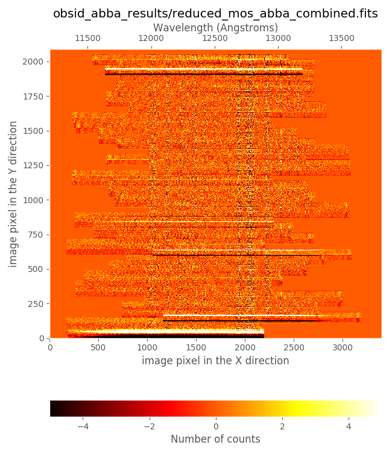

Using a different rectification and wavelength calibration for each image
=========================================================================

So far we have derived a single rectification and wavelength calibration
coefficients file ``rectwv_coeff.json`` that has been applied to the 24
scientific images. However, it is possible that for long ABBA sequences, some
offsets between the scientific images themselves may appear. These offsets must
not be confused with the different location of the targets along the spatial
direction (which are due to errors in the dithering pattern). In this case we
are referring to offsets that can be detected as variations in
the location of the OH lines (X direction) or in the slitlet frontiers (Y
direction) when comparing different images. These variations are easy to detect
(when present) making a zoom in a relatively small are of the images:

::

   (emir) $ numina-ximshow data/0002004*fits --bbox 1180,1320,1180,1280  \
     --z1z2 0,1100 --pdffile abba_imageoffsets.pdf  \
     --keystitle ra,dec,rotang."RA: %s, DEC: %s, rotang: %5.2f"

.. numina-ximshow data/0002004*fits --bbox 1180,1320,1180,1280  --z1z2 0,1100 --pdffile abba_imageoffsets.pdf  --keystitle ra,dec,rotang."RA: %s, DEC: %s, rotang: %5.2f"
   convert -delay 50 -loop 0 abba_imageoffsets.pdf abba_imageoffsets.gif

.. only:: html

   .. image:: images/abba_imageoffsets.gif
      :width: 800
      :alt: looking for offsets between individual images

.. only:: latex

   |pic_abba_offset_0|
   |pic_abba_offset_1|
   |pic_abba_offset_2|
   |pic_abba_offset_3|
   |pic_abba_offset_4|
   |pic_abba_offset_5|
   |pic_abba_offset_6|
   |pic_abba_offset_7|
   |pic_abba_offset_8|
   |pic_abba_offset_9|
   |pic_abba_offset_10|
   |pic_abba_offset_11|
   |pic_abba_offset_12|
   |pic_abba_offset_13|
   |pic_abba_offset_14|
   |pic_abba_offset_15|
   |pic_abba_offset_16|
   |pic_abba_offset_17|
   |pic_abba_offset_18|
   |pic_abba_offset_19|
   |pic_abba_offset_20|
   |pic_abba_offset_21|
   |pic_abba_offset_22|
   |pic_abba_offset_23|

   .. |pic_abba_offset_0| image:: images/abba_imageoffsets_0.png
      :width: 24%

   .. |pic_abba_offset_1| image:: images/abba_imageoffsets_1.png
      :width: 24%

   .. |pic_abba_offset_2| image:: images/abba_imageoffsets_2.png
      :width: 24%

   .. |pic_abba_offset_3| image:: images/abba_imageoffsets_3.png
      :width: 24%

   .. |pic_abba_offset_4| image:: images/abba_imageoffsets_4.png
      :width: 24%

   .. |pic_abba_offset_5| image:: images/abba_imageoffsets_5.png
      :width: 24%

   .. |pic_abba_offset_6| image:: images/abba_imageoffsets_6.png
      :width: 24%

   .. |pic_abba_offset_7| image:: images/abba_imageoffsets_7.png
      :width: 24%

   .. |pic_abba_offset_8| image:: images/abba_imageoffsets_8.png
      :width: 24%

   .. |pic_abba_offset_9| image:: images/abba_imageoffsets_9.png
      :width: 24%

   .. |pic_abba_offset_10| image:: images/abba_imageoffsets_10.png
      :width: 24%

   .. |pic_abba_offset_11| image:: images/abba_imageoffsets_11.png
      :width: 24%

   .. |pic_abba_offset_12| image:: images/abba_imageoffsets_12.png
      :width: 24%

   .. |pic_abba_offset_13| image:: images/abba_imageoffsets_13.png
      :width: 24%

   .. |pic_abba_offset_14| image:: images/abba_imageoffsets_14.png
      :width: 24%

   .. |pic_abba_offset_15| image:: images/abba_imageoffsets_15.png
      :width: 24%

   .. |pic_abba_offset_16| image:: images/abba_imageoffsets_16.png
      :width: 24%

   .. |pic_abba_offset_17| image:: images/abba_imageoffsets_17.png
      :width: 24%

   .. |pic_abba_offset_18| image:: images/abba_imageoffsets_18.png
      :width: 24%

   .. |pic_abba_offset_19| image:: images/abba_imageoffsets_19.png
      :width: 24%

   .. |pic_abba_offset_20| image:: images/abba_imageoffsets_20.png
      :width: 24%

   .. |pic_abba_offset_21| image:: images/abba_imageoffsets_21.png
      :width: 24%

   .. |pic_abba_offset_22| image:: images/abba_imageoffsets_22.png
      :width: 24%

   .. |pic_abba_offset_23| image:: images/abba_imageoffsets_23.png
      :width: 24%

Although the previous animation does not show an apparent variation in the
location of the OH lines throughout the whole ABBA sequence, we are going to
illustrate here how to proceed if that were the case.

A way to confront a situation in which there are offsets between the individual
images is to employ an individual
``rectwv_coeff.json`` file, specifically computed for each single scientific
image.

The simple way to do it is making again use of the auxiliary script
``pyemir-generate_yaml_for_abba``:

::

   (emir) $ pyemir-generate_yaml_for_abba data/list_abba.txt \
     --step 1 \
     --refine_wavecalib_mode 12 \
     --minimum_slitlet_width_mm 1.475 \
     --maximum_slitlet_width_mm 3.0 \
     --global_integer_offset_x_pix 1 \
     --global_integer_offset_y_pix -3 \
     --outfile 1_rectwv_individual.yaml

   Expected sequence pattern: ABBA
   Number of sequences......: 6
   Full set of images.......: ABBAABBAABBAABBAABBAABBA
   --> File 1_rectwv_individual.yaml generated!

Note that here we have used the script with the same parameters that we
employed above to generate ``1_rectwv_combined.yaml``, but here we have omitted
the flat ``--rectwv_combined``. Leaving out this parameter leads to the
following observation result file (that we have named
``1_rectwv_individual.yaml`` to avoid overwritting the previous one):

.. literalinclude:: 1_rectwv_individual.yaml
     :linenos:
     :lineno-start: 1

The new file is much larger because it contains an individual block for each
individual image. The ``requirements`` parameters have the same values as those
in the previous ``1_rectwv_combined.yaml`` file. The execution of the new
observation result file will logically take longer since now the reduction
recipe will be executed 24 times instead of one:

::

   (emir) $ numina run 1_rectwv_individual.yaml --link-files -r control.yaml
   ...
   ...

The previous execution will have created the corresponding ``work`` and
``results`` subdirectories for each individual frame, i.e.:

-  24 subdirectories ``obsid_0002004???_rectwv_work``

-  24 subdirectories ``obsid_0002004???_rectwv_results``

The combination of all the ABBA images should now be performed using an
observation result file that must contain the list of all the files
``rectwv_coeff.json`` generated within the  ``obsid_0002004???_rectwv_work``
subdirectories. This file can be generated automatically using, once again, the
auxiliary script ``pyemir-generate_yaml_for_abba``:

::

   (emir) $ pyemir-generate_yaml_for_abba data/list_abba.txt --step 3 --outfile 3_abba_template_individual.yaml

Note that in this case we have not employed the flag ``--rectwv_combined``
(that we used previously when generating ``3_abba_template.yaml``). The new
observation result file ``3_abba_template_individual.yaml`` has the following
content:

.. literalinclude:: 3_abba_template_individual.yaml
   :linenos:
   :emphasize-lines: 31-55
   :lineno-start: 1

The difference between the new file ``3_abba_template_individual.yaml`` and the
previous ``3_abba_template.yaml`` is that the ``requirements`` section now
contains the keyword ``list_rectwv_coeff`` (line 31) followed by a list of the
24 locations of the individual ``rectwv_coeff.json`` files (lines 32 to 55).

Before making use of this file via numina, we have to fill the ``TBD``
parameters under the ``refine_target_along_slitlet`` block. 

The distribution tgz file of this example already generated a file in our
directory tree named ``3_abba_individual.yaml``. Note that in the 
``requirements`` section of this file you can find the relevant parameters 
already set:

::

   (emir) $ diff 3_abba_template_individual.yaml 3_abba_individual.yaml 

   1c1
   < id: _abba
   ---
   > id: _abba_individual
   64,70c64,70
   <     ab_different_target: TBD
   <     vpix_region_a_target: [TBD, TBD]
   <     vpix_region_a_sky: [TBD, TBD]
   <     vpix_region_b_target: [TBD, TBD]
   <     vpix_region_b_sky: [TBD, TBD]
   <     list_valid_wvregions_a: [ [TBD, TBD], [TBD, TBD] ]
   <     list_valid_wvregions_b: [ [TBD, TBD], [TBD, TBD] ]
   ---
   >     ab_different_target: 1
   >     vpix_region_a_target: [41, 76]
   >     vpix_region_a_sky: [67, 74]
   >     vpix_region_b_target: [853, 910]
   >     vpix_region_b_sky: [853, 871]
   >     list_valid_wvregions_a: [ [11600, 12677], [12702, 12850] ]
   >     list_valid_wvregions_b: [ [11700, 12677], [12702, 12960] ]

Note that, apart from the filled ``TBD`` numbers, we have also modified the
first line of the observation result file to provide a different ``id`` label a
avoid overwriting previous reductions:

::

   (emir) $ numina run 3_abba_individual.yaml --link-files -r control.yaml
   ...
   ...

Finally, we can compare the result of this reduction, in which we have employed
an individual ``rectwv_coeff.json`` file for each of the 24 scientific images,
with the one derived using the same ``rectwv_coeff.json`` for all of them:

.. numina-ximshow obsid_abba_individual_results/reduced_mos_abba_combined.fits obsid_abba_results/reduced_mos_abba_combined.fits --bbox 500,1500,795,890 --pdffile abba_combined_comparison.pdf --z1z2 [-7,7] --figuredict "{'figsize':(8, 10), 'dpi':100}"
   convert -delay 50 -loop 0 abba_combined_comparison.pdf abba_combinedcomparison.gif

.. only:: html

   .. image:: images/abba_combinedcomparison.gif
      :width: 800
      :alt: comparison between using single of multiple rectwv_coeff.json files

.. only:: latex

   |pic_abba_combined_comparison_0| |pic_abba_combined_comparison_1|

   .. |pic_abba_combined_comparison_0| image:: images/abba_combinedcomparison_0.png
      :width: 48%

   .. |pic_abba_combined_comparison_1| image:: images/abba_combinedcomparison_1.png
      :width: 48%

Not surprisingly, the combination obtained after using the 24 individual
``rectwv_coeff.json`` files is not very different from the one derived
employing a single ``rectwv_coeff.json`` file, since there were not apparent
offsets between the images. In any case, the combination with the 24 individual
calibrations exhibits larger residuals at the locations of the bright airglow
OH lines (the target spectra between the lines are basically unchanged). This
increase in the residuals may come from the inherent errors in the wavelength
calibration coefficients: even small errors in the wavelength calibration imply
a slightly different resampling of the bright lines.

The conclusion of this comparison is:

- When there are no apparent offsets between individual images, employ a single
  ``rectwv_coeff.json`` file.

- When there are apparent offsets, you can:

  - Use the method described in this last section to generate an individual
    ``rectwv_coeff.json`` file for each image (even though you may get larger
    OH line residuals).

  - Segregate your ABBA blocks in different subsets (within which no apparent
    offsets between images are detected) and reduce each subset separately,
    using a single ``rectwv_coeff.json`` for each one.
