.. _mos_example:

***********
MOS example
***********

.. warning::

   All the commands are assumed to be executed in a terminal running the **bash
   shell**.

   Don't forget to activate the same Python environment employed to install
   PyEmir.  In this document, the prompt ``(py36) $`` will indicate that this
   is the case.

.. note::

   It is assumed that the reader has already followed the previous section of
   this tutorial :ref:`simple_example`. Some of the concepts already introduced
   there are not going to be repeated here with the same level of detail (or
   even mentioned at all!).

Let's consider the rectification and wavelength calibration of a MOS image with
slitlets configured in a non-longslit pattern.

Download the following file: `EMIR_mos_example.tgz 
<http://nartex.fis.ucm.es/~ncl/emir/EMIR_mos_example.tgz>`_.

Decompress the previous file:

::

   (py36) $ tar zxvf EMIR_mos_example.tgz
   ...
   ...
   (py36) $ rm EMIR_mos_example.tgz

A new subdirectory named ``EMIR_mos_exmaple`` should have appeared, with the
following content:

::

   (py36) $ tree EMIR_mos_example
   EMIR_mos_example/
   ├── 00_mos_example.yaml
   ├── 01_mos_example.yaml
   ├── 02_mos_example.yaml
   ├── control.yaml
   └── data
       ├── 0001572158-20180530-EMIR-STARE_SPECTRA.fits
       ├── 0001572187-20180530-EMIR-STARE_SPECTRA.fits
       ├── 0001572216-20180530-EMIR-STARE_SPECTRA.fits
       ├── 0001572245-20180530-EMIR-STARE_SPECTRA.fits
       ├── 0001572274-20180530-EMIR-STARE_SPECTRA.fits
       ├── 0001572303-20180530-EMIR-STARE_SPECTRA.fits
       ├── 0001572332-20180530-EMIR-STARE_SPECTRA.fits
       ├── 0001572361-20180530-EMIR-STARE_SPECTRA.fits
       ├── 0001572414-20180530-EMIR-STARE_SPECTRA.fits
       ├── 0001572443-20180530-EMIR-STARE_SPECTRA.fits
       ├── 0001572472-20180530-EMIR-STARE_SPECTRA.fits
       ├── 0001572501-20180530-EMIR-STARE_SPECTRA.fits
       ├── master_bpm.fits
       ├── master_dark.fits
       ├── master_flat.fits
       ├── rect_wpoly_MOSlibrary_grism_H_filter_H.json
       ├── rect_wpoly_MOSlibrary_grism_J_filter_J.json
       ├── rect_wpoly_MOSlibrary_grism_K_filter_Ksp.json
       ├── rect_wpoly_MOSlibrary_grism_LR_filter_HK.json
       └── rect_wpoly_MOSlibrary_grism_LR_filter_YJ.json

   1 directory, 24 files

Move into the ``EMIR_mos_example`` directory:

::

   (py36) $ cd EMIR_mos_example

This directory contains a subdirectory ``data/`` with the following files:

- The first 12 FITS files ``0001572*.FITS`` correspond to science exposures. In
  this case, the targets were observed following the typical ABBA scheme (in
  particular, the 12 images correspond to 3 consecutive ABBA blocks).

- ``master_bpm.fits`` is a preliminary bad-pixel-mask image (pixels in this
  image with values different from zero are interpolated).

- ``master_dark.fits`` is a dummy 2048x2048 image of zeros (this image is
  typically not necessary since in the IR the reduction of science observations
  usually requires de subtraction of consecutive images).

- ``master_flat.fits`` is a dummy 2048x2048 image of ones (in a more realistic
  reduction this image should have been obtained previously).

- The ``rect_wpoly_MOSlibrary_grism*.json`` files contain the empirical
  calibration for rectification and wavelength calibration for different
  grism+filter configurations.

Remain in the ``EMIR_simple_example`` directory. From here you are going to
execute the pipeline.

You can easily examine the header of the 12 science files using the utilities 
``dfits`` and ``fitsort`` (previously mentioned):

::

   (py36) $ dfits data/0001572* | fitsort object grism filter exptime date-obs
   FILE                                            	OBJECT     	GRISM   	FILTER  	EXPTIME   	DATE-OBS              	
   data/0001572158-20180530-EMIR-STARE_SPECTRA.fits	MOS example	J       	J       	359.986465	2018-05-30T22:50:16.03	
   data/0001572187-20180530-EMIR-STARE_SPECTRA.fits	MOS example	J       	J       	359.986465	2018-05-30T22:56:25.08	
   data/0001572216-20180530-EMIR-STARE_SPECTRA.fits	MOS example	J       	J       	359.986465	2018-05-30T23:02:28.88	
   data/0001572245-20180530-EMIR-STARE_SPECTRA.fits	MOS example	J       	J       	359.986465	2018-05-30T23:08:37.93	
   data/0001572274-20180530-EMIR-STARE_SPECTRA.fits	MOS example	J       	J       	359.986465	2018-05-30T23:15:03.87	
   data/0001572303-20180530-EMIR-STARE_SPECTRA.fits	MOS example	J       	J       	359.986465	2018-05-30T23:21:11.87	
   data/0001572332-20180530-EMIR-STARE_SPECTRA.fits	MOS example	J       	J       	359.986465	2018-05-30T23:27:15.66	
   data/0001572361-20180530-EMIR-STARE_SPECTRA.fits	MOS example	J       	J       	359.986465	2018-05-30T23:33:24.72	
   data/0001572414-20180530-EMIR-STARE_SPECTRA.fits	MOS example	J       	J       	359.986465	2018-05-31T00:00:25.01	
   data/0001572443-20180530-EMIR-STARE_SPECTRA.fits	MOS example	J       	J       	359.986465	2018-05-31T00:06:34.07	
   data/0001572472-20180530-EMIR-STARE_SPECTRA.fits	MOS example	J       	J       	359.986465	2018-05-31T00:12:37.86	
   data/0001572501-20180530-EMIR-STARE_SPECTRA.fits	MOS example	J       	J       	359.986465	2018-05-31T00:18:46.92

Have a look to any of the tree raw arc images (the three images are similar).
For that purpose you can use ``ds9`` or the visualization tool provided with
numina:
   
::

   (py36) $ numina-ximshow data/0001572158-20180530-EMIR-STARE_SPECTRA.fits

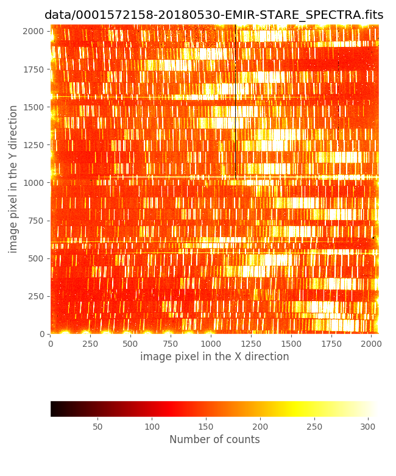

The CSU configuration
=====================

It is clear from the previous figure that the EMIR slitlets were not configured
in `longslit` mode, but in `MOS` mode. In addition, it is important to
highlight that not all the slitlets were opened (i.e., the slits not assigned
to a particular scientific target were closed in order to avoid spurious
spectra in the image; note that even for the closed slitlets the corresponding
CSU bars are not completely closed to avoid collisions)

The slitlet configuration can be easily displayed with the help of the
auxiliary PyEmir script ``pyemir-display_slitlet_arrangement`` (please, note
the use in this case of the additional parameter ``--n_clusters 2``):

::

   (py36) $ pyemir-display_slitlet_arrangement \
     data/0001572158-20180530-EMIR-STARE_SPECTRA.fits \
     --n_clusters 2
   ...
   ...
   ---> separator:   1.295

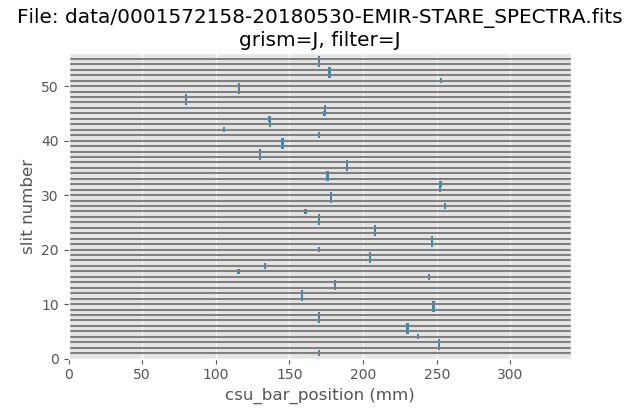

The first figure displays the slitlet arrangement.

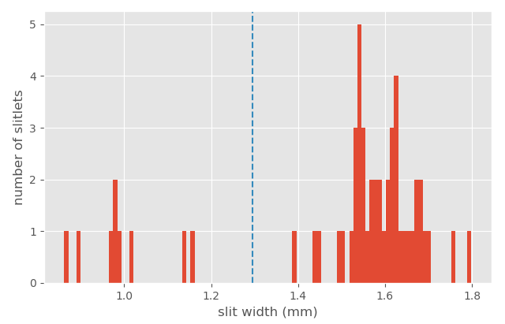

Note that in this case we have employed the parameter ``--n_clusters 2``, that
forces the script to display a histogram of slitlet widths, and to compute two
clusters and a separating value (in this case 1.295 mm) which classifies the
slitlets in two groups: slitlets closed (widths < 1.295 mm) and opened (width >
1.295 mm). This number will be used later.

Preliminary rectification and wavelength calibration
====================================================

As explained in :ref:`simple_example`, the rectification and wavelength
calibration of any EMIR spectroscopic image can be obtained with two levels of
quality:

- **preliminary calibration**: without auxiliary calibration images, computed
  from the empirical calibration derived by the instrument team.

- **refined calibration**: that refines the empirical calibration by making use
  of either additional calibration images (i.e., arcs) or by using the airglow
  (OH) emission lines. 
  
  
*The refinement process requires an initial estimation of the offsets in the
spatial (Y axis) and spectral (X axis) directions between the empirical
calibration and the actual data. These two offsets can be easily estimated
after computing the preliminary calibration.*

In this example, for the preliminary rectification and wavelength calibration
one can simply reduce any of the twelve scientific images.
Have a look to the observation result file ``00_mos_example.yaml``:

::

   id: 2158preliminary
   instrument: EMIR
   mode: GENERATE_RECTWV_COEFF
   frames:
    - 0001572158-20180530-EMIR-STARE_SPECTRA.fits
   enabled: True

Execute the reduction recipe:

::

   (py36) $ numina run 00_mos_example.yaml -r control.yaml
   ...
   ...

As expected, two new subdirectories have been created: 
``obsid2158preliminary_work`` and ``obsid2158preliminary_results``.

::

   (py36) $ numina-ximshow obsid2158preliminary_results/reduced_mos.fits

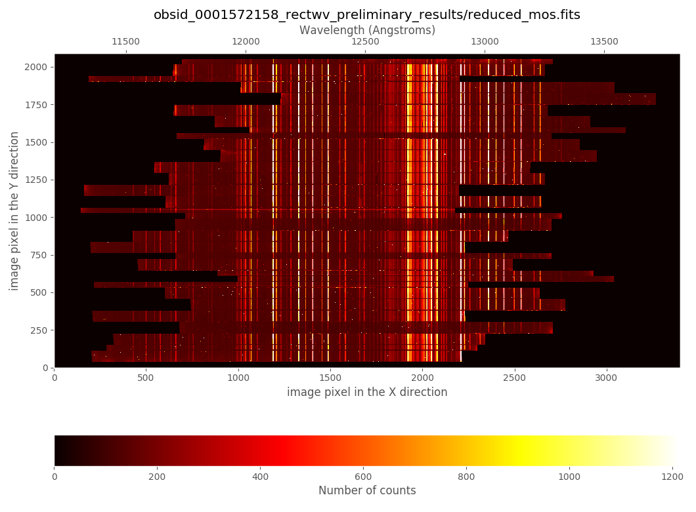

Refined rectification and wavelength calibration
================================================

Alghough the rectified and wavelength calibration image that we have just
obtained appears to be fine, looking in detail it is possible to realize that
the absolute and relative wavelength calibration between slitlets is still not
perfect and that there exists a small offset between the expected and the
observed slitlet frontiers. Fortunately, both problems can be easily solved.

.. note::

   As described in :ref:`simple_example`, the task of finding the offsets can
   be performed with either the auxiliary PyEmir script
   ``pyemir-overplot_boundary_model``, or by using ``ds9`` with the auxiliary
   ds9-region files created during the preliminary rectification and wavelength
   calibration reduction. In the following two subsections we are using the
   latter option.

Checking the spatial direction (Y axis)
---------------------------------------

The offset in the spatial direction (Y axis) can be estimated by plotting the
expected slitlet frontiers (file
``obsid2158preliminary_work/ds9_frontiers_rawimage.reg``), derived in the
preliminary rectification and wavelength calibration, over the raw image:

::

   (py36) $ ds9 data/0001572158-20180530-EMIR-STARE_SPECTRA.fits &

- select ``scale --> zscale``

- select ``region --> load -->
  obsid2158preliminary_work/ds9_frontiers_rawimage.reg``

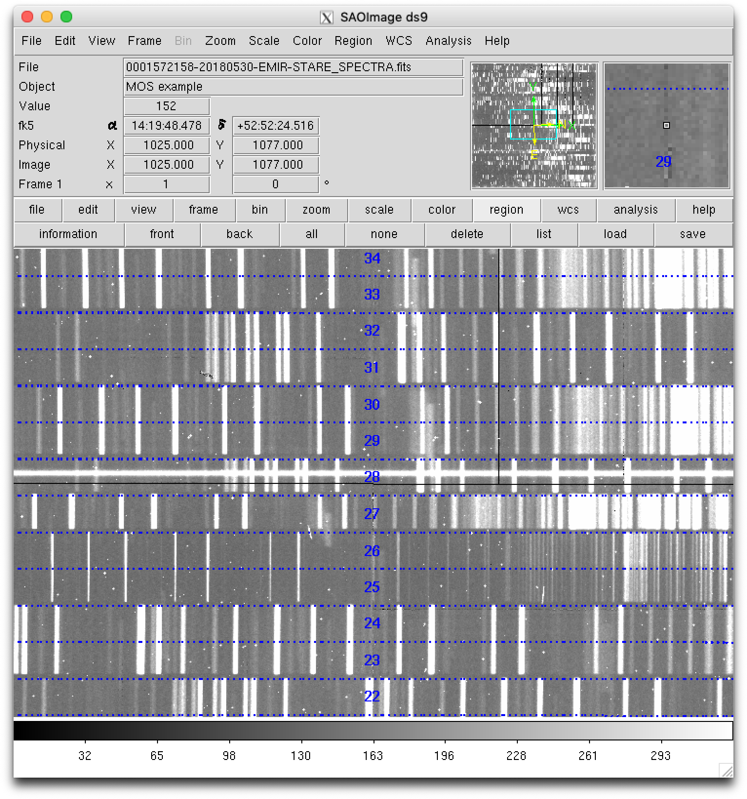

Zooming:

.. image:: images/0001572158_overplot2.png
   :width: 800
   :alt: Image 0001572158 overplot 2

From this visual examination one concludes that ``global_integer_offset_y_pix:
-4``. Note that the sign of the offset is chosen to place the actual data
within the predicted frontiers (displayed with dotted blue lines).

Checking the wavelength direction (X axis)
------------------------------------------

.. warning::

   The refinement process here described is based on the use of airglow (OH)
   emission lines in the science frames. This assumes that the target spectra
   are not dominant over the airglow emission. If this is not the case (for
   example when observing bright sources with short exposure times), the user
   should employ calibration arc images obtained before and/or after the
   science images. The refinement process should then be carried out as
   described in :ref:`simple_example`.

Continuing with the same ``ds9`` interface, overplot the expected location of
the airglow (OH) emission lines:

- select ``region --> load -->
  obsid2158preliminary_work/ds9_oh_rawimage.reg``

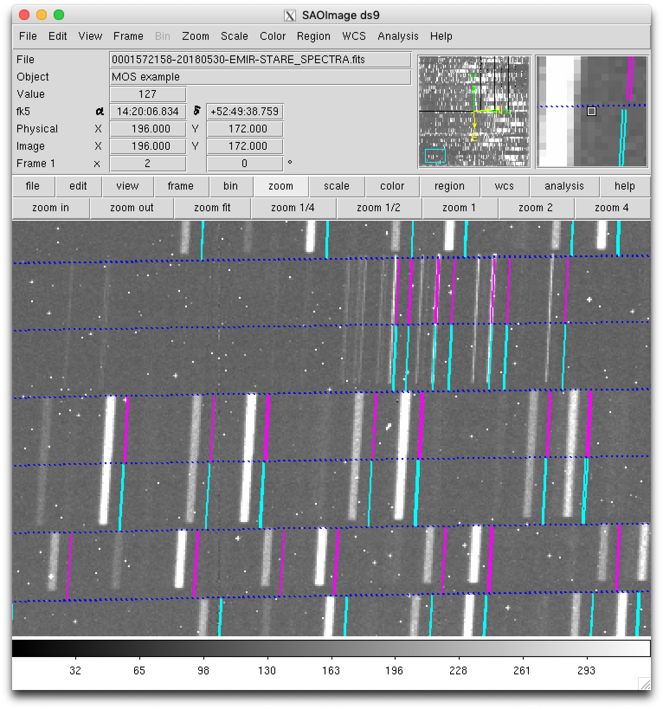

Note that the location of only the brightest OH lines are displayed. The visual
examination reveals that in this case ``global_integer_offset_x_pix: 8``. Note
that the sign of the offset is chosen to place the observed OH lines on the
predicted locations (displayed in cyan and magenta for the odd- and
even-numbered slitlets, respectively).

Improving the rectification and wavelength calibration
------------------------------------------------------

For the refined rectification and wavelength calibration we are going to use
the observation result file ``01_mos_example.yaml``:

::

   id: 2158refined
   instrument: EMIR
   mode: GENERATE_RECTWV_COEFF
   frames:
    - 0001572158-20180530-EMIR-STARE_SPECTRA.fits
    - 0001572187-20180530-EMIR-STARE_SPECTRA.fits
    - 0001572216-20180530-EMIR-STARE_SPECTRA.fits
    - 0001572245-20180530-EMIR-STARE_SPECTRA.fits
    - 0001572274-20180530-EMIR-STARE_SPECTRA.fits
    - 0001572303-20180530-EMIR-STARE_SPECTRA.fits
    - 0001572332-20180530-EMIR-STARE_SPECTRA.fits
    - 0001572361-20180530-EMIR-STARE_SPECTRA.fits
    - 0001572414-20180530-EMIR-STARE_SPECTRA.fits
    - 0001572443-20180530-EMIR-STARE_SPECTRA.fits
    - 0001572472-20180530-EMIR-STARE_SPECTRA.fits
    - 0001572501-20180530-EMIR-STARE_SPECTRA.fits
   enabled: True
   requirements:
     refine_wavecalib_mode: 12
     minimum_slitlet_width_mm: 1.295
     maximum_slitlet_width_mm: 2.000
     global_integer_offset_x_pix: 8 
     global_integer_offset_y_pix: -4

If you compare this file with the previous one (``00_mos_example.yaml``) you 
can see the following changes:

- We are using the 12 raw images (not only the first one). The reduction recipe
  is going to compute the median of the 12 images, improving the signal to
  noise ratio, prior to the rectification and wavelength calibration process.
  Thus, the end result of this reduction recipe will be a single calibrated
  image.

- We have introduced a ``requirements`` block, defining the following
  parameters:

   - ``refine_wavecalib_mode: 12``: this indicates that the image corresponds
     to a science exposure, deep enough to detect OH sky lines, and that we are
     asking for a refinement of the wavelength calibration using that
     information. Note that if we were using an arc image, this parameter
     should be set to ``2`` instead of ``12`` (as described in
     :ref:`simple_example`).

   - ``minimum_slitlet_width_mm: 1.295`` and ``maximum_slitlet_width_mm:
     2.000``: minimum and maximum slitlet widths (mm) to be considered as a
     scientific slitlet. Note that these numbers are compatible with the
     histogram of slitlet widths that we have obtained previously using
     ``pyemir-display_slitlet_arrangement`` with the parameter ``n_clusters
     2``. Only the slitlets which width was set within the specified range will
     be employed to derive a median sky spectrum (needed for the
     cross-correlation algorithm that is taking place during the refinement
     process).

   - ``global_integer_offset_x_pix: 8`` and ``global_integer_offset_y_pix:
     -4``: these are the offsets between the raw images and the expected
     empirical calibration, estimated as previously described.

Execute the reduction recipe:

::

   (py36) $ numina run 01_mos_example.yaml -r control.yaml
   ...
   ...

As expected, two new subdirectories have been created: 
``obsid2158refined_work`` and ``obsid2158refined_results``.

::

   (py36) $ numina-ximshow obsid2158refined_results/reduced_mos.fits

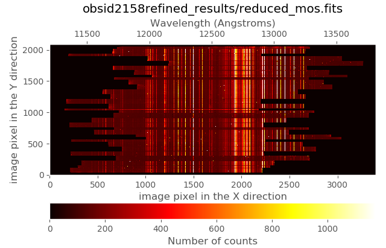

It is possible to display the synthetic image with the expected location of the
airglow (OH) lines (remember that the line intensities are normalized in the
range from 0.0 to 1.0):

::

   (py36) $ numina-ximshow obsid2158refined_work/expected_catalog_lines.fits --z1z2 0,0.3

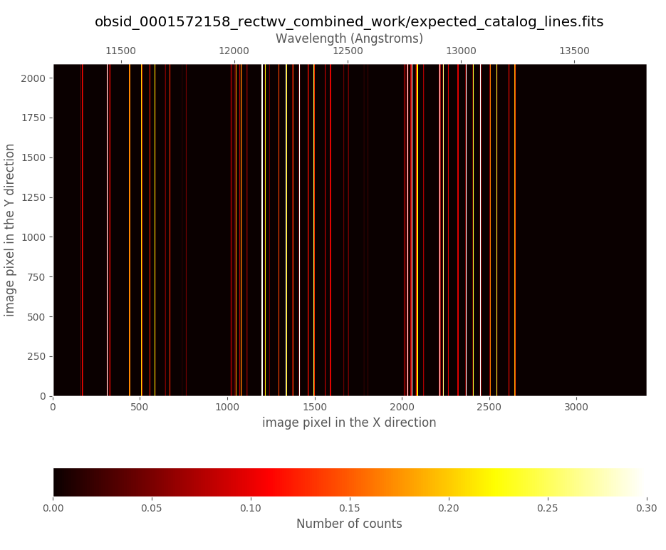

In the ``obsid2158refined_work`` subdirectory you can find a file named
``crosscorrelation.pdf`` which contains a graphical summary of the
cross-correlation process. In particular, you have an individual plot for each
slitlet showing the cross-correlation function:

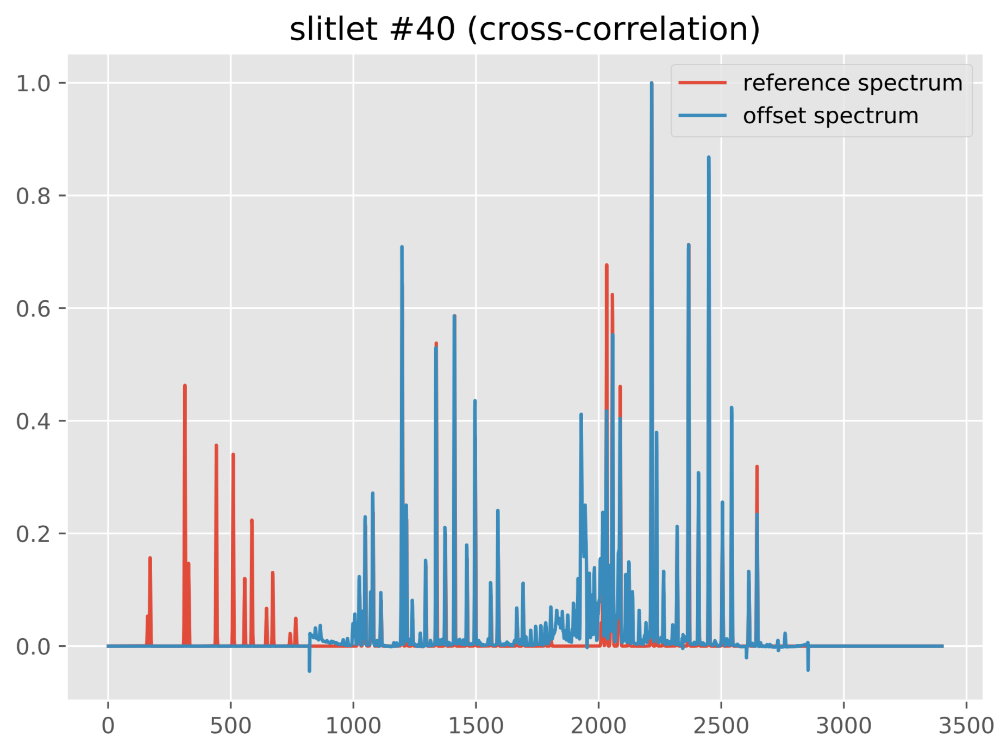

.. image:: images/0001572158_crosscorrelation1.png
   :width: 800
   :alt: cross-correlation example 1

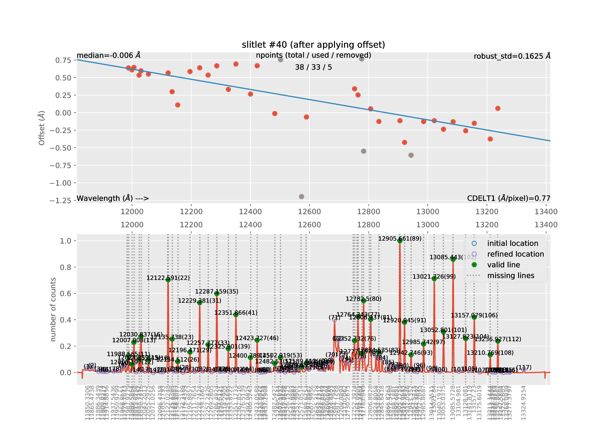

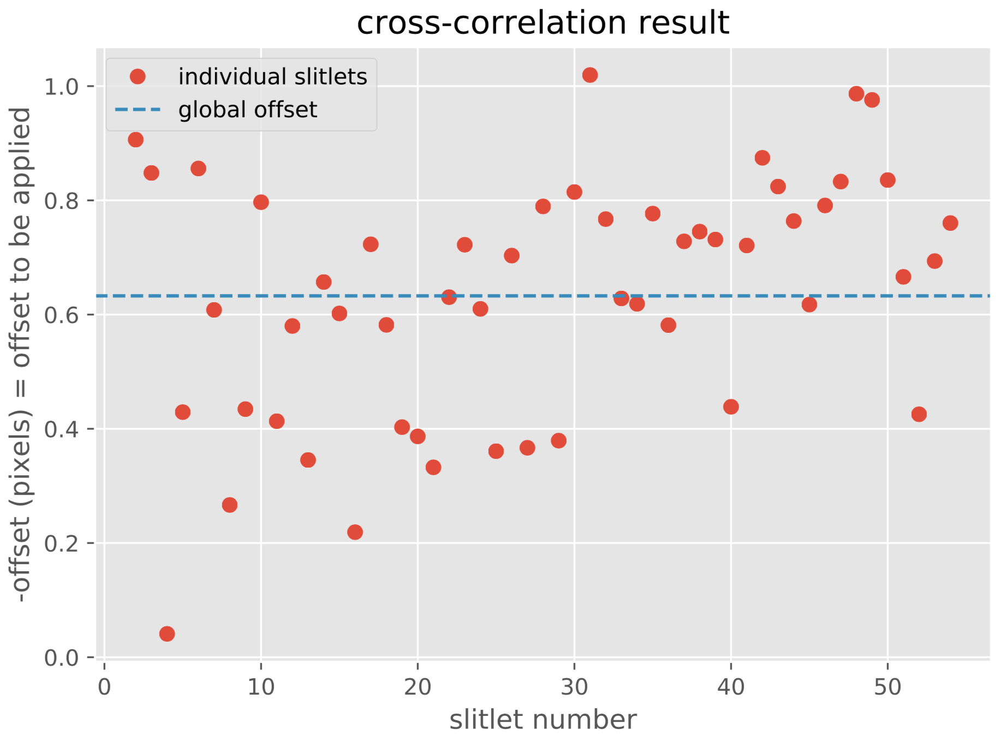

.. warning::

   The refined rectification and wavelength calibration has been saved in the
   file ``obsid2158refined_results/rectwv_coeff.json``. This file can be
   applied, as described in the next section, to any raw image (with the same
   CSU configuration).

   This file, stored in JSON format, contains all the relevant information
   necessary to carry out the rectification and wavelength calibration of any
   image.

   Note: JSON is an open-standard file format that uses human readable text to
   transmit data objects (see details in `JSON description
   <https://www.json.org/>`_).

Applying the refined rectification and wavelength calibration
=============================================================

Placing the refined calibration in ``data/`` subdirectory
---------------------------------------------------------

The first step is to copy the file containing the refined rectification and
wavelength calibration (in this case
``obsid2158refined_results/rectwv_coeff.json``) into the ``data/``
subdirectory. Since the this JSON file has a generic name, it is advisable to
rename it in order to avoid overwritting it by accident:

::

   (py36) $ cp obsid2158refined_results/rectwv_coeff.json data/rectwv_coeff_2158refined.json

Preparing the observation result file
-------------------------------------

Next, one needs to generate a new observation result file in which each
individual raw frame is going to be rectified and wavelength-calibrated using
the refined calibration previously computed. For our case this file is
``02_mos_example.yaml``. The first 42 lines of this file are:

.. literalinclude:: 02_mos_example.yaml
   :lines: 1-42
   :emphasize-lines: 1-8, 37-41
   :linenos:
   :lineno-start: 1

Note that this file is more complex than the previous observation result files
employed in this tutorial. In this sense, the main differences are:

- The file contains several blocks, one for each reduction recipe to be
  executed. Each block is separated from the next one by a separating line
  containing just three dashes (``---``). In the previous display the first
  and the fifth block have been highlighted (lines 1-8, and 37-41).
  
  - Do not forget the separation line between blocks (otherwise the pipeline
    will no recognize where one block ends and the next one begins).

  - This separation line must not appear after the last block.
  
- Comment lines in this file start by a hash (``#``) symbol.

- Each block contains a different ``id``, which means that the execution of
  each block is going to generate two different subdirectories (`work` and
  `results`), in order to avoid overwritting the intermediate work and final
  results derived from the executions of each reduction recipe.

The previous display shows the first 5 blocks:

- The first 4 blocks (lines 1-8, 10-17, 19-26 and 28-35) correspond to the
  rectification and wavelength calibration of the first four individual images
  of the first ABBA observation pattern employed at the telescope. 
  
  - **Note that the reduction recipe is** ``STARE_SPECTRA_RECTWV``, which
    indicates that the pipeline is not going to use the empirical calibration
    but the refined calibration previously obtained. The specific name of the
    file containing this refined calibration must be given in the requirements
    section of each block under the label ``rectwv_coeff`` (remember that
    the refined calibration file has been copied to the ``data/`` subdirectory
    and renamed as ``rectwv_coeff_2158refined.json``). We are using the same
    refined calibration for the 12 science images (the three ABBA observation
    blocks).

  - The ``id`` label for each block has been arbitrarily set to the last 4
    digits of the running number that uniquely identifies each raw image
    obtained with the GTC.

  - The resulting reduced image for each one of the 12 science images will be 
    stored as ``reduced_mos.fits`` under the corresponding ``results``
    subdirectory.  ``reduced_mos.fits``.

- The fifth block (lines 37-41) is the responsible of computing the arithmetic
  combination A-B-B+A sequence, using for that purpose the result (rectified
  and wavelength calibrated image) of the previous four blocks.

  - In this case there is no ``frames:`` field in the block, but a
    ``children:`` field. This field contains a list with the ``id`` of the four
    relevant blocks (``[2158, 2187, 2216, 2245]``), which correspond,
    respectively to the A, B, B, and A image within the ABBA sequence.

  - **The reduction recipe is** ``LS_ABBA``.

  - The ``id`` of this fifth block has been chosen to be ``ABBA1``.

  - The corresponding `work` and `results` subdirectory will be created.
   
  - The result of the A-B-B+A combination will be stored as
    ``reduced_mos_abba.fits`` under the ``results`` subdirectory.

If you examine the rest of the file ``02_mos_example.yaml`` you will find that
the same pattern of 5 blocks is actually repeated three times, once for each of
the three ABBA sequences.

Finally, there is an additional block at the end of the observation result file 
(lines 130-137) that reads:

.. literalinclude:: 02_mos_example.yaml
   :lines: 130-137
   :linenos:
   :lineno-start: 130

This block is responsible of computing the median of the results of
the previous blocks identified as ``ABBA1``, ``ABBA2`` and ``ABBA3``:

- **The reduction recipe is** ``BASIC_COMBINE``. Within the ``requirements``
  field of this block we have specified the combination method (``median``,
  altough ``sum`` and ``mean`` are also valid options).

- There is no ``frames:`` field in the block, but a
  ``children:`` field. This field contains a list with the ``id`` of the three
  relevant blocks (``[ABBA1, ABBA2, ABBA3]``).

- The additional requirement ``field: reduced_mos_abba`` indicates that the
  results from the reduction of the ``ABBA1``, ``ABBA2`` and ``ABBA3`` blocks
  that are going to be used as input are the images named
  ``reduced_mos_abba.fits`` (these files can be found within the corresponding
  ``obsidABBA1_result``, ``obsidABBA2_result`` and ``obsidABBA3_result``
  subdirectories).

- The final combined result is ``result.fits`` under the
  ``obsidABBA_combined_results`` subdirectory.
 
Here is a summary of the different blocks that constitute the observation
result file ``02_mos_example.yaml``:

============== ============================================  ======================
id             input                                         recipe
============== ============================================  ======================
2158           0001572158-20180530-EMIR-STARE_SPECTRA.fits   STARE_SPECTRA_RECTWV
2187           0001572187-20180530-EMIR-STARE_SPECTRA.fits   STARE_SPECTRA_RECTWV
2216           0001572216-20180530-EMIR-STARE_SPECTRA.fits   STARE_SPECTRA_RECTWV
2245           0001572245-20180530-EMIR-STARE_SPECTRA.fits   STARE_SPECTRA_RECTWV
ABBA1          4 files reduced_mos.fits (within              LS_ABBA
               obsidXXXX_results/,
               where XXXX=2158, 2187,2216 and 2245)
2274           0001572274-20180530-EMIR-STARE_SPECTRA.fits   STARE_SPECTRA_RECTWV
2303           0001572303-20180530-EMIR-STARE_SPECTRA.fits   STARE_SPECTRA_RECTWV
2332           0001572332-20180530-EMIR-STARE_SPECTRA.fits   STARE_SPECTRA_RECTWV
2361           0001572361-20180530-EMIR-STARE_SPECTRA.fits   STARE_SPECTRA_RECTWV
ABBA2          4 files reduced_mos.fits (within              LS_ABBA
               obsidXXXX_results/,
               where XXXX=2274, 2303, 2332 and 2361)
2414           0001572414-20180530-EMIR-STARE_SPECTRA.fits   STARE_SPECTRA_RECTWV
2443           0001572443-20180530-EMIR-STARE_SPECTRA.fits   STARE_SPECTRA_RECTWV
2472           0001572472-20180530-EMIR-STARE_SPECTRA.fits   STARE_SPECTRA_RECTWV
2501           0001572501-20180530-EMIR-STARE_SPECTRA.fits   STARE_SPECTRA_RECTWV
ABBA3          4 files reduced_mos.fits (within              LS_ABBA
               obsidXXXX_results/,
               where XXXX=2414, 2443, 2472 and 2501)
ABBA_combined  3 files reduced_mos_abba.fits (within         BASIC_COMBINE (median)
               obsidABBAX_results/, where X=1, 2 and 3)
============== ============================================  ======================

Executing the observation result file
-------------------------------------

The last step consists in running numina with the observation result file
described in the previous subsection:

::

   (py36) $ numina run 02_mos_example.yaml -r control.yaml
   ...
   ...

The execution of all the blocks may require a few minutes (depending on your
computer speed). The final image will be stored in the
``obsidABBA_combined_results`` subdirectory:

::

  (py36) $ ds9 obsidABBA_combined_results/result.fits

- select ``region --> load ->
  obsid2158refined_work/ds9_boundaries_rectified.reg``

- select ``region --> load ->
  obsid2158refined_work/ds9_frontiers_rectified.reg``

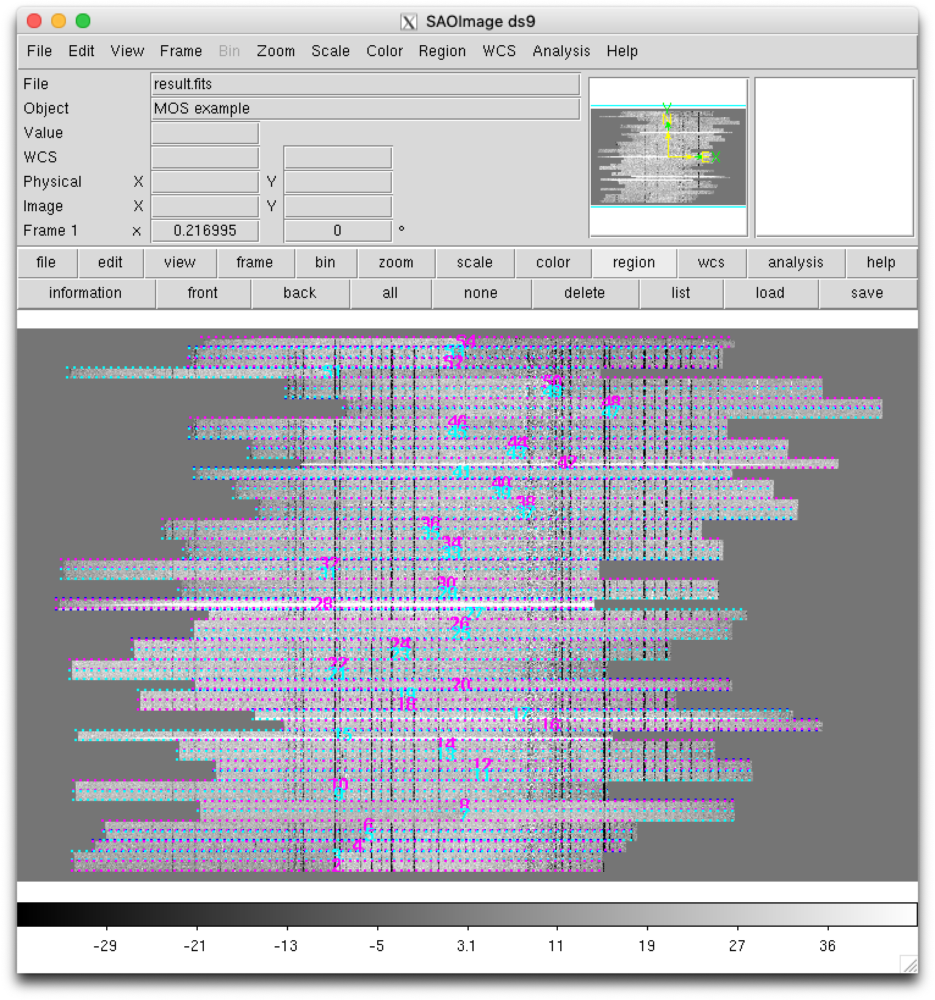

.. note::

   Remember that the ds9-region files with the refined boundaries and
   frontiers were stored in the ``obsid2158refined_work/`` subdirectory!

