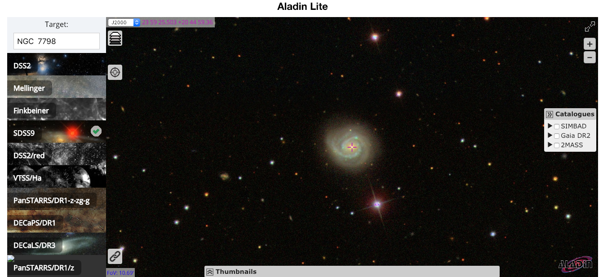
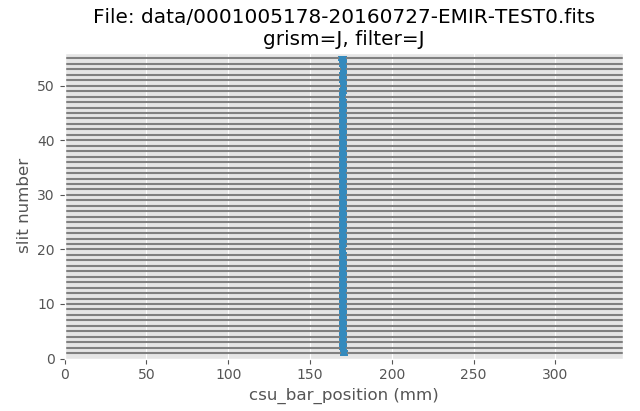
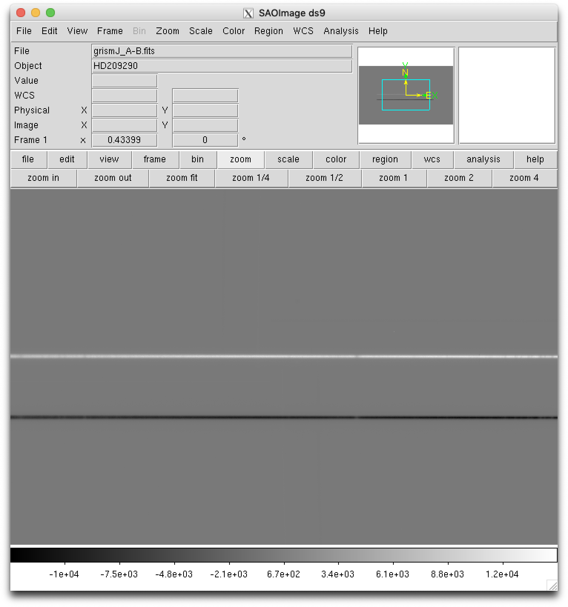
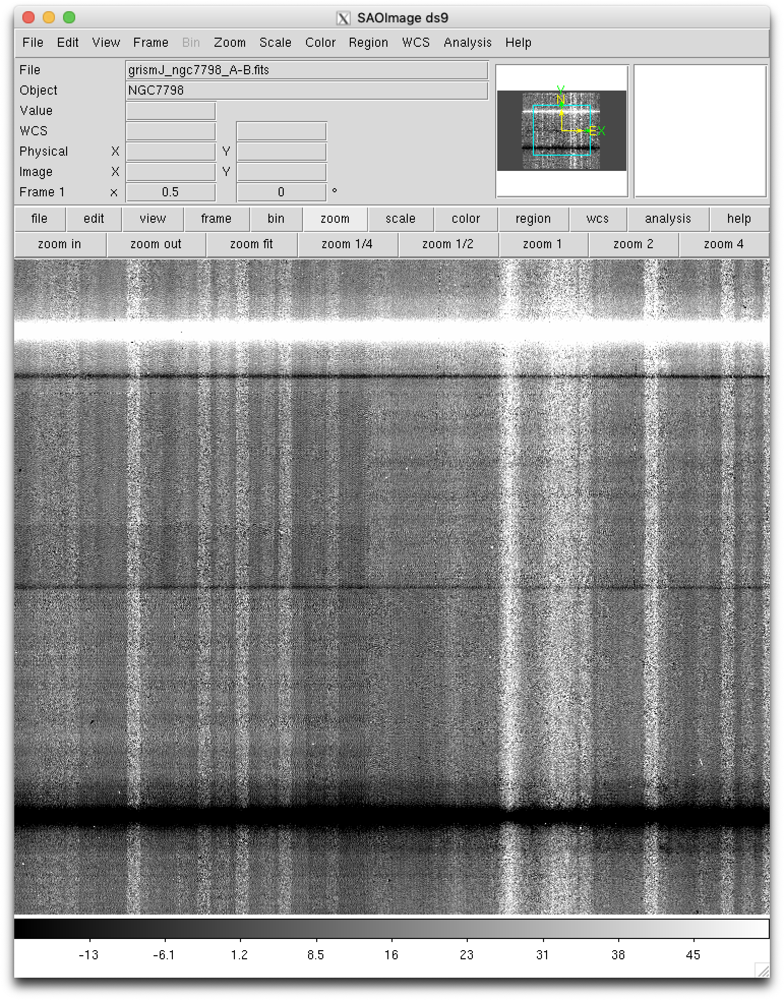
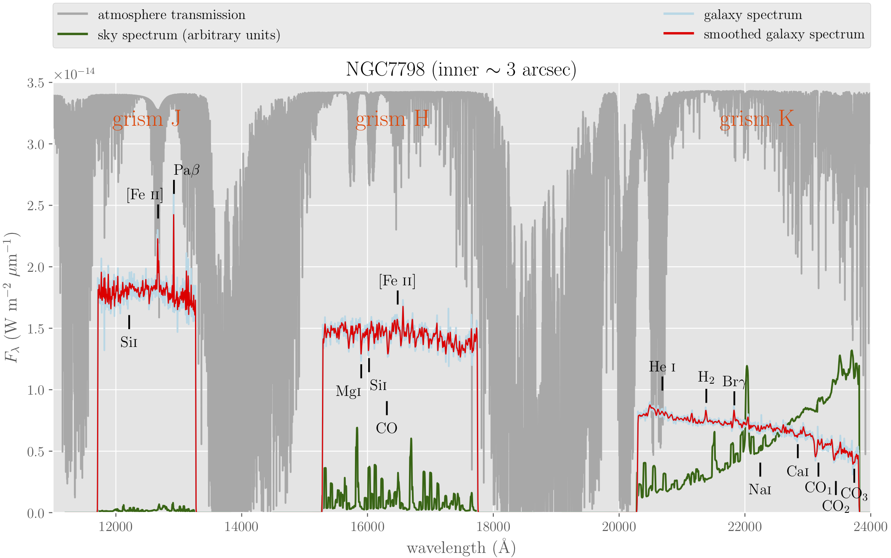

.. _ngc7798:

*******
NGC7798
*******

.. warning::

   All the commands are assumed to be executed in a terminal running the **bash
   shell**.

   Don't forget to activate the same Python environment employed to install
   PyEmir.  In this document, the prompt ``(emir) $`` will indicate that this
   is the case.

.. note::

   It is assumed that the reader has already followed the previous sections of
   this tutorial :ref:`simple_example` and :ref:`mos_example`. Some of the
   concepts already introduced there are not going to be repeated here with the
   same level of detail (or even mentioned at all!).

In this case we are going to reduce simple spectroscopic observations obtained
in the central region of the HII galaxy NGC7798 using the J, H and K grisms. 
**The target was observed with all the EMIR slitlets aligned,
simulating a single (pseudo) longslit.**

Since we plan to obtained flux calibrated results, we are also going to reduce
the spectra of the spectrophotometric standard HD209290 (HIP 108782), observed
with the same instrumental configuration.

Download the following file: `pyemir_ngc7798_tutorial_v2.tgz
<http://nartex.fis.ucm.es/data/pyemir/pyemir_ngc7798_tutorial_v2.tgz>`_.

Move to the directory where you have deployed the initial file tree structure
containing the basic PyEmir calibration files (see  :ref:`initial_file_tree`).

Decompress there the previously mentioned tgz file:

::

   (emir) $ tar zxvf pyemir_ngc7798_tutorial_v2.tgz
   ...
   ...
   (emir) $ rm pyemir_ngc7798_tutorial_v2.tgz

This action should have populated the file tree with 12 science exposures
(placed wihtin the ``data`` subdirectory) and some additional auxiliary files:

::

   (emir) $ tree
   .
   ├── 0_stare_hd209290.yaml
   ├── 0_stare_ngc7798.yaml
   ├── control.yaml
   └── data
       ├── 0001005178-20160727-EMIR-TEST0.fits
       ├── 0001005189-20160727-EMIR-TEST0.fits
       ├── 0001005200-20160727-EMIR-TEST0.fits
       ├── 0001005211-20160727-EMIR-TEST0.fits
       ├── 0001005222-20160727-EMIR-TEST0.fits
       ├── 0001005233-20160727-EMIR-TEST0.fits
       ├── 0001005263-20160727-EMIR-TEST0.fits
       ├── 0001005266-20160727-EMIR-TEST0.fits
       ├── 0001005269-20160727-EMIR-TEST0.fits
       ├── 0001005272-20160727-EMIR-TEST0.fits
       ├── 0001005275-20160727-EMIR-TEST0.fits
       ├── 0001005278-20160727-EMIR-TEST0.fits
       ├── master_bpm.fits
       ├── master_dark_zeros.fits
       ├── master_flat_ones.fits
       ├── master_flat_spec.fits
       ├── rect_wpoly_MOSlibrary_grism_H_filter_H.json
       ├── rect_wpoly_MOSlibrary_grism_J_filter_J.json
       ├── rect_wpoly_MOSlibrary_grism_K_filter_Ksp.json
       ├── rect_wpoly_MOSlibrary_grism_LR_filter_HK.json
       └── rect_wpoly_MOSlibrary_grism_LR_filter_YJ.json

You can easily examine the header of the 12 science files using the astropy
utility ``fitsheader``:

::

   (emir) $ fitsheader data/0001005* -k object -k grism -k filter -k exptime -f
                   filename                  OBJECT  GRISM FILTER  EXPTIME  
   ---------------------------------------- -------- ----- ------ ----------
   data/0001005178-20160727-EMIR-TEST0.fits  NGC7798     J      J 119.991601
   data/0001005189-20160727-EMIR-TEST0.fits  NGC7798     J      J 119.991601
   data/0001005200-20160727-EMIR-TEST0.fits  NGC7798     H      H 119.991601
   data/0001005211-20160727-EMIR-TEST0.fits  NGC7798     H      H 119.991601
   data/0001005222-20160727-EMIR-TEST0.fits  NGC7798     K    Ksp 119.991601
   data/0001005233-20160727-EMIR-TEST0.fits  NGC7798     K    Ksp 119.991601
   data/0001005263-20160727-EMIR-TEST0.fits HD209290     K    Ksp   9.999289
   data/0001005266-20160727-EMIR-TEST0.fits HD209290     K    Ksp   9.999289
   data/0001005269-20160727-EMIR-TEST0.fits HD209290     H      H   9.999289
   data/0001005272-20160727-EMIR-TEST0.fits HD209290     H      H   9.999289
   data/0001005275-20160727-EMIR-TEST0.fits HD209290     J      J   9.999289
   data/0001005278-20160727-EMIR-TEST0.fits HD209290     J      J   9.999289

The slitlet configuration can be easily displayed with the help of the
auxiliary PyEmir script ``pyemir-display_slitlet_arrangement``:

::

   (emir) $ pyemir-display_slitlet_arrangement data/0001005*
   ...

12 plots are displayed, one for each raw image. The additional information
displayed in the terminal show that the CSU configuration was the same for the
12 images.

Reduction of HD209290
---------------------

The rectification and wavelength calibration of the images corresponding to the
spectrophotometric star is carried using the empirical model (reduction recipe
``GENERATE_RECTWV_COEFF``). The first lines of the associated observation
result ``0_stare_hd209290.yaml`` are:

.. literalinclude:: 0_stare_hd209290.yaml
   :lines: 1-14
   :linenos:
   :lineno-start: 1

There is a block for each single raw image.

Execute the reduction recipe:

::

   (emir) $ numina run 0_stare_hd209290.yaml --link-files -r control.yaml
   ...
   ...

As expected, two new subdirectories (``obsid_00010052??_work`` and
``obsid_00010052??_results``) have been created for each raw image.

Since we have 2 images for each grism (positions A and B along the slit), it is
useful to subtract them. You can use for this task your favourite software, or
the auxiliary Numina script ``numina-imath`` (which performs binary operations
betwen images of the same size):

::

   (emir) $ numina-imath obsid_0001005278_results/reduced_mos.fits - \
     obsid_0001005275_results/reduced_mos.fits grismJ_hd209290_A-B.fits

   (emir) $ numina-imath obsid_0001005269_results/reduced_mos.fits - \
     obsid_0001005272_results/reduced_mos.fits grismH_hd209290_A-B.fits

   (emir) $ numina-imath obsid_0001005266_results/reduced_mos.fits - \
     obsid_0001005263_results/reduced_mos.fits grismK_hd209290_A-B.fits

Display the result to check that you get two spectra (one with positive counts
and another with negavite counts) in each case:

::

   (emir) $ ds9 grismJ_hd209290_A-B.fits

**From this point, we continue the reduction of the spectrophotometric standard
using Python (within a Jupyter notebook).** 
See `final reduction of HD209290 
<http://nartex.fis.ucm.es/~ncl/emir/reduction_hd209290.html>`_.

Reduction of NGC7798
--------------------

The rectification and wavelength calibration of the images corresponding to the
central region of NGC7798 star is carried using the empirical model (reduction recipe
``GENERATE_RECTWV_COEFF``). The first lines of the associated observation
result ``0_stare_ngc7798.yaml`` are:

.. literalinclude:: 0_stare_ngc7798.yaml
   :lines: 1-14
   :linenos:
   :lineno-start: 1

There is a block for each single raw image.

Execute the reduction recipe:

::

   (emir) $ numina run 0_stare_ngc7798.yaml --link-files -r control.yaml
   ...
   ...

As expected, two new subdirectories (``obsid_00010052??_work`` and
``obsid_00010052??_results``) have been created for each raw image.

Since we have 2 images for each grism (positions A and B along the slit), it is
useful to subtract them. You can use for this task your favourite software, or
the auxiliary Numina script ``numina-imath`` (which performs binary operations
betwen images of the same size):

::

   (emir) $ numina-imath obsid_0001005178_results/reduced_mos.fits - \
     obsid_0001005189_results/reduced_mos.fits grismJ_ngc7798_A-B.fits

   (emir) $ numina-imath obsid_0001005211_results/reduced_mos.fits - \
     obsid_0001005200_results/reduced_mos.fits grismH_ngc7798_A-B.fits

   (emir) $ numina-imath obsid_0001005222_results/reduced_mos.fits - \
     obsid_0001005233_results/reduced_mos.fits grismK_ngc7798_A-B.fits

Display the result to check that you get two spectra (one with positive counts
and another with negavite counts) in each case:

::

   (emir) $ ds9 grismJ_ngc7798_A-B.fits

**From this point, we continue the reduction of the galaxy spectra using 
Python (within a Jupyter notebook).** 
See `final reduction of NGC7798
<http://nartex.fis.ucm.es/~ncl/emir/reduction_ngc7798.html>`_.

