.. _simple_example:

****************************
Simple example: arc exposure
****************************

.. warning::

   All the commands are assumed to be executed in a terminal running the **bash
   shell**.

   Don't forget to activate the same Python environment employed to install
   PyEmir.  In this document, the prompt ``(py36) $`` will indicate that this
   is the case.

The rectification and wavelength calibration of any EMIR spectroscopic image
can be obtained with two levels of quality:

- **Preliminary (empirical) calibration**, without auxiliary calibration
  images, computed from the empirical calibration derived by the instrument
  team. 
  
  -  This is the on-line reduction perfomed at the GTC while gathering the
     images. 
     
  - Note that although the empirical calibrations were computed using a large
    set of initial calibration (continuum and arc) images, *it is not
    expected that the absolute wavelength calibration to be correct within a
    few pixels nor the relative wavelength calibration between slitlets to
    agree within one pixel*. For that reason, this rectified and wavelength
    calibrated image has been defined as a preliminary version. In addition,
    *the boundaries between slitlets can also exhibit small deviations (a few
    pixels) with respect to the empirical calibration*. Anyhow, this empirical
    calibration constitutes a good starting point in order to have a look to
    the data.

- **Refined calibration**, which requires either auxilary arc exposures or a
  more detailed reduction of scientific images with good signal on the airglow
  emission (OH emission lines). In this case, the preliminary calibration is
  refined *in order to guarantee that both, the absolute wavelength calibration
  and the relative wavelength calibration between slitlets do agree within a
  fraction of a pixel*. In addition, the boundaries between the slitlets can
  also be shifted in order to match the real data.

Preliminary rectification and wavelength calibration
====================================================

Assume you want to perform the rectification and wavelength calibration of the
following raw spectroscopic images (corresponding in this case to spectral arc
lamps):

::

   0001041345-20160917-EMIR-TEST0.fits  
   0001041348-20160917-EMIR-TEST0.fits  
   0001041351-20160917-EMIR-TEST0.fits

These images should be similar since they were taken consecutively with the
same instrument configuration. In this case, the median of the three raw images
will be computed and a preliminary rectified and wavelength calibrated image
will be generated from that median image.

Those three files (together with some additional files that you will need to
follow this simple example) are available as a compressed tgz file:
`EMIR_simple_example.tgz 
<http://nartex.fis.ucm.es/~ncl/emir/EMIR_simple_example.tgz>`_.

Download and decompress the previous file:

::

   (py36) $ tar zxvf EMIR_simple_example.tgz
   ...
   ...
   (py36) $ rm EMIR_simple_example.tgz

A new subdirectory named ``EMIR_simple_example`` should have appeared, with the
following content:

::

   (py36) $ tree EMIR_simple_example
   EMIR_simple_example
   ├── 00_simple_example.yaml
   ├── 01_simple_example.yaml
   ├── control.yaml
   └── data
       ├── 0001041345-20160917-EMIR-TEST0.fits
       ├── 0001041348-20160917-EMIR-TEST0.fits
       ├── 0001041351-20160917-EMIR-TEST0.fits
       ├── master_bpm.fits
       ├── master_dark.fits
       ├── master_flat.fits
       ├── rect_wpoly_MOSlibrary_grism_H_filter_H.json
       ├── rect_wpoly_MOSlibrary_grism_J_filter_J.json
       ├── rect_wpoly_MOSlibrary_grism_K_filter_Ksp.json
       ├── rect_wpoly_MOSlibrary_grism_LR_filter_HK.json
       └── rect_wpoly_MOSlibrary_grism_LR_filter_YJ.json

   1 directory, 14 files

Move into the ``EMIR_simple_example`` directory:

::

   (py36) $ cd EMIR_simple_example

This directory contains a subdirectory ``data/`` with the following files:

- The first three FITS files ``00010413*.FITS`` correspond to the arc exposures.

- ``master_bpm.fits`` is a preliminary bad-pixel-mask image (pixels in this
  image with values different from zero are interpolated).

- ``master_dark.fits`` is a dummy 2048x2048 image of zeros (this image is
  typically not necessary since in the IR the reduction of science observations
  usually requires de subtraction of consecutive images).

- ``master_flat.fits`` is a dummy 2048x2048 image of ones (in a more realistic
  reduction this image should have been obtained previously).

- The ``rect_wpoly_MOSlibrary_grism*.json`` files contain the empirical
  calibration for rectification and wavelength calibration for different
  grism+filter configurations.

Remain in the ``EMIR_simple_example`` directory. From here you are going to
execute the pipeline.

You can easily examine the header of the three arc files using the utilities 
``dfits`` and ``fitsort`` (previously mentioned):

::

   (py36) $ dfits data/00010413*fits | fitsort object grism filter exptime date-obs
   FILE                                    	OBJECT           	GRISM  FILTER  	EXPTIME 	DATE-OBS              	
   data/0001041345-20160917-EMIR-TEST0.fits	CSU_RETI ALL SPEC	J      J       	1.999288	2016-09-17T18:32:29.61	
   data/0001041348-20160917-EMIR-TEST0.fits	CSU_RETI ALL SPEC	J      J       	1.999288	2016-09-17T18:32:32.68	
   data/0001041351-20160917-EMIR-TEST0.fits	CSU_RETI ALL SPEC	J      J       	1.999288	2016-09-17T18:32:35.74

Have a look to any of the tree raw arc images (the three images are similar).
For that purpose you can use ``ds9`` or the visualization tool provided with
numina:
   
::

   (py36) $ numina-ximshow data/0001041345-20160917-EMIR-TEST0.fits

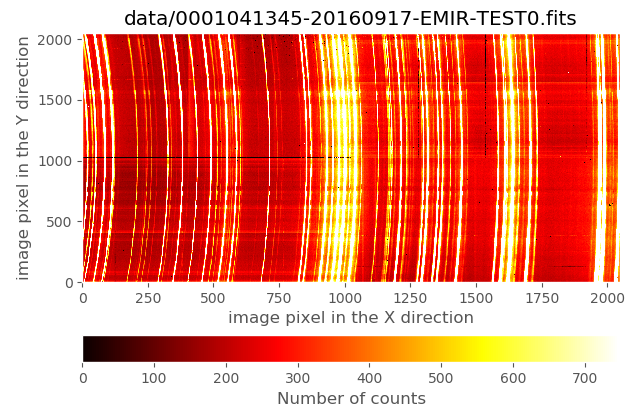

The wavelength direction corresponds to the horizontal axis, whereas the
spatial direction is the vertical axis. This image was obtained with all the
slitlets configured in longslit format. The arc lines exhibit an important
geometric distortion when moving along the spatial direction even in this
longslit configuration.

The slitlet configuration can be easily displayed using the auxiliay PyEmir
script ``pyemir-display_slitlet_arrangement``:

::

   (py36) $ pyemir-display_slitlet_arrangement data/0001041345-20160917-EMIR-TEST0.fits
   ...
   ...

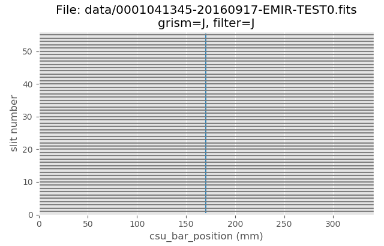

The above image clearly shows that all CSU bars were configured to create
aligned slitlets forming a (pseudo) longslit.

.. note::

   Remember that the ``numina`` script is the interface with GTC pipelines. 
   In order to execute PyEmir recipes you should use type something like:

   ::
   
      (py36) $ numina run <observation_result_file.yaml> -r <requirements_file.yaml>

   where ``<observation_result_file.yaml>`` is an observation result file in 
   YAML format, and ``<requirements_files.yaml>`` is a requirements file, also 
   in YAML format.

   YAML is a human-readable data serialization language (for details see 
   `YAML Syntax
   <https://docs.ansible.com/ansible/latest/reference_appendices/YAMLSyntax.html>`_)

The directory ``EMIR_simple_example`` contains the following two files required
to execute the reduction recipe needed in this case:

- ``00_simple_example.yaml``: this is what we call an observation result
  file, which basically contains the reduction recipe to be applied and the
  images involved.

   ::

      id: 1345
      instrument: EMIR
      mode: GENERATE_RECTWV_COEFF
      frames:
       - 0001041345-20160917-EMIR-TEST0.fits
       - 0001041348-20160917-EMIR-TEST0.fits
       - 0001041351-20160917-EMIR-TEST0.fits
      enabled: True

   - The ``id`` value is a label that is employed to generate the name of two
     auxiliary subdirectories. In this example the two subdirectories will be
     named ``obsid1345_work`` and ``obsid1345_results`` (see below), where the
     intermediate results and the final results are going to be stored,
     respectively. Note that we have arbitrarily chosen the last 4 digits of
     the unique running number assigned to each image obtained with the GTC.
   
   - Not surprisingly, the key ``instrument`` is set to EMIR (do not forget
     that Numina also is at present also employed to reduce MEGARA data, and
     hopefully, future GTC instruments).
   
   - The key ``mode`` indicates the identification of the reduction recipe
     (``GENERATE_RECTWV_COEFF`` in this example). 
     
   - The key ``frames`` lists the images to be combined (median). 
   
   - The key ``enabled: True`` indicates that this block is going to be
     reduced. As it is going to be shown later, it is possible to concatenate 
     several blocks in the same observation result file; the user can easily
     activate/deactivate the execution of particular reduction recipes (i.e.
     blocks in this file) just by modifying this flag.

- ``control.yaml``: this is the requirements file, containing the expected name
  of generic calibration files.

   ::

      version: 1
      products:
        EMIR:
         - {id: 2, type: 'MasterBadPixelMask', tags: {}, content: 'master_bpm.fits'}
         - {id: 3, type: 'MasterDark', tags: {}, content: 'master_dark.fits'}
         - {id: 4, type: 'MasterSpectralFlat', tags: {}, content: 'master_flat.fits'}
         - {id: 11, type: 'MasterRectWave', tags: {grism: J, filter: J}, content: 'rect_wpoly_MOSlibrary_grism_J_filter_J.json'}
         - {id: 12, type: 'MasterRectWave', tags: {grism: H, filter: H}, content: 'rect_wpoly_MOSlibrary_grism_H_filter_H.json'}
         - {id: 13, type: 'MasterRectWave', tags: {grism: K, filter: Ksp}, content: 'rect_wpoly_MOSlibrary_grism_K_filter_Ksp.json'}
         - {id: 14, type: 'MasterRectWave', tags: {grism: LR, filter: YJ}, content: 'rect_wpoly_MOSlibrary_grism_LR_filter_YJ.json'}
         - {id: 15, type: 'MasterRectWave', tags: {grism: LR, filter: HK}, content: 'rect_wpoly_MOSlibrary_grism_LR_filter_HK.json'}
         - {id: 21, type: 'RefinedBoundaryModelParam', tags: {grism: J, filter: J}, content: 'final_multislit_bound_param_grism_J_filter_J.json'}
         - {id: 22, type: 'RefinedBoundaryModelParam', tags: {grism: H, filter: H}, content: 'final_multislit_bound_param_grism_H_filter_H.json'}
         - {id: 23, type: 'RefinedBoundaryModelParam', tags: {grism: K, filter: Ksp}, content: 'final_multislit_bound_param_grism_K_filter_Ksp.json'}
         - {id: 24, type: 'RefinedBoundaryModelParam', tags: {grism: LR, filter: YJ}, content: 'final_multislit_bound_param_grism_LR_filter_YJ.json'}
         - {id: 25, type: 'RefinedBoundaryModelParam', tags: {grism: LR, filter: HK}, content: 'final_multislit_bound_param_grism_LR_filter_HK.json'}
      requirements:
        EMIR:
          default:
            {
            }
      
You are ready to execute the reduction recipe indicated in the file
``00_simple_example.yaml`` (in this case the reduccion recipe named
``GENERATE_RECTWV_COEFF``):

::

   (py36) $ numina run 00_simple_example.yaml -r control.yaml
   ...
   ...

After the execution of the previous command line, two subdirectories should
have been created:

- a work subdirectory: ``obsid1345_work/``

- a results subdirectory: ``obsid1345_results/``

The ``work`` subdirectory
-------------------------

::

   (py36) $ tree obsid1345_work/
   obsid1345_work/
   ├── 0001041345-20160917-EMIR-TEST0.fits
   ├── 0001041348-20160917-EMIR-TEST0.fits
   ├── 0001041351-20160917-EMIR-TEST0.fits
   ├── ds9_arc_rawimage.reg
   ├── ds9_arc_rectified.reg
   ├── ds9_boundaries_rawimage.reg
   ├── ds9_boundaries_rectified.reg
   ├── ds9_frontiers_rawimage.reg
   ├── ds9_frontiers_rectified.reg
   ├── ds9_oh_rawimage.reg
   ├── ds9_oh_rectified.reg
   ├── index.pkl
   ├── master_bpm.fits
   ├── master_dark.fits
   ├── master_flat.fits
   ├── median_spectra_full.fits
   ├── median_spectra_slitlets.fits
   ├── median_spectrum_slitlets.fits
   └── reduced_image.fits
   
   0 directories, 19 files

All the relevant raw images ``00010413*-EMIR-TEST0.fits`` have been copied into
this working directory in order to preserve the original files.

In addition, some intermediate images are also stored here during the execution
of the reduction recipe. In particular:

- ``reduced_image.fits``: result of applying, to the median combination of the
  three ``00010413*fits files``, the bad-pixel mask, bias, dark and flatfield.
  Note that, albeit its name, this is not a rectified and wavelength calibrated
  image. This is simply a temporary image, stored in this working directory for
  double-checking purposes.

- ds9-region files for raw images (before rectification and wavelength
  calibration):

   - ``ds9_frontiers_rawimage.reg``: ds9-region file with the frontiers
     between slitlets, valid for the raw-type images (images with the original
     distortions).

   - ``ds9_boundaries_rawimage.reg``: ds9-region file with the boundaries
     for each slitlet, valid for the raw-type images (images with the original
     distortions).

   - ``ds9_arc_rawimage.reg``: ds9-region file with expected location of
     arc lines from the EMIR calibration lamps.

   - ``ds9_oh_rawimage.reg``: ds9-region file with expected location of airglow
     (OH) sky lines.

- ds9-region files for rectified and wavelength calibrated images:

   - ``ds9_frontiers_rectified``: ds9-region file with the frontiers between
     slitlets, valid for rectified and wavelength calibrated images.

   - ``ds9_boundaries_rectified``: ds9-region file with the boundaries for each
     slitlet, valid for rectified and wavelength calibrated images.

   - ``ds9_arc_rectified.reg``: ds9-region file with expected location of arc
     lines from the EMIR calibration lamps.

   - ``ds9_oh_rectified.reg``: ds9-region file with expected location of
     airglow (OH) sky lines.

- images with averaged spectra:

   - ``median_spectra_full.fits``: image with the same size as the rectified
     and wavelength calibrated image, where the individual 38 spectra of each
     slitlet have been replaced by its median spectrum.

   - ``median_spectra_slitlets.fits``: image with simply 55 spectra,
     corresponding to the 55 median spectrum of each slitlet.

   - ``median_spectrum_slitlets.fits``: single median spectrum, with signal in
     all pixels with wavelength coverage in any of the 55 slitlets.

The ``results`` subdirectory
----------------------------

::

   (py36) $ tree obsid1345_results/
   obsid1345_results/
   ├── processing.log
   ├── rectwv_coeff.json
   ├── reduced_mos.fits
   ├── result.yaml
   └── task.yaml
   
   0 directories, 5 files

The main results are stored separately in this last subdirectory. The
important files here are:

- ``reduced_mos.fits`` is the preliminary version of the rectified and
  wavelength calibrated image (please, keep reading).

- ``rectwv_coeff.json``: rectification and wavelength calibration polinomial
  coefficients derived from the empirical model, and computed for the specific
  CSU configuration of the considered raw images.

You can easily display the last image using ``ds9`` or the visualization tool
provided with numina:

::

   (py36) $ numina-ximshow obsid1345_results/reduced_mos.fits --z1z2 0,1000

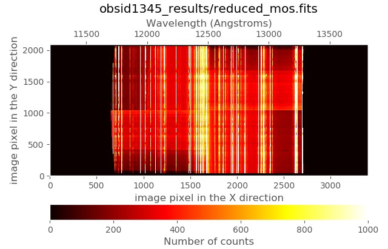

- The wavelength calibration coefficientes are stored in the usual FITS
  keywords ``CRPIX1``, ``CRVAL1`` and ``CDELT1``:

  ::

     (py36) $ dfits obsid1345_results/reduced_mos.fits | fitsort crpix1 crval1 cdelt1
     FILE                              	CRPIX1	CRVAL1 	CDELT1	
     obsid1345_results/reduced_mos.fits	1.0   	11200.0	0.77 

  Prefixed ``CRVAL1`` and ``CDELT1`` values have been stablished for the
  different grism+filter combinations (``CRPIX1=1`` is employed in all cases).
  The goal is that all the rectified and wavelength calibrated images,
  corresponding to raw images obtained the same grism+filter, have the same
  linear coverage and sampling in wavelength, which should facilitate the
  scientific analysis of images obtained with distinct CSU configurations.
     

- Note that the image dimensions are now NAXIS1=3400 and NAXIS2=2090:

  ::

     (py36) $ dfits obsid1345_results/reduced_mos.fits | fitsort naxis1 naxis2
     FILE                              	NAXIS1	NAXIS2	
     obsid1345_results/reduced_mos.fits	3400  	2090  

  ``NAXIS1`` has been enlarged in order to accommodate wavelength calibrated
  spectra for slitlets in different locations along the spectral direction
  (i.e., with different wavelength coverage). For that reason there are empty
  leading and trailing areas (with signal set to zero) in the wavelength
  direction. ``NAXIS2`` has also been slightly enlarged (from 2048 to 2090) in
  order to guarantee that all the rectified slitlets have exactly the same
  extent in the spatial direction (38 pixels). In the configuration of this
  particular example (grism J + filter J) slitlet#1 and slitlet#55 fall
  partially or totally outside of the spatial coverage of the EMIR detector.
  For that reason the first 38 pixels (slitlet #1) and the last 38 pixels
  (slitlet#55) in the vertical (spatial) direction are also set to zero in the
  reduced image.

- The coordinates of the useful rectangular region of each slitlet in the
  rectified and wavelength calibrated image are stored in the FITS header under
  the keywords:
  
  - ``IMNSLT??`` (minimum Y pixel)
  
  - ``IMXSLT??`` (maximum Y pixel)

  - ``JMNSLT??`` (minimum X pixel)
  
  - ``JMXSLT??`` (maximum X pixel)
  
  where ``??`` runs from 01 to 55 (slitlet number). In principle ``IMNSLT??``
  and ``IMXSLT??`` are always the same for all the grism + filter combinations,
  and are independent of the slitlet location along the wavelength direction (X
  axis). This guarantees that reduced images will have each slitlet always
  spanning the same location in the spatial direction (Y axis). However,
  ``JMNSLT??`` and ``JMXSLT??`` will change with the location of the slitlets
  in the spectral direction (X axis), since the actual location of each slitlet
  determines its resulting wavelength coverage.

In the simple example just described, we have straightforwardly executed the
reduction recipe ``GENERATE_RECTWV_COEFF`` using the empirical model for
rectification and wavelength calibration. This is good enough for a preliminary
inspection of the data (for example when observing at the telescope), but it is
possible to do a better job with some extra effort. For example, having a look
to the preliminary rectified and wavelength calibrated image (making a zoom in
a relatively narrow range in the X direction) it is clear that the relative
wavelength calibration between slitlets does not agree within roughtly 1 pixel:

::

   (py36) $ numina-ximshow obsid1345_results/reduced_mos.fits --bbox 1920,2050,1,2090 --z1z2 0,11000

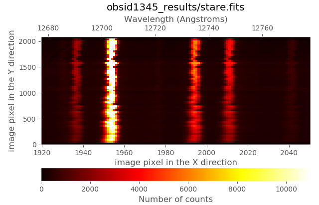

In addition, the absolute wavelength calibration is also wrong by a few pixels,
as it is described below.

Refined rectification and wavelength calibration
================================================

The user can obtain a more refined rectified and wavelength calibrated image
using precise wavelength calibration data. For this purpose one can use arc
exposures (obtained just before or after de scientific images), or even the
scientific images themselves, when the airglow emission (OH emission lines) are
brigth enough to be employed as wavelength signposts).

In this simple example, since the image we are trying to reduce is precisely an
arc exposure, we are using its own arc-line set to refine the calibration.

**Important:** The following process only works for arc images obtained when
the 3 types of arc lamps were simultaneously ON during the exposure time. An
easy way to check that this was really the case is to examine the corresponding
status keywords:

::

   (py36) $ dfits obsid1345_results/reduced_mos.fits | fitsort lampxe1 lampne1 lamphg1 lampxe2 lampne2 lamphg2
   FILE                              	LAMPXE1	LAMPNE1	LAMPHG1	LAMPXE2	LAMPNE2	LAMPHG2	
   obsid1345_results/reduced_mos.fits	1      	1      	1      	1      	1      	1

Note that the EMIR calibration unit has 3 types of arc lamps: Xe, Ne, and Hg
(actually two lamps of each type). In principle the six lamps should be ON
(keyword = 1) for the refinement procedure to work properly.  If separate
exposures were obtained for each lamp type, the user must previously combine
the images, multiplying each frame by the appropiate factor in order to
simulate simultaneous exposures of the three arc lamp types *with the same
exposure time*.

.. warning::

   Before attempting to obtain a reasonable rectified and wavelength calibrated
   image, it is important to understand that the empirical calibration does not
   guarantee a perfect job when determining the slitlet location along the
   spatial direction (Y axis) nor in the wavelength direction (X axis). These
   two effects can be estimated either making use of the script
   ``pyemir-overplot_boundary_model``, or by overplotting ds9-region files on
   the images. Both methods are described in the next subsections).

Checking the spatial direction (Y axis)
---------------------------------------

.. note::

   If you prefer to use ``ds9`` instead of the default PyEmir graphical output
   for the following examples, please keep reading anyway and wait for
   additional explanations below.

For example, we can execute the auxiliary script
``pyemir-overplot_boundary_model`` with the first of the three raw arc images
previously used (since the three images were obtained consecutively with
exactly the same configuration, we can choose any of them):

::

   (py36) $ pyemir-overplot_boundary_model \
     data/0001041345-20160917-EMIR-TEST0.fits \
     --rect_wpoly_MOSlibrary data/rect_wpoly_MOSlibrary_grism_J_filter_J.json

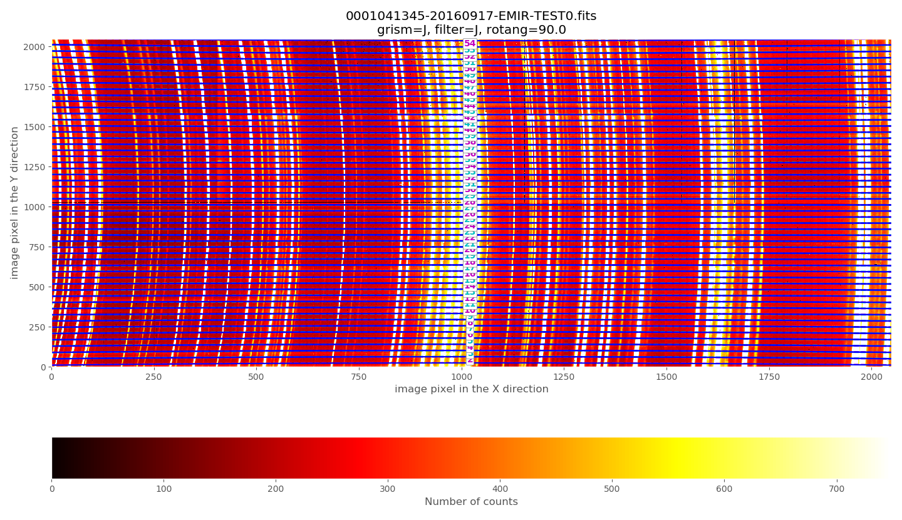

Zooming in the lower region:

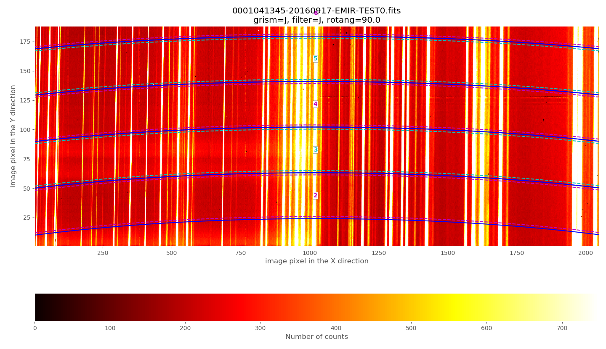

Zooming in the middle region:

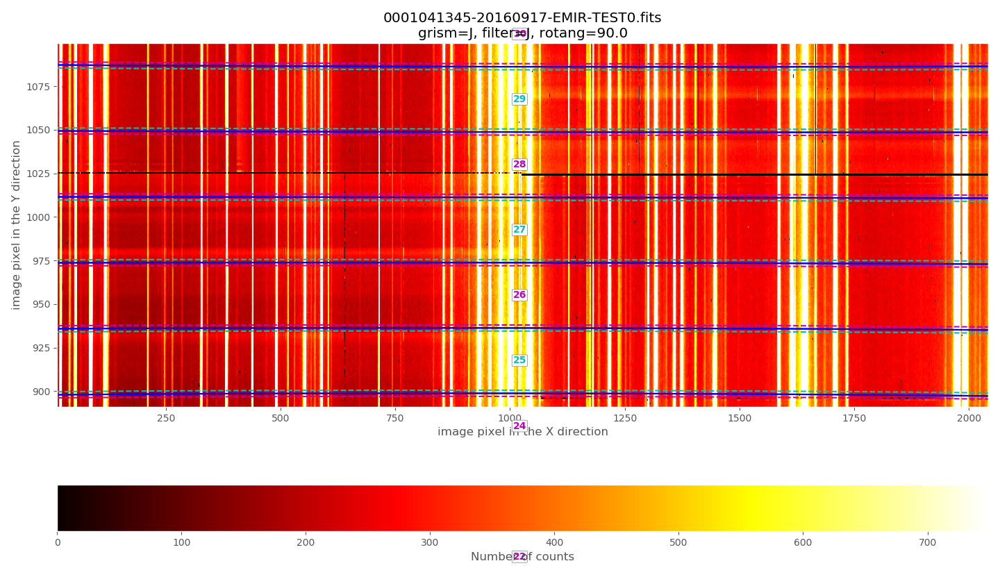

Zooming in the upper region:

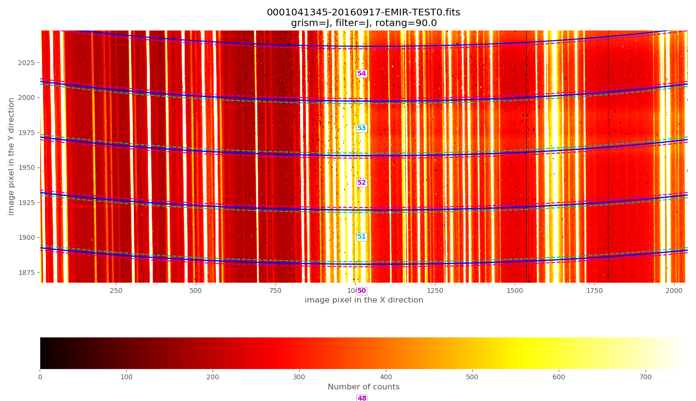

The above plots show the selected image with the **frontiers** and
**boundaries** of each slitlet overplotted. Here a clarification is needed:

- **Frontiers**: separation between slitlets. In the above plots frontiers are
  displayed with blue lines running from left to right. These lines are curved
  due to the geometric distortions.

- **Boundaries**: more conservative slitlet limits, avoiding a few pixels too
  close to the frontiers. Boundaries have been determined by examining
  continuum lamp exposures and selecting regions were the slitlet illumination
  is relatively flat. Note that, by construction, the CSU bars create a small
  (but detectable) decrease in the slitlet width at the frontiers between bars.
  The boundary limits are displayed alternatively with cyan and magenta lines
  (with the same color as the one employed in the label indicating the slitlet
  number; in this example all the labels appear centered in the image along the
  X axis). One can easily check that with grism J + filter J the slitlets
  number 1 and 55 fall partially outside the detector.

Although the (pseudo) longslit configuration in this example makes difficult to
distinguish the frontiers between slitlets in the data, a reasonable zoom
(showing consecutive slitlets with slightly different slit widths), helps to
check that the predicted frontiers (blue lines) properly separate the slitlet
data:

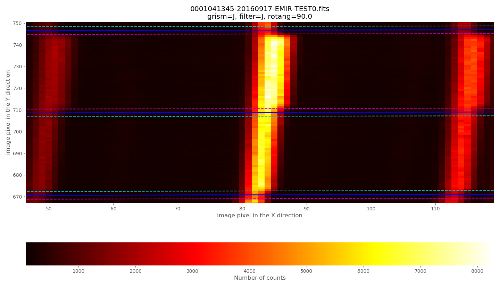

If you prefer to use ``ds9`` for this task, remember that some useful auxiliary
ds9-region files have been created under the ``obsid1345_work`` subdirectory.
In particular:

- ``ds9_frontiers_rawimage.reg``: the ds9-region file with the frontiers for
  the raw image

- ``ds9_boundaries_rawimage.reg``: the ds9-region file with the boundaries for
  the raw image

Open ``ds9`` with the same image

::

   (py36) $ ds9 data/0001041345-20160917-EMIR-TEST0.fits

and load the two region files:

- select ``region --> load -> obsid1345_work/ds9_frontiers_rawimage.reg``

- select ``region --> load -> obsid1345_work/ds9_boundaries_rawimage.reg``

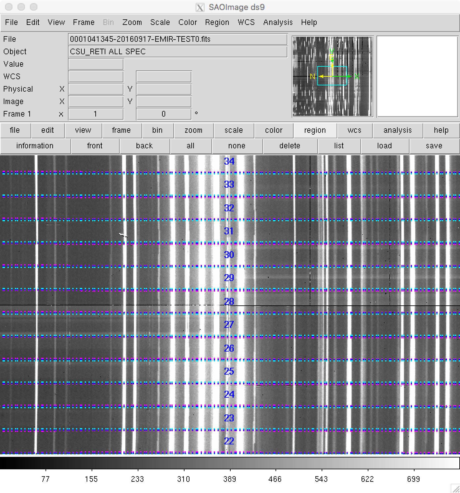

Zooming to check the slitlet frontiers:

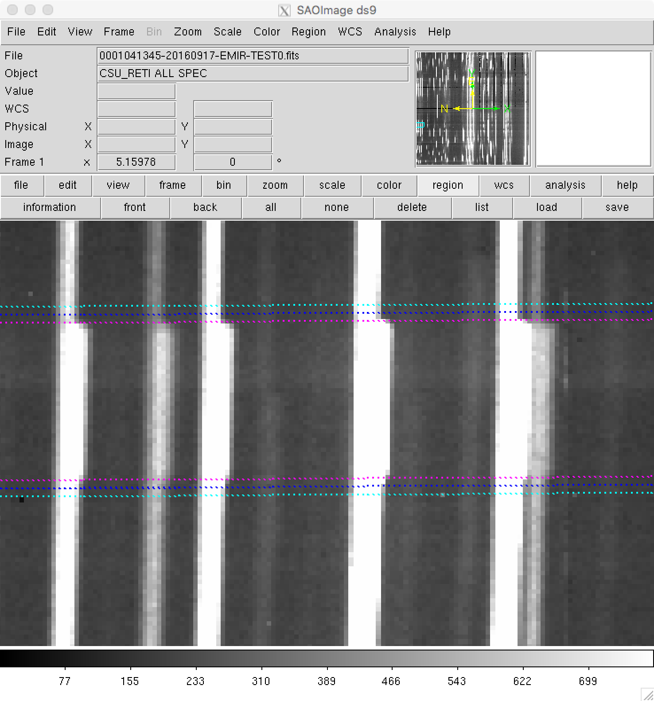

Checking the wavelength direction (X axis)
------------------------------------------

.. note::

   If you prefer to use ``ds9`` instead of the default PyEmir graphical output
   for the following examples, please keep reading anyway and wait for
   additional explanations below.

Since we know that the raw data correspond to arc images, we can overplot the
expected locations of the some of the brightest arc lines by using the
additional parameter ``--arc_lines``:

::

   (py36) $ pyemir-overplot_boundary_model \
     data/0001041345-20160917-EMIR-TEST0.fits \
     --rect_wpoly_MOSlibrary data/rect_wpoly_MOSlibrary_grism_J_filter_J.json \
     --arc_lines

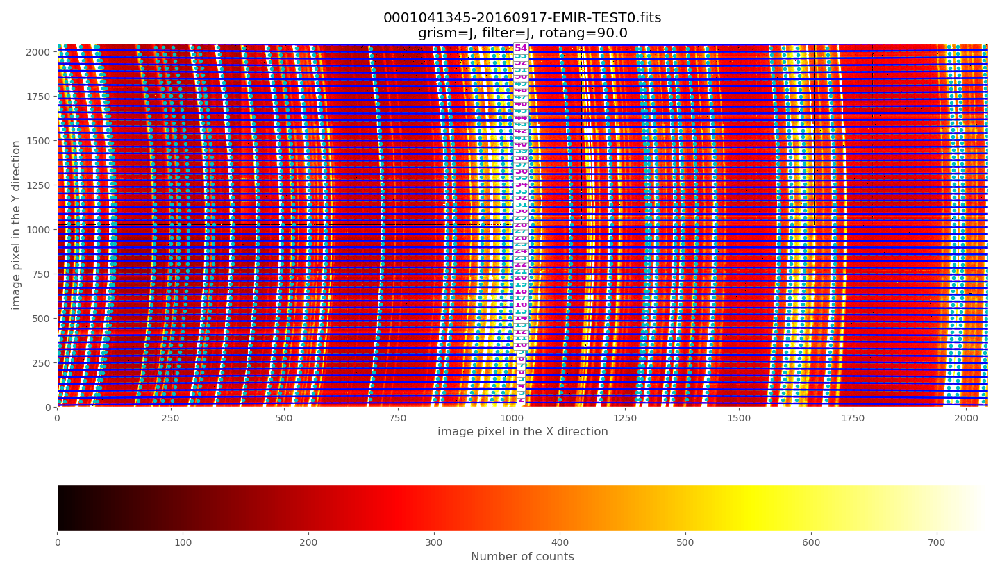

Zooming:

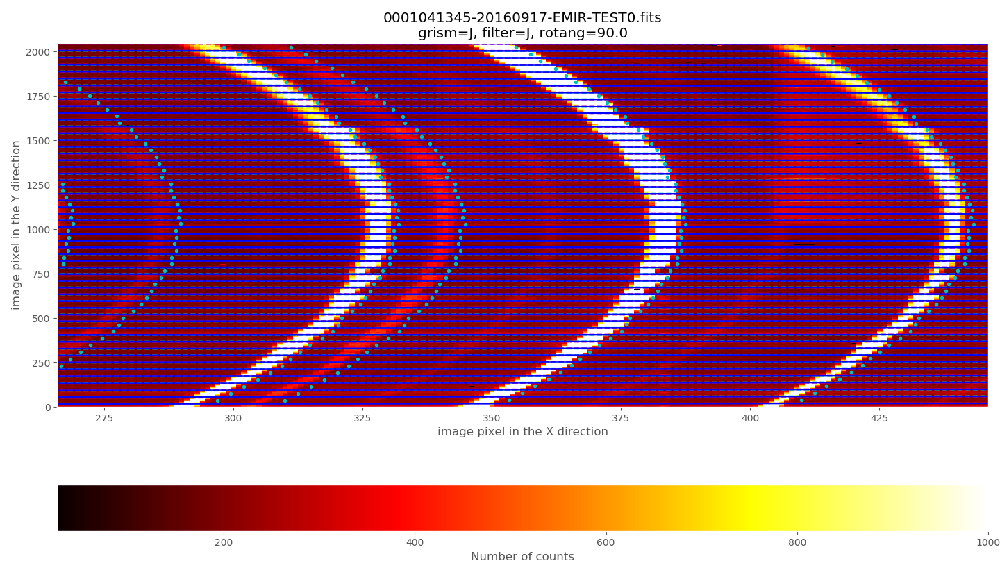

The observed arc lines appear around 3 pixels towards the left of the predicted
locations (marked by the cyan circles).

If you prefer to use ``ds9`` for this task, it is also possible to use the
auxiliary ds9-region with the expected location of the arc lines, created under
the ``obsid1345_work`` subdirectory. In this case, open ``ds9`` with the same
image:

::

   (py36) $ ds9 data/0001041345-20160917-EMIR-TEST0.fits

and load the region file:

- select ``region --> load -> obsid1345_work/ds9_arc_rawimage.reg``

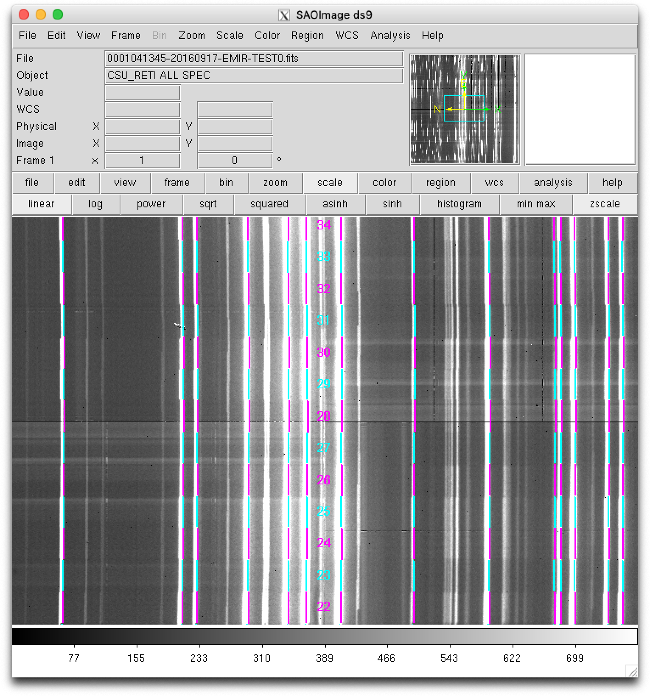

Zooming:

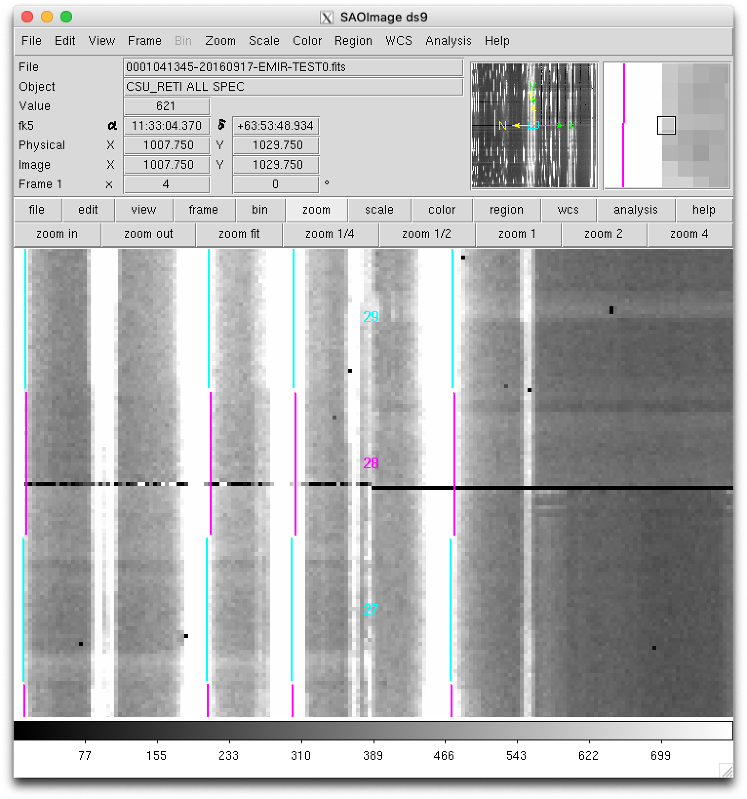

Here it is also clear that the observed arc lines appear around 3 pixels
towards the left of the expected locations (indicated by the ds9 regions).

Improving the rectification and wavelength calibration
------------------------------------------------------

Once you have estimated the potential integer offsets (in X and Y) of your
image relative to the expected slitlet frontiers (Y axis) and arc line
locations (X axis), it is possible to rerun the reduction recipe
``GENERATE_RECTWV_COEFF`` making use of that information.

In our case, we have estimated that there is no offset in the spatial direction
(Y axis), and an offset of around 3 pixels in the wavelength direction (X
axis). Those offsets should be introduced in the observation result file. For
that purpose, we have created a modified version of
``00_simple_example.yaml`` with the name ``01_simple_example.yaml``:

::

   id: 1345refined
   instrument: EMIR
   mode: GENERATE_RECTWV_COEFF
   frames:
    - 0001041345-20160917-EMIR-TEST0.fits
    - 0001041348-20160917-EMIR-TEST0.fits
    - 0001041351-20160917-EMIR-TEST0.fits
   enabled: True
   requirements:
     refine_wavecalib_mode: 2
     global_integer_offset_x_pix : 3 
     global_integer_offset_y_pix : 0 

This file is the same as ``00_simple_example.yaml`` but with a different
``id`` (to generate different `work` and `results` subdirectories that do not
overwrite the initial reduction), and four extra lines at the end. In
particular, we are specifying a few parameters that are going to modify the
behavior of the reduction recipe:

- ``refine_wavecalib_mode``: 2: this indicates that the image correspond to an
  arc exposure and that we are asking for a refinement of the wavelength
  calibration using that information. Note that, by default, this parameter is
  set to zero, which means that no refinement is carried out (being the rest of
  the refinement parameters ignored). The value ``2`` indicates that the
  refinement is performed with the help or arc lines; a value of ``12``
  indicates that the refinement process will use airglow (OH) lines.

- ``global_integer_offset_x_pix``: 3: integer offset (pixels) that must be
  applied to the image data for the arc lines to fall at the expected location.

- ``global_integer_offset_y_pix``: 0: integer offset (pixels) that must be applied to the image data for the frontiers to fall at the expected location.

Execute the reduction recipe using the new observation result file:

::

   (py36) $ numina run 01_simple_example.yaml -r control.yaml
   ...
   ...

Now the execution of the code takes longer (the median spectrum of each slitlet
is crosscorrelated with an expected arc spectrum in order to guarantee that the
wavelength calibration of the different slitlets match).

The new ``reduced_mos.fits`` image now does exhibit a much better wavelength calibration:

::

   (py36) $ numina-ximshow obsid1345refined_results/reduced_mos.fits --bbox 1920,2050,1,2090 --z1z2 0,11000

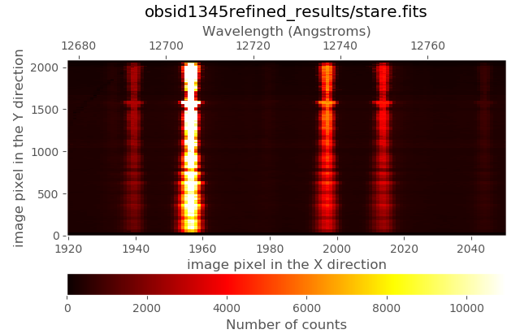

Within the ``obsid1345refined_work`` subdirectory you can find a new auxiliary
file called ``expected_catalog_lines.fits`` which contains the expected
locations of the arc lines in the rectified and wavelength calibrated sampling
(i.e., with the same dimensions as ``reduced_mos.fits``). We can then display
that new image zooming into the same region employed in the last plot (note
that the intensity of the arc lines in ``expected_catalog_lines.fits`` ranges
from 0.0 to 1.0):

::

   (py36) $ numina-ximshow obsid1345refined_work/expected_catalog_lines.fits --bbox 1920,2050,1,2090 --z1z2 0,0.4

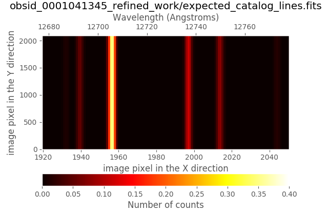

Remember that in the work directory you can still find the ds9-region files
with the frontiers (``ds9_frontiers_rectified.reg``), boundaries
(``ds9_boundaries_rectified.reg``) and expected arc line locations
(``ds9_arc_rectified.reg``) for the rectified and wavelength calibrated image.
Note that in this case the expected frontiers and boundaries lines are
perfectly horizontal, whereas the expected arc lines are vertical (the image
has been rectified!). These region files are useful to locate individual
slitlets by number.

::

   (py36) $ ds9 obsid1345refined_results/reduced_mos.fits

and load the region files:

- select ``region --> load -> obsid1345refined_work/ds9_boundaries_rectified.reg``
- select ``region --> load -> obsid1345refined_work/ds9_frontiers_rectified.reg``
- select ``region --> load -> obsid1345refined_work/ds9_arc_rectified.reg``

.. image:: images/ds9_rectified.png
   :width: 800
   :alt: ds9 rectified image

Zooming:

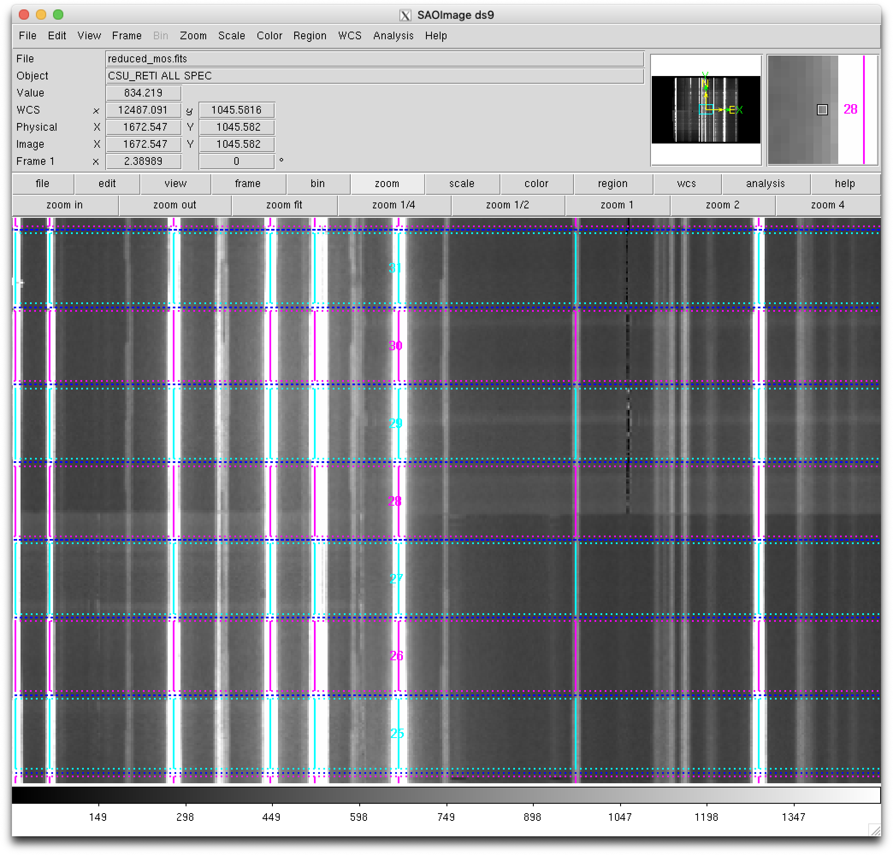

In the ``obsid1345refined_work`` subdirectory you should also find a new file
named ``crosscorrelation.pdf`` which contains a graphical summary of the
cross-correlation process. In particular, you have an individual plot for each
slitlet showing the cross-correlation function:

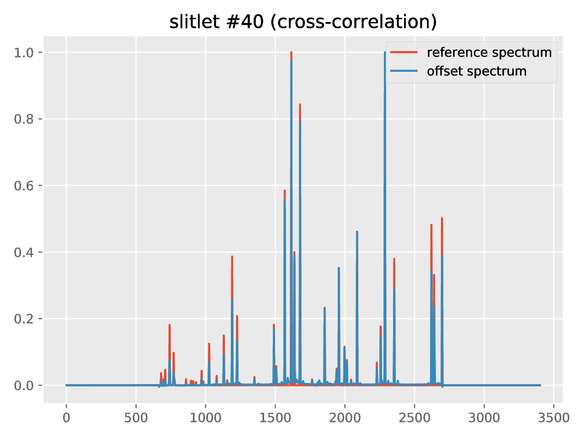

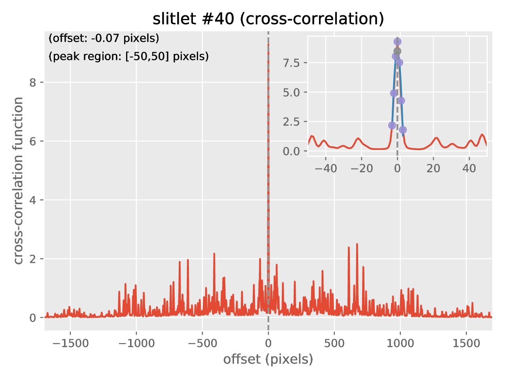

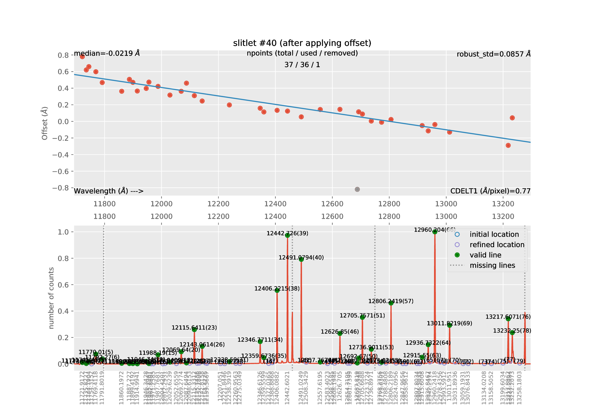

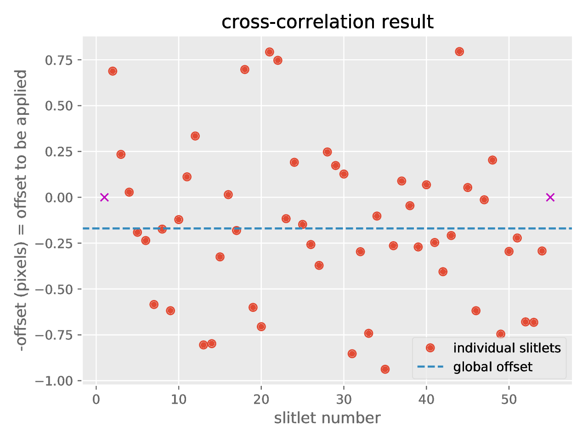

