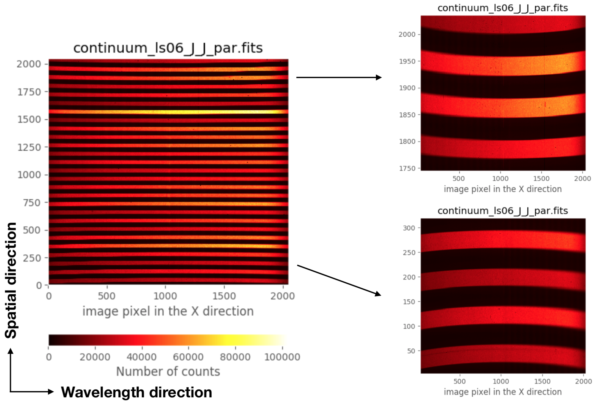

*****************************************
Understanding the data: image distortions
*****************************************

It is important to highlight that the **raw** spectroscopic images obtained
with EMIR exhibit geometric distortions, specially noticeable near the borders
of the spatial direction.

The previous image corresponds to a continuum exposure where the even-numbered
slitlets were opened, whereas the odd-numbered slitlets were closed. In this
way it was easier to recognize the detector region spanned by each (distorted)
individual 2D spectroscopic image corresponding to each particular slitlet.

In addition to that, it also important to keep in mind that the frontiers
between diferent slitlets change as a function of the location of the slitlet
(along the wavelength direction) in the focal plane of the telescope (i.e., the
configuration of the slitlets in the Cold Slit Unit). 

The described geometric distortion, as well as the wavelength calibration for
each slitlet, have been modelled for any arbitrary configuration of the Cold
Slit Unit (i.e., for any reasonable arrangement of the slitlets), using for
that purpose a large set of continuum and arc calibration exposures.
The calibration model can be easily employed to obtain a preliminary
rectified and wavelength calibrated EMIR spectroscopic image without additional
calibration images. This facilitates both the on-line quick reduction
of the data at the telescope and the off-line detailed reduction of the data by
the astronomer.

You can see an example of the variation of the slitlet frontiers when using
different slitlet configurations in the following videos:

.. raw:: html

   <iframe width="640" height="480" src="https://www.youtube.com/embed/BdcnlTJYZsI?rel=0" frameborder="0" allowfullscreen></iframe>

- `Video 1: <https://www.youtube.com/embed/BdcnlTJYZsI>`_ Variation of the
  frontiers between slitlets 3 and 4 as a function of the location of the
  slitlets (along the wavelength direction) in the Cold Slit Unit, using grism
  J and filter J. The varying numbers at the top of the image indicate the
  location of both slitlets (in mm).

.. raw:: html

   

.. raw:: html

   <iframe width="640" height="480" src="https://www.youtube.com/embed/whWaEtFQlkk?rel=0" frameborder="0" allowfullscreen></iframe>

- `Video 2: <https://www.youtube.com/embed/whWaEtFQlkk>`_ Same as the previous
  video, but zooming in the frontier between slitlet 3 and 4.

