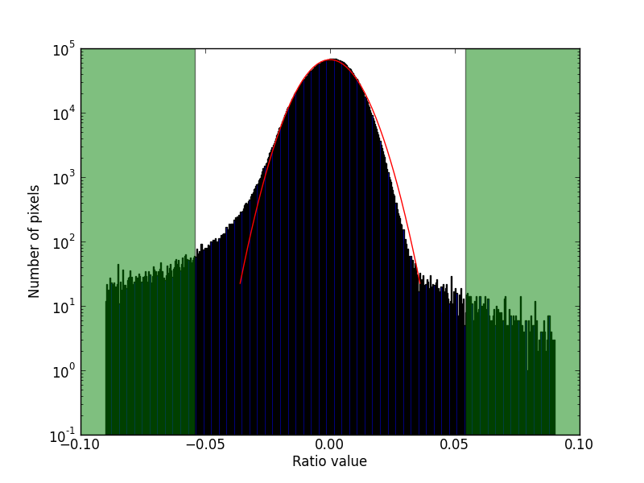

Engineering Recipes
===================

These recipes are devoted to calibrate the EMIR detector, a Rockwell HAWAII-2
unit.

Cosmetics
+++++++++
Detector cosmetics include: dead and hot pixels, 
inhomogenitites in pixel-to-pixel response, stripes pattern and
bias in the least significative bit.

Dead and hot pixels
-------------------
Dead pixels have low response independently of the brightness of the 
incident light. Hot pixels have high response even in low brightness conditions.
Both types of pixels are related with problem in detector electronics.

Dead and hot pixels are detected using two flat illuminated images
of different exposure time. The ratio of this images would be a constant,
except in dead or hot pixels, which will deviate significantly.

Asumming a normal distribution for the vast majority of the pixels in
the ratio image, we flag as hot pixels those that lie a given number
of standard deviations over the center of the distribution. Dead
pixels are those that lie a given number of pixels below the center
of the distribution.

The center of the distribution is estimated as the median of the full
image. The standard deviation of the distribution of pixels is computed
obtaining the percentiles nearest the pixel values corresponding to
`nsig` in the normal CDF. The standar deviation is then the distance
between the pixel values divided by two times `nsig`.
The ratio image is then normalized with this standard deviation.

In the image below we plot the histogram of the ratio image (with median
subtracted). The red curve represents a median distribution with mean 0
and sigma computed from 1-sigma percentiles. The normal distribution
is plotted upto 4-sigma. Overplotted in green are the regions at
6-sigma level. These points would be flagged as bad pixels in the final output
mask.

.. note::
    The procedure is similar to the algorithm of the IRAF task `ccdmask`

The recipe are that created the cosmetic mask is
:class:`emir.recipes.engineering.cosmetics.CosmeticsRecipe`

:mode: Engineering
:requires:
    -  lowercut = Parameter(default=4.0, Values below this sigma level are flagged as dead pixels)
    -  uppercut = parameter(default=4.0, Values above this sigma level are flagged as hot pixels)
:provides:  
    - ratio = DataFrame(Normalized ratio of the two flat images)
    - mask = DataFrame(Frame with zero for valid pixel and non zero for invalid)

